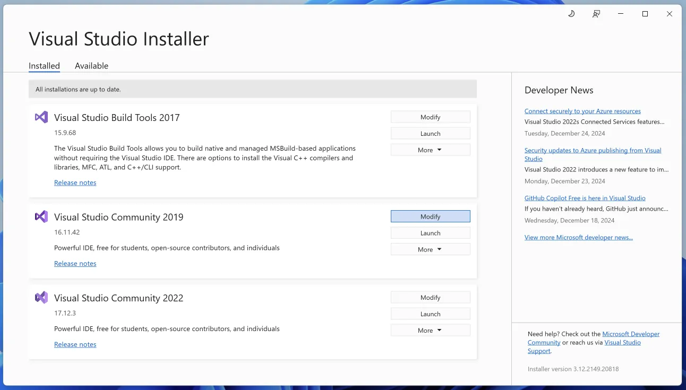
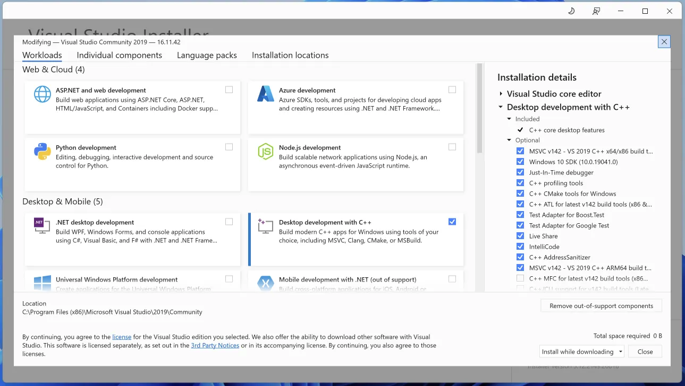

Working on FreeCAD is similar to working on many other open-source projects. This guide provides a short overview of the process. Much more information can be found at https://wiki.freecad.org.

## Build Environment

To work on FreeCAD, you will need CMake, git, a code editor, a C++ compiler, and a Python interpreter. Many different combinations work:

- On Linux, it's common to use vim, emacs, KDevelop, or CLion as your editor. Compilation with GCC and Clang is supported.
- On Windows, we support Visual Studio, Visual Studio Code, and CLion for development, all using the MSVC compiler toolchain.
- On macOS, you will need to install the XCode command line tools, and you can use XCode, Visual Studio Code, or CLion as your editor.

Other combinations may work as well; these are just the ones that you will be able to get help with most readily on the [FreeCAD Forum](https://forum.freecad.org).

## Dependencies

See also [Dependencies](../dependencies)

FreeCAD depends on many other open source projects to provide the basic foundations of the program. There are many ways of installing these dependencies: for details and the complete list, see the following Wiki pages:

- Linux: [https://wiki.freecad.org/Compile_on_Linux](https://wiki.freecad.org/Compile_on_Linux)
- Windows: [https://wiki.freecad.org/Compile_on_Windows](https://wiki.freecad.org/Compile_on_Windows)
- Mac: [https://wiki.freecad.org/Compile_on_MacOS](https://wiki.freecad.org/Compile_on_MacOS)

## Pixi

One of the easiest ways of creating a standalone FreeCAD build environment with its dependencies in a way that does not affect the rest of your system is to use
[Pixi](https://pixi.sh/latest/).

1. Install `pixi` using the following command:

- Windows (PowerShell): `iwr -useb https://pixi.sh/install.ps1 | iex`
- Linux/macOS: `curl -fsSL https://pixi.sh/install.sh | bash`

2. Configure FreeCAD for your platform. There are additional steps necessary on Windows, outlined in the next subsection.

    `pixi run configure`

3. Build FreeCAD

    `pixi run build`

    If your computer has less ram than is necessary to run a compiler per processor core, then you can reduce the number of parallel compiler jobs.  For example, if you wish to limit to 4 parallel compiler processes, use the following command:

    `pixi run build -j 4`

4. Run FreeCAD

    `pixi run freecad`

Pixi will take care of all the dependencies. In general, there will be no need to re-run the configure command as it will be automatically run by `pixi run build` if needed.  However, there may be times when a git submodule is added or updated.  To integrate these changes, the command `pixi run initialize` will run the commands necessary.

### Pixi on Windows

Pixi uses the `conda-forge` packages, including the `compilers` meta package to bring in the platform-specific compiler support.  On Windows, it is expected that Microsoft Visual C++ has been installed and matches the version used by the `conda-forge` team, which is [Visual Studio Community 2022](https://aka.ms/vs/17/release/vs_community.exe).

The Visual Studio Installer may be used to install Visual Studio Community 2022 alongside newer versions of Visual Studio. Ensure all of the necessary components are installed:

1. Open the Visual Studio Installer
2. Click `modify` for Visual Studio 2022.

    

3. Make sure to select `Desktop development with C++` under the `Desktop & Mobile` section.  Ensure that the necessary optional items are selected on the right.

    

## Setting up for Development

1. Fork [https://github.com/FreeCAD/FreeCAD](https://github.com/FreeCAD/FreeCAD) on GitHub
2. Clone your fork: for example, on the command line, you can use `git clone --recurse-submodules https://github.com/YourUsername/FreeCAD FreeCAD-src`
3. Set up `pre-commit` (our automatic code-formatter and checker):

    - Install `pre-commit` (either using your system package manager or pip):
      - Debian/Ubuntu: `apt install pre-commit`
      - Fedora: `dnf install pre-commit` (Fedora)
      - Arch Linux: `pacman -S pre-commit`
      - Other (pip in PATH): `pip install pre-commit`
      - Other (pip not in PATH): `python -m pip install pre-commit`
    - On a command line, change into your FreeCAD clone, e.g. `cd FreeCAD-src`
    - Run `pre-commit install` (or `python -m pre-commit install`, depending on your PATH)

4. We **strongly** recommend doing an out-of-source build, that is, building FreeCAD and putting all generated files in a separate directory. Otherwise, the build files will be spread all over the source code, and it will be much harder to sort out one from the other. A build directory can be created outside the FreeCAD source folder or inside:

    - `mkdir build`
    - `cd build`

5. Run CMake, either via the CMake GUI or on the command line. See the wiki compilation page for your operating system for a detailed list of options.
6. CMake will generate project files that can be read by your IDE of choice. See your IDE's documentation for details. In general:

    - On Linux, compile with a command like `cmake --build /path/to/FreeCAD-src` run from your build directory ( or `cmake --build ..` if your build directory is inside FreeCAD-src).
    - On Windows with Visual Studio, build the "ALL_BUILD target" (you will have to change the path to the final executable the first time you try to run that target).
    - On Mac, on the command line, use `cmake --build /path/to/FreeCAD-src` from your build directory, or if using CLion, be sure to "Build All" the first time you run.

7. If you plan on submitting a PR, create a branch:

    - `git branch fixTheThing`
    - `git checkout fixTheThing` (or both commands in one go: `git checkout -b fixTheThing`)
