The FreeCAD website takes advantage of a headless Content Management System (CMS). It is intended for content editors, translators, and contributors to ease the process of adding and editing the website content. For detailed CMS features, refer to the official [Sveltia CMS documentation](https://sveltiacms.app/en/docs/intro).

## CMS overview

The website content can be managed through a web-based CMS:

* Create and edit pages and articles.
* Update translations.
* Upload and manage resources such as images and documents.
* Review existing content before publishing changes.

Reading the [website guidelines](guidelines) is highly recommended. Thank you!

> [!NOTE]
> Changes made in the CMS are saved in the website git repository.
> Depending on the workflow chosen below, some additional steps and review time are required before the changes appear on the public website.

## Logging in

Open the [Admin page](admin) or if building locally, open the [localhost admin](http://localhost:1313/admin/) address:

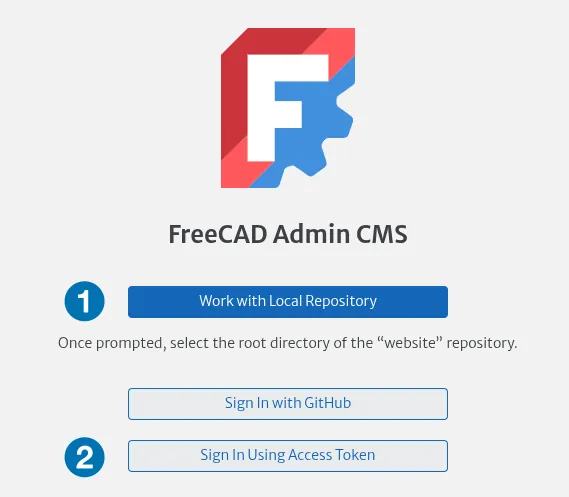

There are two main workflows: a local one (1) and a git server-based one (2).
Both workflows require a GitHub account, the main git platform currently used by the FreeCAD project for now.

### 1. Local workflow

- Clone the repository locally as described in the [website building](start#building) fourth step.
- Click **Work with Local Repository** on the CMS login page.
- Select the destination of your local repository clone.

The local workflow means a standard git-based process with branches, commits and pull requests is required to submit changes to upstream, as is the case with FreeCAD development in general.

### 2. Git server

- Log into your GitHub account and request a GitHub fine-grained Personal Access Token (PAT) by filling in the form as below:
  - `<your-username>` > `Developers Settings`  > `Fine-grained personal access token` (2)
  - Choose a token name and description
  - Choose the FreeCAD organization as owner (3)
  - Choose a duration for the validity of the PAT (e.g. one month)
  - Fill in the request message
  - Select the `FreeCAD/Website` repository for access (4)
  - Choose the `Read and write` access permissions for the `Contents` of the repository (5)
  - Generate the token by requesting access and copy safely the PAT code

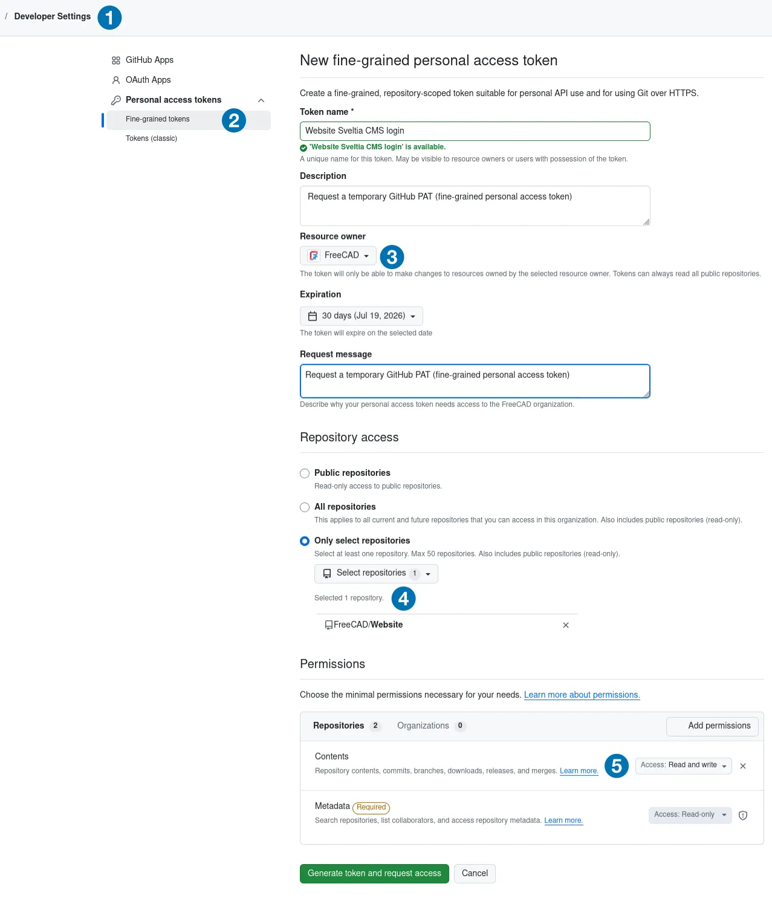

- Once the request is approved (a few days may be needed as it is manually validated by maintainers), click **Sign in using Access Token** on the CMS login page and provide the PAT code:

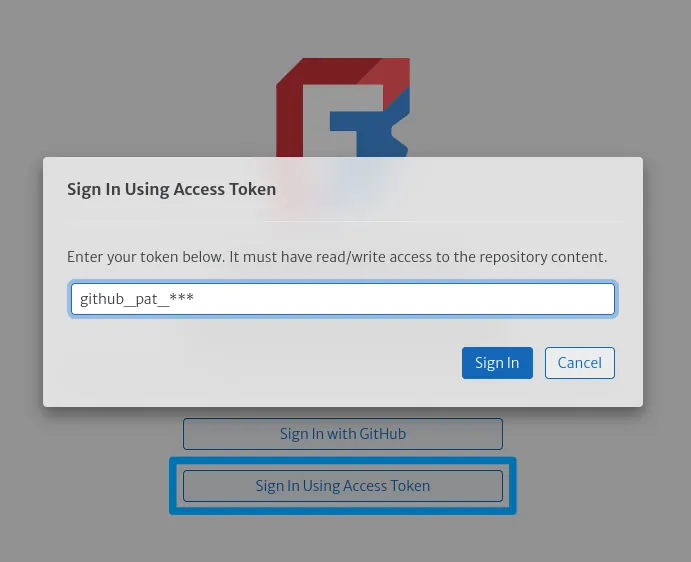

## Using the CMS

After successful login, the CMS dashboard will open:

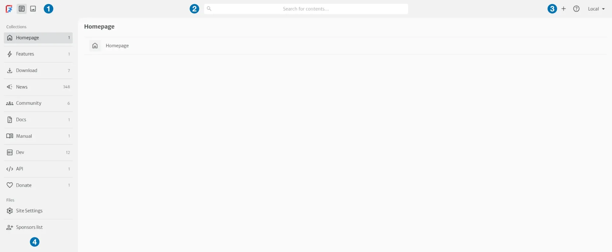

The top-left FreeCAD icon links to the public website, followed by the Collections and Assets tabs (1).
The top-center search field (2) looks for entries in the whole repository, with the menus (3) on the top-right.

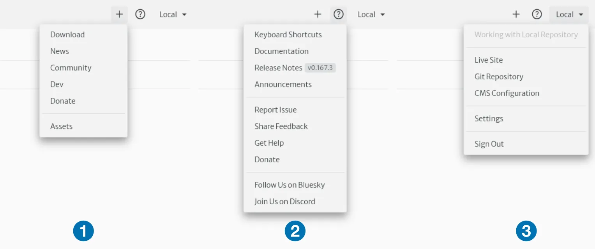

The available menus are general entry addition (1), help (2), and CMS settings (3).

### Navigate Collections

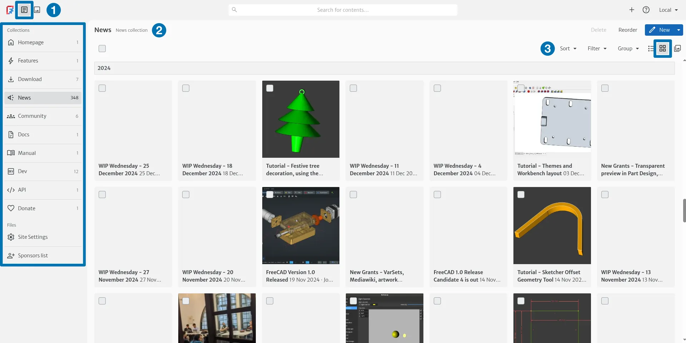

By default, the Collections tab is shown (1). Its left sidebar contains all editable content sections, collections, and files.
The selected collection lists its pages (2) either as cards with large thumbnails or as a compact vertical list:

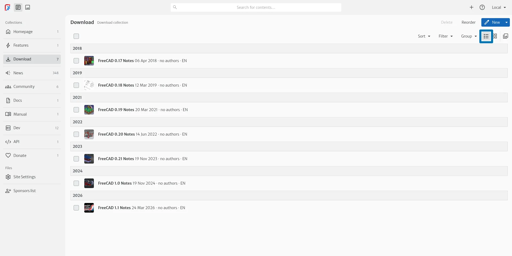

Sorting (1), filtering (2) and grouping (3) view options are available on the right of the Collection panel:

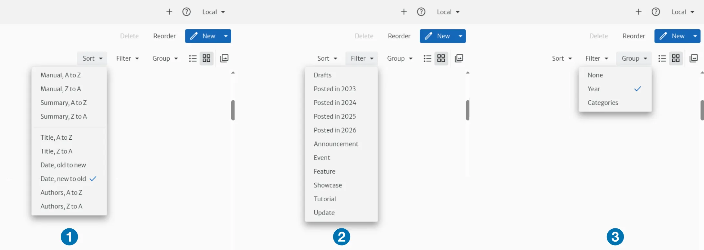

### Edit existing content

Open an entry in the collection list to edit its content:

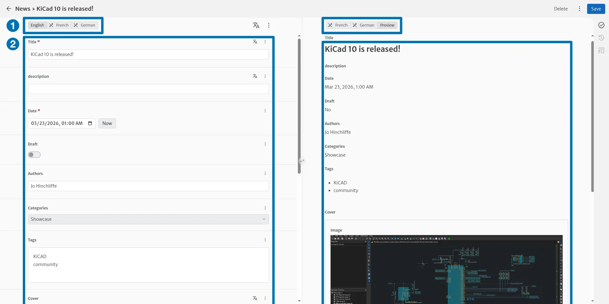

The languages and preview are accessible on the top (1).
Below, all page metadata fields are displayed (2).

The `Body` field is where the main content of the page is stored in Markdown.

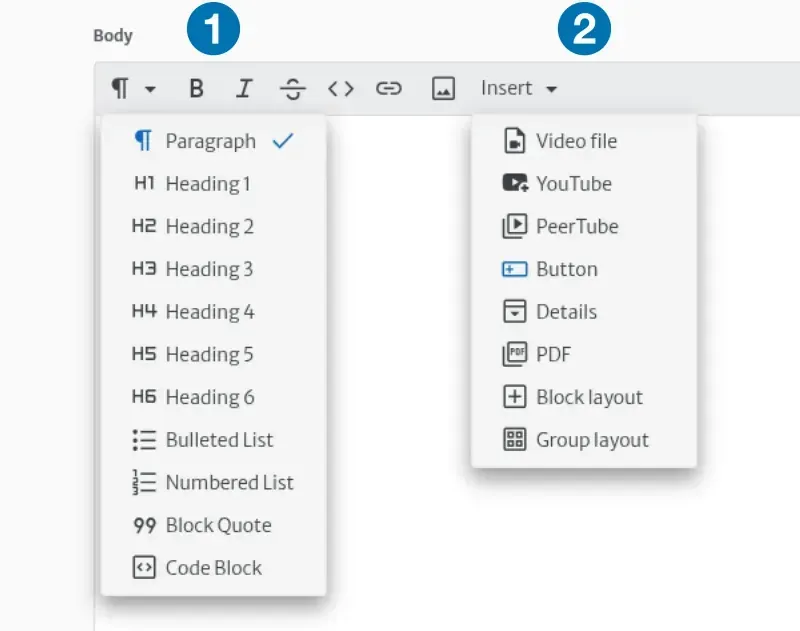

By default, it is displayed as a Rich Text editor with user-friendly buttons for both common Markdown formatting (1) and [custom shortcodes](shortcodes) (2).
The Markdown code can be seen by clicking on the Markdown icon on the right of the `Body` field.

Nested shortcodes can be added as well and their preview is shown on the preview side:

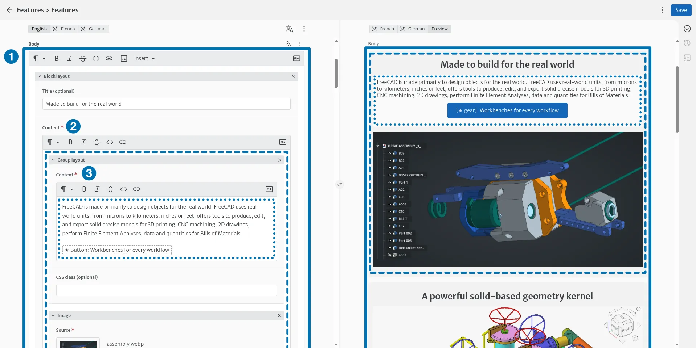

Note the hierarchy between the `Body` field (1), the `Block` shortcodes (2) and the nested `Group` shortcodes (3).

Some shortcodes are displayed as compact buttons opening a dialog, such as the `Button` shortcode shown here.

After making changes, use the `Save` button on the top-right.

### Create New Content

- On the Collections panel, use `New` directly in the appropriate collection or the general `+` entry addition button to add pages in the collections that allow new entries.
- Complete the required fields.
- Save the entry.

### Upload Images or Files

Images and documents can be uploaded directly from image or file fields in the Content editor.

Additional resources can be added via the assets panel (1):

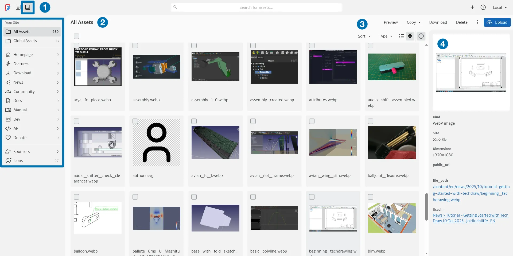

Assets are grouped by collections and special folders (2).
Management features (3) and information on the selected files (4) are available on the right side.

### Manage Translations

As seen previously, pages that support multiple languages display the list of enabled and disabled translations on the top of the content editor:

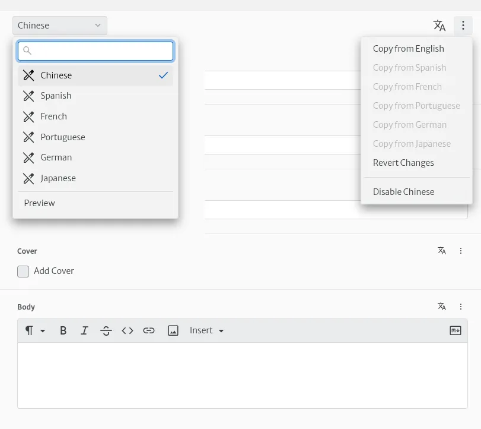

New translations can be enabled and the original content copied easily in one go to be translated manually.

Some automatic online translation services are also available via an API key:

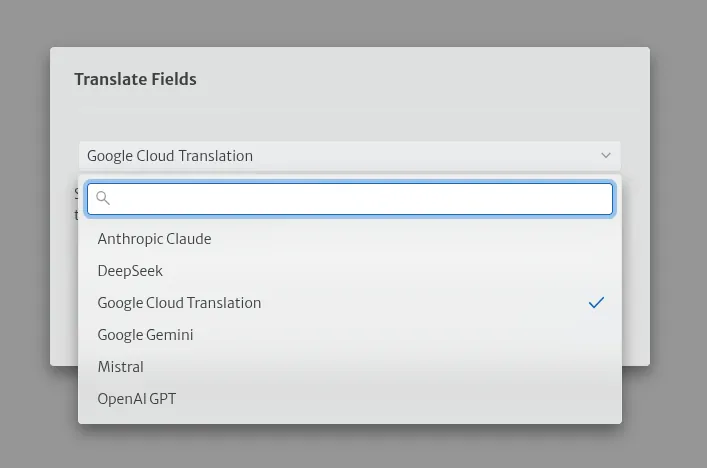

## Need Help?

In case of problems:

1. Go back to the general Dashboard and try again. Draft content can be discarded.
2. Check that the correct language is selected.
3. Fill in all required fields.
4. Sometimes writing in plain Markdown instead of using the Rich Text editor can help.
5. Don't forget to save.
6. Contact the website maintainers and provide all useful information: reproduction steps, screenshots, relevant pages, and CMS version visible in the help menu.
