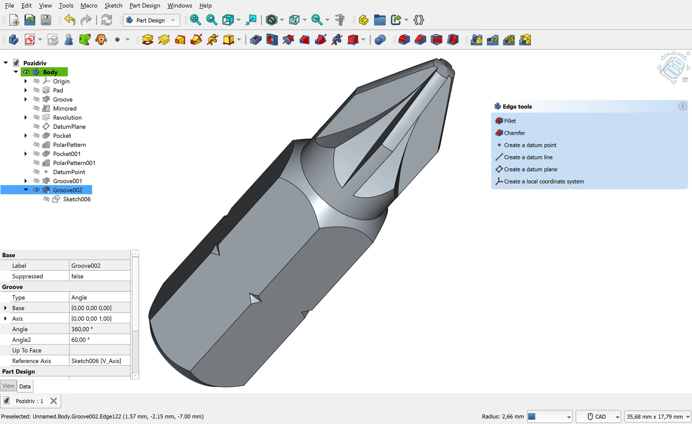

Hugo supports [Markdown](https://en.wikipedia.org/wiki/Markdown) syntax for formatting text, creating lists, and more.

This article offers a sample of basic Markdown syntax that can be used in Hugo content files and its rendered output with the current theme.


## Headings

```text {file=Markdown}
# Heading 1
## Heading 2
### Heading 3
#### Heading 4
##### Heading 5
###### Heading 6

### Heading with custom style {style="color: purple; background: coral; padding: 0.5rem; border-radius: var(--radius);"}

### Heading with a custom id {#custom-id}
```

<u>How it renders:</u>

# Heading 1
## Heading 2
### Heading 3
#### Heading 4
##### Heading 5
###### Heading 6

### Heading with custom style {style="color: purple; background: coral; padding: 0.5rem; border-radius: var(--radius);"}

### Heading with a custom id {#custom-id}


## Emphasis

```text {file=Markdown}
*This text will be italic*
_This will also be italic_

**This text will be bold**
__This will also be bold__

_You **can** combine them_
```

<u>How it renders:</u>

*This text will be italic*

_This will also be italic_

**This text will be bold**

__This will also be bold__

_You **can** combine them_


## Lists

### Unordered

```text {file=Markdown}
- Item 1
- Item 2
  - Item 2a
  - Item 2b
```

<u>How it renders:</u>

- Item 1
- Item 2
  - Item 2a
  - Item 2b

### Ordered

```text {file=Markdown}
1. Item 1
2. Item 2
3. Item 3
   1. Item 3a
   2. Item 3b
```

<u>How it renders:</u>

1. Item 1
2. Item 2
3. Item 3
   1. Item 3a
   2. Item 3b

### Task list

```text {file=Markdown}
- [x] Write documentation
- [ ] Review code
- [ ] Deploy changes
```

<u>How it renders:</u>

- [x] Write documentation
- [ ] Review code
- [ ] Deploy changes

### Definition list

```text {file=Markdown}
First Term
: This is the definition of the first term.

Second Term
: This is the definition of the second term.
```

<u>How it renders:</u>

First Term
: Lorem est tota propiore conpellat pectoribus de pectora summo. Redit teque digerit hominumque toris verebor lumina non cervice subde tollit usus habet Arctonque, furores quas nec ferunt. Quoque montibus nunc caluere tempus inhospita parcite confusaque translucet patri vestro qui optatis lumine cognoscere flos nubis! Fronde ipsamque patulos Dryopen deorum.

Second Term
: This is the definition of the second term.


## Images

```text {file=Markdown}

```

<u>How it renders:</u>


With caption:

```text {file=Markdown}

```

<u>How it renders:</u>


For more advanced functionality, use Hugo's built-in [Figure shortcode](https://gohugo.io/shortcodes/figure/).


## Links

```text {file=Markdown}
[Hugo](https://gohugo.io)

[News Section](/news)

[Heading ID](#custom-id)
```

<u>How it renders:</u>

[Hugo](https://gohugo.io)

[News Section](/news)

[Heading ID](#custom-id)


## Styling Text

| Style       | Syntax          | Example output           |
| ----------- | --------------- | ------------------------ |
| Bold        | `**bold**`      | Some **bold** text       |
| Italic      | `*italic*`      | Some *italic* text       |
| Mark        | `==mark==`      | Some ==marked== text.    |
| Deleted     | `~~deleted~~`   | Some ~~deleted~~ text    |
| Inserted    | `++inserted++`  | Some ++inserted++ text   |
| Subscript   | `~subscript~`   | Some ~subscript~ text.   |
| Superscript | `^superscript^` | Some ^superscript^ text. |


## Blockquotes

```text {file=Markdown}
> As Newton said:
>
> If I have seen further it is by standing on the shoulders of Giants.
```

<u>How it renders:</u>

> As Newton said:
>
> If I have seen further it is by standing on the shoulders of Giants.

### Blockquote with attribution

```text {file=Markdown}
> Don't communicate by sharing memory, share memory by communicating.
> — <cite>Rob Pike[^1]</cite>

[^1]: The above quote is excerpted from Rob Pike's [talk](https://www.youtube.com/watch?v=PAAkCSZUG1c) during Gopherfest, November 18, 2015.
```

```text {file=Markdown}
> Programs must be written for people to read, and only incidentally for machines to execute.
{cite="https://web.mit.edu/6.001/6.037/sicp.pdf" caption="**Harold Abelson & Gerald Jay Sussman**, *Structure and Interpretation of Computer Programs*"}
```

<u>How it renders:</u>

> Don't communicate by sharing memory, share memory by communicating.
>
> — <cite>Rob Pike[^1]</cite>
[^1]: The above quote is excerpted from Rob Pike's [talk](https://www.youtube.com/watch?v=PAAkCSZUG1c) during Gopherfest, November 18, 2015.

> Programs must be written for people to read, and only incidentally for machines to execute.
{cite="https://web.mit.edu/6.001/6.037/sicp.pdf" caption="**Harold Abelson & Gerald Jay Sussman**, *Structure and Interpretation of Computer Programs*"}


## Inline Code

```text {file=Markdown}
Inline `code` has `back-ticks around` it.
```

<u>How it renders:</u>

Inline `code` has `back-ticks around` it.


## Code Blocks

Hugo uses [Chroma](https://github.com/alecthomas/chroma), a general purpose syntax highlighter in Go.

### Language Syntax Highlighting

To set the language, add the language short name after the backticks:

````markdown {file=Markdown}
```python
def hello():
    print("Hello World!")
```
````

````markdown {file=Markdown}
```go
func main() {
    fmt.Println("Hello World!")
}
```
````

<u>How it renders:</u>

```python
def hello():
    print("Hello World!")
```

```go
func main() {
    fmt.Println("Hello World!")
}
```

For a list of supported languages and the names to use, please see the [Chroma documentation](https://github.com/alecthomas/chroma#supported-languages).

### Line numbers

To set line numbers, set the `linenos` attribute to `table` and optionally set `linenostart` to the starting line number:

````text {file=Markdown}
```python {linenos=inline,linenostart=42}
def hello():
    print("Hello World!")
```
````

````text {file=Markdown}
```html {linenos=inline}
<!DOCTYPE html>
<html lang="en">
    <head>
        <meta charset="utf-8" />
        <title>Example HTML5 Document</title>
        <meta name="description" content="Basic Markdown syntax.">
    </head>
    <body>
        <p>Test</p>
    </body>
</html>
```
````

<u>How it renders:</u>

```python {linenos=inline,linenostart=42}
def hello():
    print("Hello World!")
```

```html {linenos=inline}
<!DOCTYPE html>
<html lang="en">
    <head>
        <meta charset="utf-8" />
        <title>Example HTML5 Document</title>
        <meta name="description" content="Basic Markdown syntax.">
    </head>
    <body>
        <p>Test</p>
    </body>
</html>
```

### Filename

To add a filename, an url or title to the code block, set the `file` attribute:

````text {file="Markdown"}
```python {file="hello.py"}
def hello():
    print("Hello World!")
```
````

<u>How it renders:</u>

```python {file="hello.py"}
def hello():
    print("Hello World!")
```

### Highlighting Lines

To highlight lines, set the `hl_lines` attribute to a list of line numbers:

````text {file="Markdown"}
```python {linenos=inline,linenostart=1,hl_lines=[2,"4-5"],file="hello.py"}
def hello():
    print("Hello World!")

def main():
    hello()
```
````

<u>How it renders:</u>

```python {linenos=inline,linenostart=1,hl_lines=[2,"4-5"],file="hello.py"}
def hello():
    print("Hello World!")

def main():
    hello()
```


## Tables

```text {file=Markdown}
| Syntax    | Description |
| --------- | ----------- |
| Header    | Title       |
| Paragraph | Text        |
```

<u>How it renders:</u>

| Syntax    | Description |
| --------- | ----------- |
| Header    | Title       |
| Paragraph | Text        |

### Inline Markdown within tables and alignment

```text {file=Markdown}
| Italics   | Bold     | Code   |
| :-------- | :------: | -----: |
| *italics* | **bold** | `code` |
```

<u>How it renders:</u>

| Italics   | Bold     | Code   |
| :-------- | :------: | -----: |
| *italics* | **bold** | `code` |


## Alerts

Alerts are a Markdown extension based on the blockquote syntax that you can use to emphasize critical information.
[GitHub-style alerts](https://docs.github.com/en/get-started/writing-on-github/getting-started-with-writing-and-formatting-on-github/basic-writing-and-formatting-syntax#alerts) are supported.

Please make sure you are using [Hugo v0.146.0](https://github.com/gohugoio/hugo/releases/tag/v0.146.0) or later.

```text {file=Markdown}
> [!NOTE]
> Useful information that users should know, even when skimming content.

> [!TIP]
> Helpful advice for doing things better or more easily.

> [!IMPORTANT]
> Key information users need to know to achieve their goal.

> [!WARNING]
> Urgent info that needs immediate user attention to avoid problems.

> [!CAUTION]
> Advises about risks or negative outcomes of certain actions.
```

<u>How it renders:</u>

> [!NOTE]
> Useful information that users should know, even when skimming content.

> [!TIP]
> Helpful advice for doing things better or more easily.

> [!IMPORTANT]
> Key information users need to know to achieve their goal.

> [!WARNING]
> Urgent info that needs immediate user attention to avoid problems.

> [!CAUTION]
> Advises about risks or negative outcomes of certain actions.


## Other Elements

HTML is supported in most cases:

```text {file="Markdown abbreviation"}
<abbr title="Graphics Interchange Format">GIF</abbr> is a bitmap image format.
```
<abbr title="Graphics Interchange Format">GIF</abbr> is a bitmap image format.


```text {file="Markdown keyboard"}
Press <kbd>CTRL</kbd> + <kbd>ALT</kbd> + <kbd>Delete</kbd> to end the session.
```

Press <kbd>CTRL</kbd> + <kbd>ALT</kbd> + <kbd>Delete</kbd> to end the session.


## Configuration

Hugo uses [Goldmark](https://github.com/yuin/goldmark) for Markdown parsing.
Markdown rendering can be configured in `hugo.yaml` under `markup.goldmark`.
See Hugo documentation on [Configure Markup](https://gohugo.io/getting-started/configuration-markup/).


## Learning Resources

- [Markdown Syntax Guide](https://www.markdownguide.org/basic-syntax/)
- [Markdown Cheatsheet](https://github.com/adam-p/markdown-here/wiki/Markdown-Cheatsheet)
- [Markdown Tutorial](https://www.markdowntutorial.com/)
- [Markdown Reference](https://commonmark.org/help/)
- [Hugo Markdown](https://gohugo.io/content-management/formats/#markdown)
