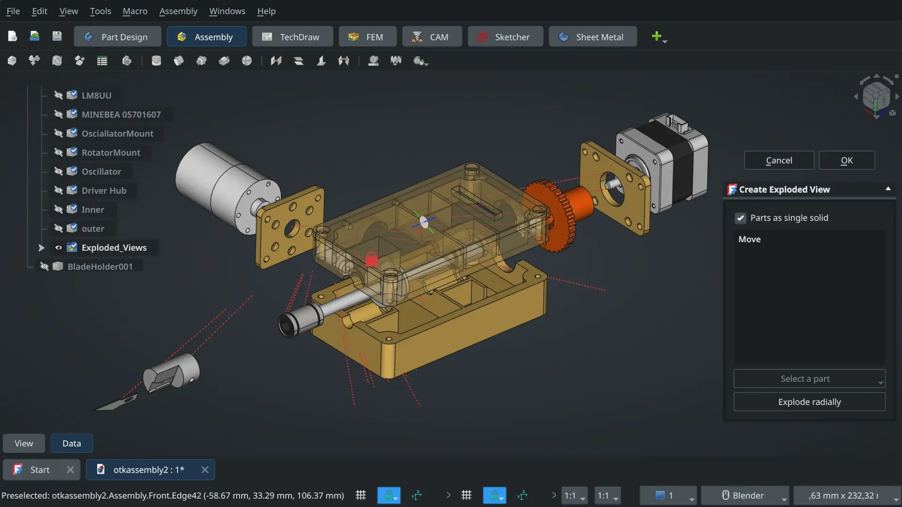
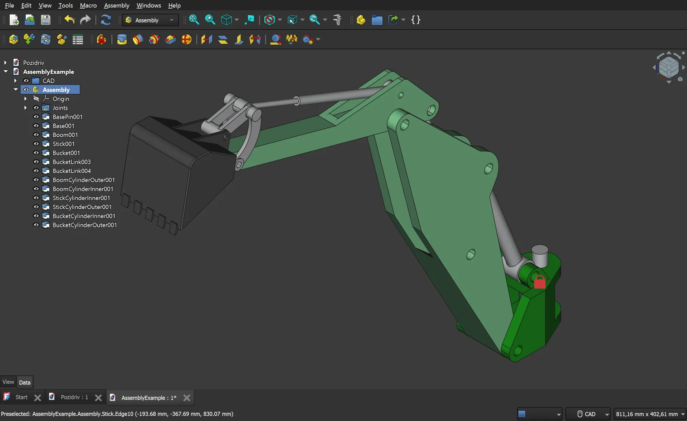
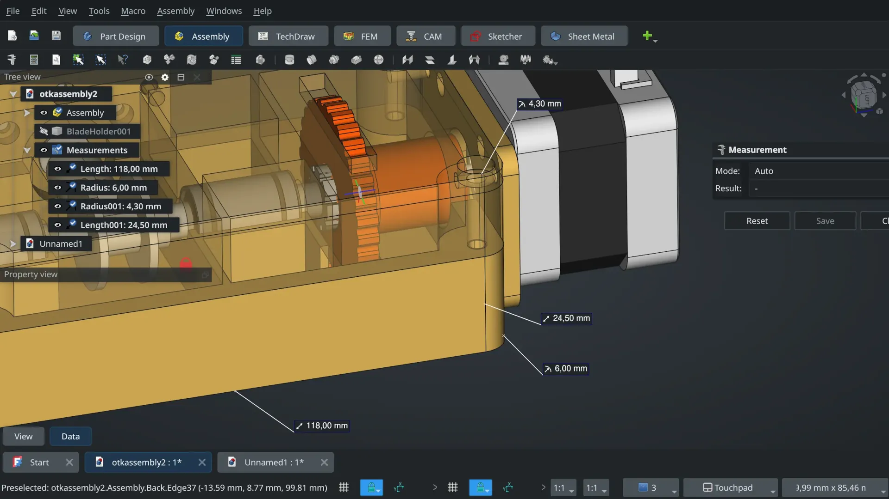
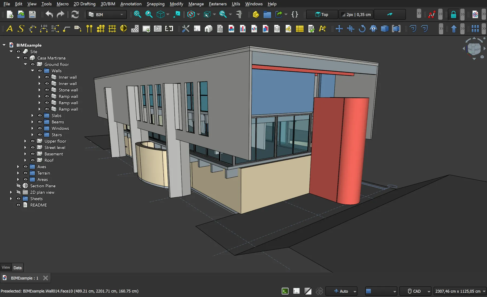
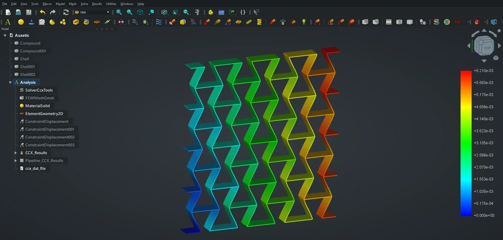

After more than 20 years of development, the 1.0 release marks a major milestone for the FreeCAD project.

With a strong focus on stability, usability, and long-requested core features, FreeCAD is now more powerful, flexible, extensible, and robust than ever before.






> [!NOTE]
> FreeCAD now tracks how individual sub-elements (faces, edges, vertices) evolve through modeling operations by building a history map that records whether elements were modified, generated, or deleted.
> This allows stable references to be maintained even as the underlying topology changes.

- The mitigation algorithm to the long-standing topological naming problem has finally been merged
- Models now better survive edits without randomly breaking dependencies
- Parametric workflows and complex design iterations are far more predictable, resilient, and effective



```cpp {file="src/Mod/Part/App/PropertyTopoShape.cpp"}
void ShapeHistory::reset(
    BRepBuilderAPI_MakeShape& mkShape,
    TopAbs_ShapeEnum type,
    const TopoDS_Shape& newS,
    const TopoDS_Shape& oldS
)
{
    shapeMap.clear();
    this->type = type;

    TopTools_IndexedMapOfShape newM, oldM;
    TopExp::MapShapes(newS, type, newM);  // map with all old objects
    TopExp::MapShapes(oldS, type, oldM);  // map with all new objects

// Look all objects in old shape and find modified object in new shape
    for (int i = 1; i <= oldM.Extent(); i++) {
        bool found = false;
        TopTools_ListIteratorOfListOfShape it;
        // Find all new objects modified from old object (e.g. resized face)
        for (it.Initialize(mkShape.Modified(oldM(i))); it.More(); it.Next()) {
            found = true;
            for (int j = 1; j <= newM.Extent();
                 j++) {  // one old object might create several new ones!
                if (newM(j).IsPartner(it.Value())) {
                    shapeMap[i - 1].push_back(j - 1);
                    break;

// Find all new objects generated from old object (e.g. face generated from edge)
        for (it.Initialize(mkShape.Generated(oldM(i))); it.More(); it.Next()) {
            found = true;
            for (int j = 1; j <= newM.Extent(); j++) {
                if (newM(j).IsPartner(it.Value())) {
                    shapeMap[i - 1].push_back(j - 1);
                    break;

// Find all old objects that don't exist anymore (e.g. face completely cut away)
        if (!found) {
            if (mkShape.IsDeleted(oldM(i))) {
                shapeMap[i - 1] = std::vector<int>();
```








- A brand-new built-in Assembly workbench powered by a modern solver
- Define constraints between parts with improved reliability
- Designed for real-world multi-part engineering workflows






- New light and dark themes for better comfort
- Smarter selection tools (filter vertices, edges, faces)
- Rotation center indicator for precise navigation
- Reworked panels, tabs, and preferences dialog
- Faster, cleaner start page










- Universal measurement tools available across workbenches
- Improved Sketcher and Part Design workflows
- More consistent behavior across tools






- A unified Building Information Modeling workbench with Native IFC support
- Better project structure, data handling, and building workflows
- Improved interoperability with other open BIM tools








- Expressions now support the vector API
- New ==App::VarSet== for managing design variations
- Expanded and cleaner Python API
- Improved Python editor and scripting workflow








- A new materials system for visual and physical properties
- Many enhancements across FEM and simulation tools












And so much more, by hundreds of contributors around the world!

**What to be part of this adventure too?** Join the [community](community) and [support](donate) its development.

As always, have fun and keep *FreeCADing*!