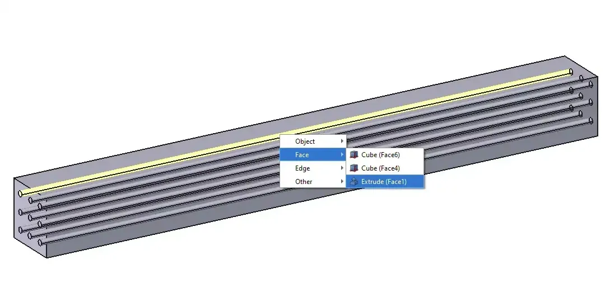
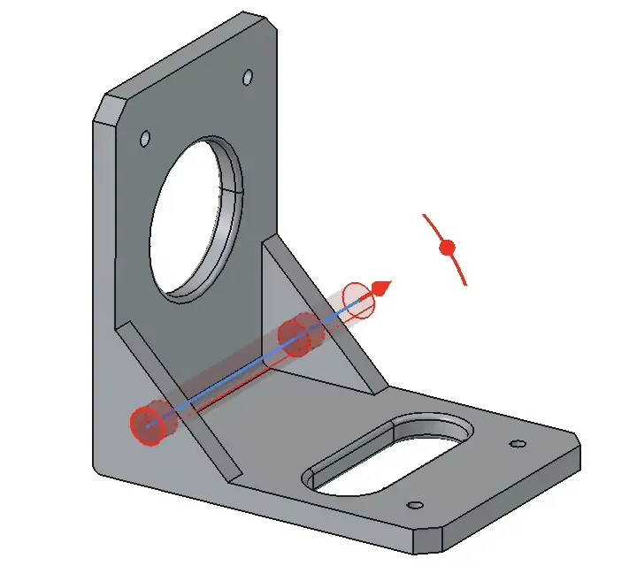
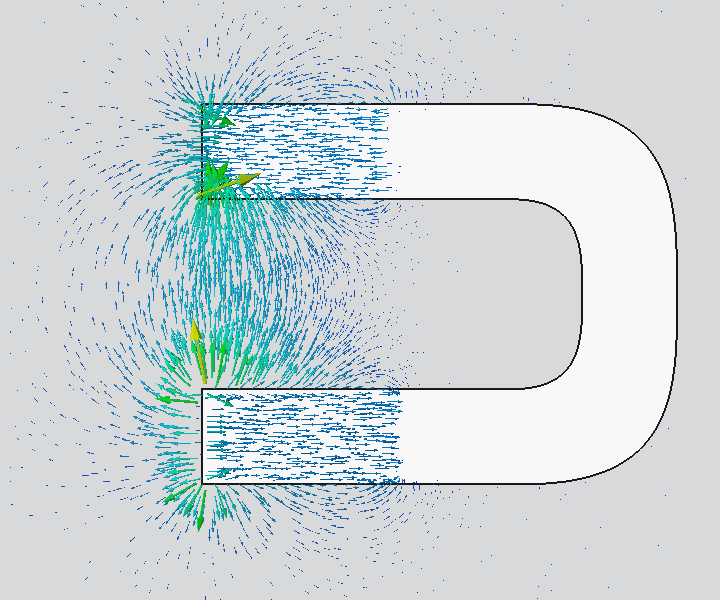
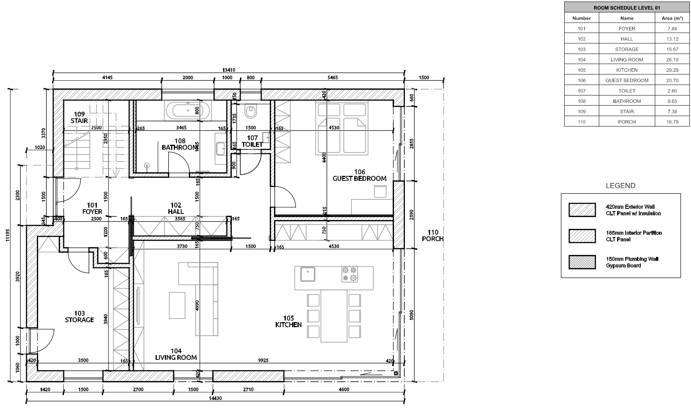
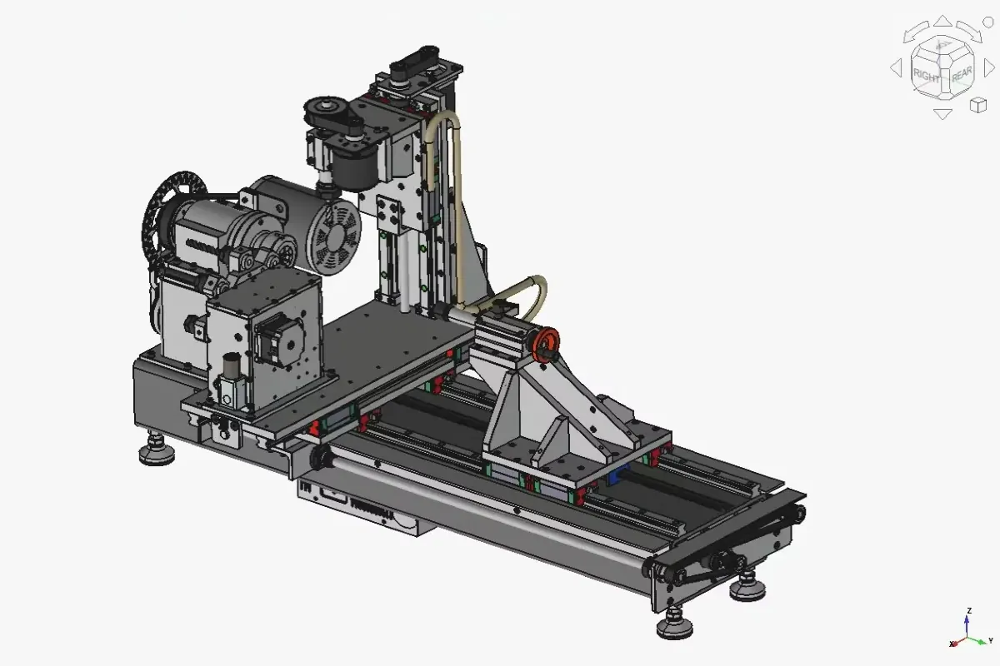

After one year and a half of continuous development, FreeCAD 1.1 builds on the 1.0 milestone with meaningful new tools and improved workflows across the board.

This release focuses on making everyday modeling more reliable, faster, and more intuitive — while expanding capabilities for hobbyists, advanced users and professionals alike.









- Three-point lighting improving rendering of models in the 3D view.
- Transform tool overhaul, with draggers, precise input, alignment, snapping, and target features.
- New Theme Editor and theme token system to easily customize stylesheets.
- Consolidated ==Add Property== dialog and Expression Editor with better completion and VarSet input.





- New tools and shortcut hints and quick measure in the Status bar.
- The new clarify selection enables temporary transparency to shows all nearby geometrical entities.
- Improved navigation controls, align to selection, and visual utility tools.
- New search in the Preferences Editor.







- Enhanced feedback during modeling and editing thanks to transparent previews and interactive draggers.
- Overhauled hole tool task panel, taper and thread support, and performance.
- Two sided mode for padding and different spacing in transform tools.
- New part insertion, simulation for joints motion and animations, and Bill of Materials for Assemblies.









- Projection, intersection, and external geometry in the Sketcher.
- Improved master sketch workflow via make internals for closed contours.
- Many usability and interface tweaks to streamline sketching workflows.







- New toolbit library and editor, better multi-pass support and post-processors introduced in CAM.
- FEM results now support animations, electrostatic analyses, and glyph filters.
- TechDraw has improved snapping, frame toggle, annotation, and dimension tools.





- View panel to view, interact, and manage the project spatial structure and 2D views.
- Interactive sun position and ray visualization for sites.
- Improved layers management with overrides, array tools, drafting objects creation and editing.





- Continued improvements to topological naming mitigation for greater model stability.
- Better Wayland support for Linux users.
- Faster startup and reduced memory usage.
- Numerous bug fixes across all workbenches.





And much more, thanks to hundreds of contributions from the community around the world.

**Want to be part of the journey?** Join the [community](/community) and [help shape](/donate) the future of FreeCAD.

As always — have fun and keep *FreeCADing*!