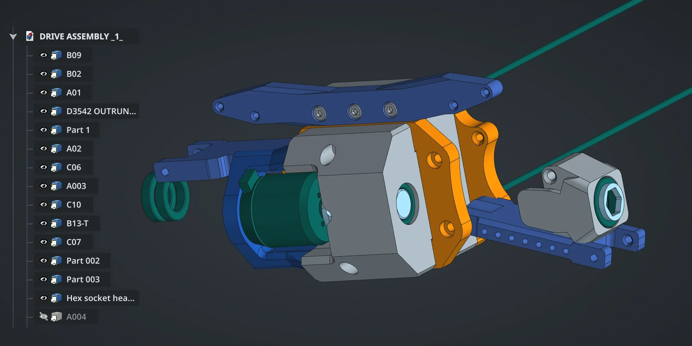
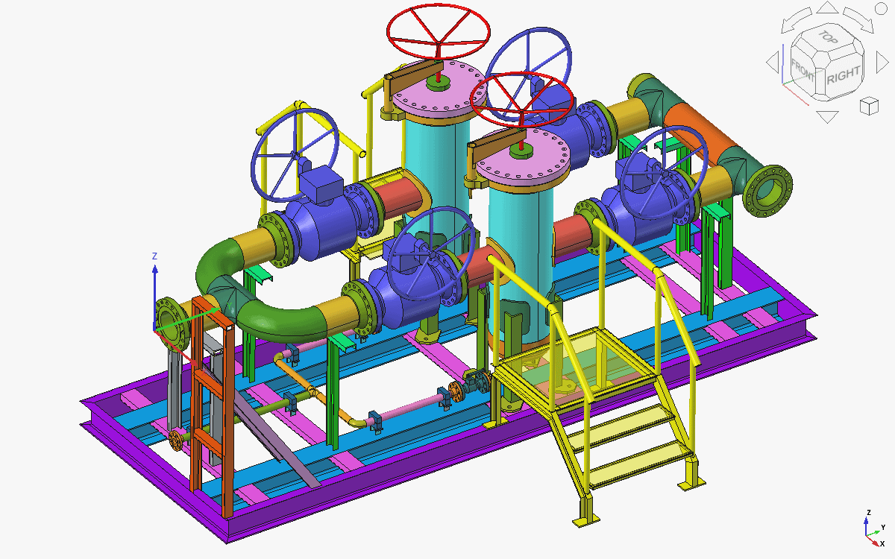
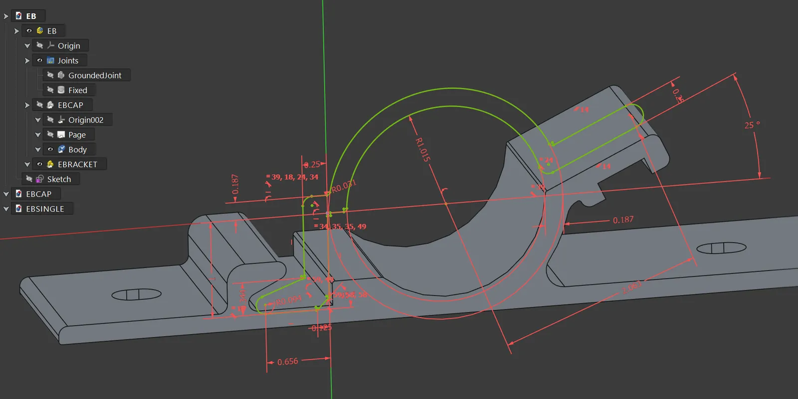
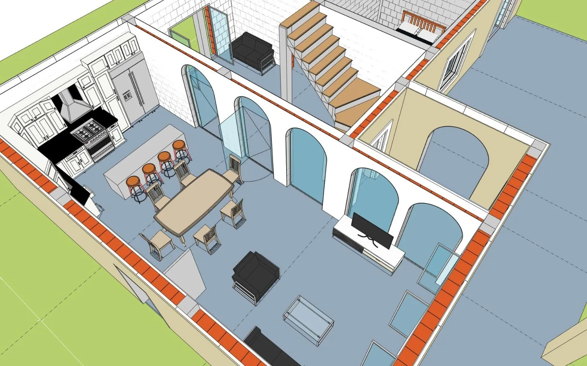





FreeCAD is made primarily to design objects for the real world. FreeCAD uses real-world units, from microns to kilometers, inches or feet, offers tools to produce, edit, and export solid precise models for 3D printing, CNC machining, 2D drawings, perform Finite Element Analyses, data and quantities for Bills of Materials.











FreeCAD features an advanced geometry engine based on Open CASCADE Technology. It supports solids, Boundary Representation (BRep) objects, Non-Uniform Rational Basis Spline (NURBS) curves and surfaces, and offers a wide range of tools to create and modify them via complex Boolean operations, fillets, shape cleaning and much more.











All FreeCAD objects are natively parametric, meaning their shape can be based on properties such as numeric values, texts, many data types, or even other objects allowing complex custom parametric behavior. All shape changes are recalculated on demand, recorded by an undo/redo stack, and allow to maintain a precise modelling history. New parametric objects are easy to code thanks to Python code that allows to perform just about anything in FreeCAD, from simple one-line commands in the integrated Python console to recording macros, developing custom tools up to fully featured workbenches.











FreeCAD allows to import and export models and data to dozens of different file formats such as STEP, IGES, OBJ, STL, DXF, SVG, SHP, DAE, IFC or OFF, NASTRAN, VRML, OpenSCAD CSG and many more, in addition to FreeCAD's native FCStd file format. Addon workbenches can also add more file formats.











FreeCAD offers dedicated workbenches for a variety of purposes such as CSG modeling, simple 2D CAD drafting, NURBS surfaces, architectural BIM modeling, 3D printing, CAM and CNC, point clouds, working with OpenSCAD files, designing industrial robot trajectories, doing Finite Element Analyses, and much more. FreeCAD also provides easy tools to install and manage Addon workbenches and macros developed by the users community.













FreeCAD is made for everybody, by everybody. Developed and maintained by a community of developers, users, professionals, hobbyists, translators, all united to improve and have fun with FreeCAD. No commercial driven decisions, no urge to upgrade or lock into a specific workflow or ecosystem. FreeCAD and the files and data produced are yours truly, forever!









