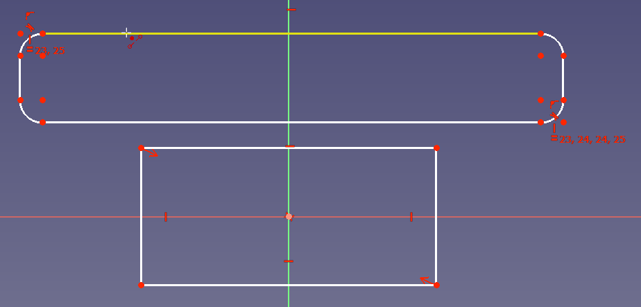
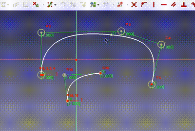
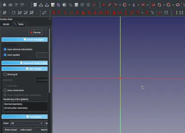

Of all the [new features](https://wiki.freecad.org/Release_notes_0.20) in the recently-released [FreeCAD 0.20](https://github.com/freecad/freecad/releases/tag/0.20), it's likely that the ones that will affect the most users are the improved tools in the [Sketcher workbench](https://wiki.freecad.org/Sketcher_Workbench).

### New Tools: Rounded Rectangles, Centered Rectangles, and Split

Several new tools were added in FreeCAD 0.20 to speed up common workflows.

- Centered rectangles define a center point with an automatically-added symmetry constraint.
- Rounded rectangles begin with equality-constrained filleted corners.
- The split tool splits a line into two sections but attempts to maintain any previously-set constraints.

### Spline Enhancements

Several improvements were made to the spline interface: most notably, it is now possible to add knots to existing splines:

Additional usability improvements include directly setting the degree of the spline on creation by pressing "D" to activate a the degree dialog, and using "Backspace" to delete the last-defined pole.

### Slot alignment options

The behavior of the slot tool has changed in FreeCAD 0.20: it is now possible to define a slot that is not axis-aligned by setting the centers of its two semicircles to any point in space. These points snap as expected when drawing, and auto-constraints are added if the slot is supposed to be aligned vertically or horizontally.

### Other Sketcher Improvements

There are dozens of other improvements in Sketcher for FreeCAD 0.20: you can read about many of them in the [Release Notes](https://wiki.freecad.org/Release_notes_0.20), and discuss their usage and get help in [the FreeCAD Forum](https://forum.freecad.org/).