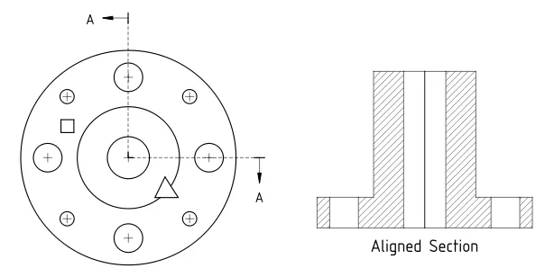
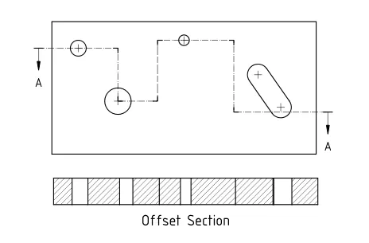

After [many person-hours of effort](https://forum.freecad.org/viewtopic.php?f=35&t=72026), last week a new type of section view, [Complex Section](https://wiki.freecad.org/TechDraw_ComplexSection), was added to the TechDraw workbench. This new type of section allows essentially arbitrary cross-sections to be extracted from 3D geometry and displayed in TechDraw by specifying a specific object as the "profile object" to use.

According to TechDraw's lead developer, "wandererfan":

> The premise is that the user generates a "cutting profile" using Sketcher or Draft, anything that will create a wire or edge. This profile is extruded into a cutting tool that is used to remove material from a source shape. You can make a stand alone ComplexSection feature, or one based on an existing view.

This feature is available for beta testing in FreeCAD's various Nightly and Weekly builds, and will be included in the next major release of the software. Thanks to wandererfan and all of the FreeCAD Forums members who helped to test and improve the feature in preparation for its release.