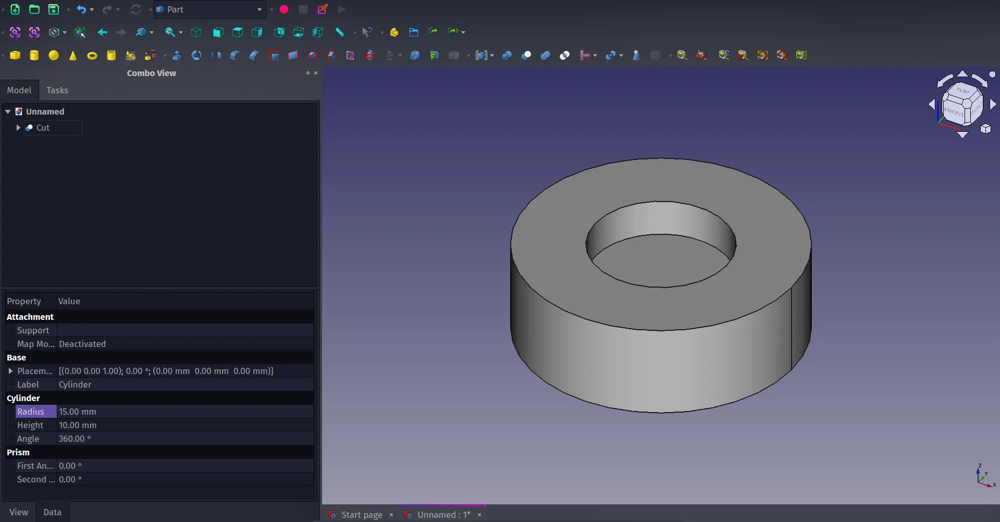
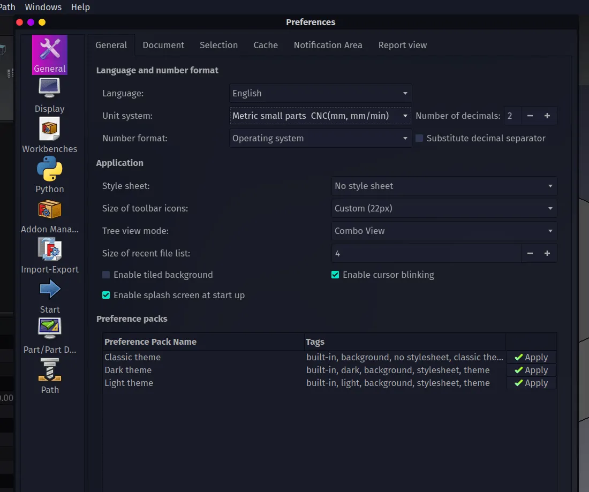
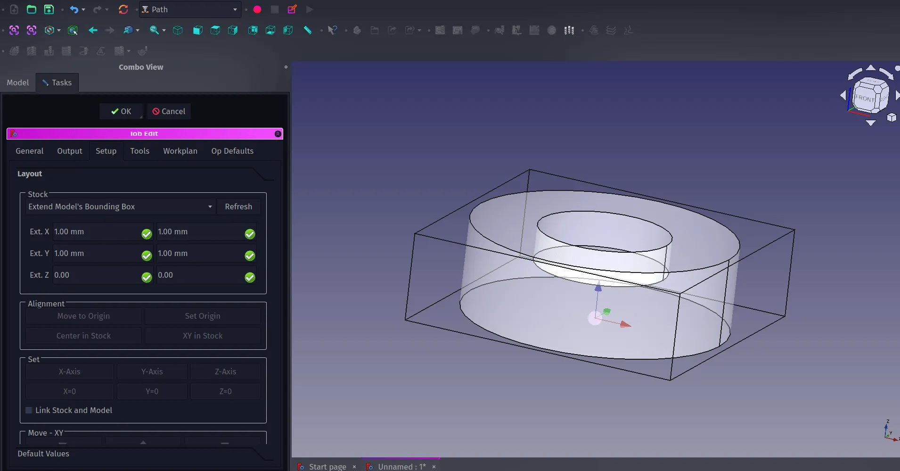
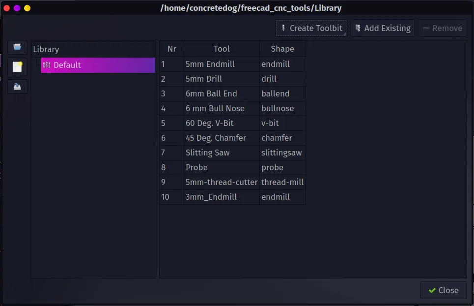
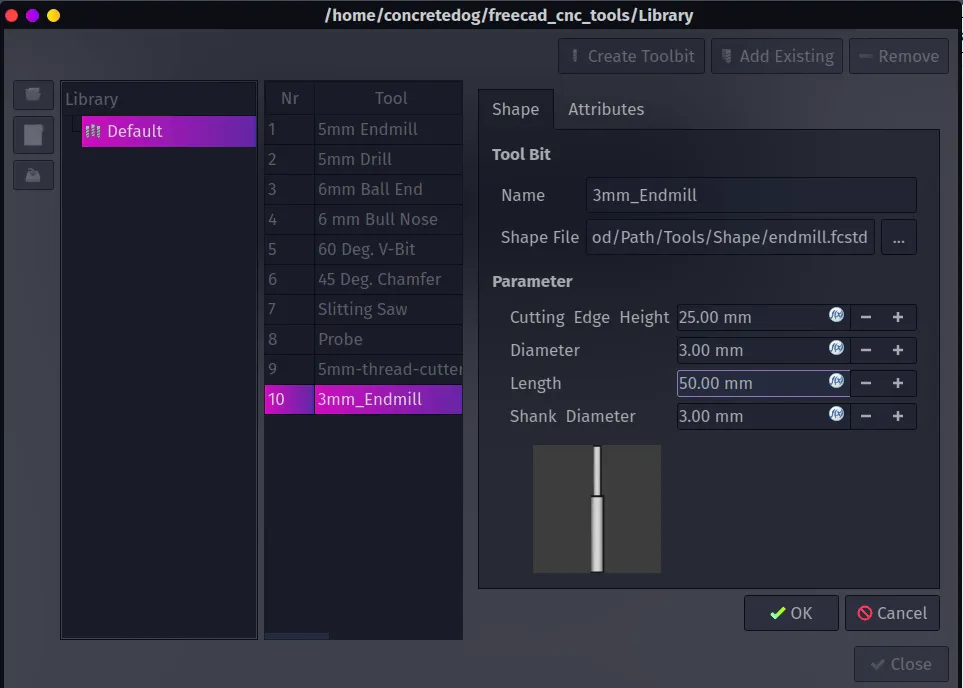
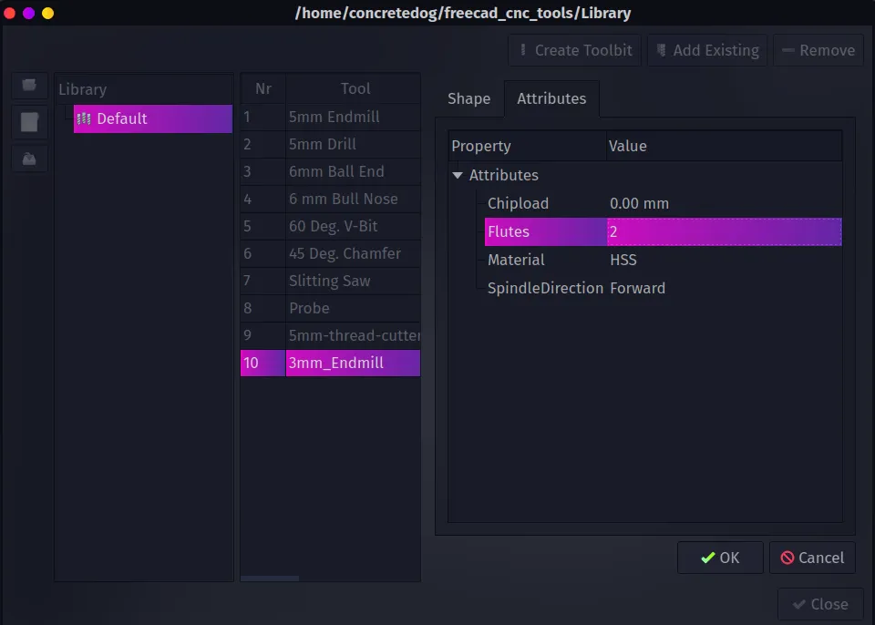

The [Path workbench](https://wiki.freecad.org/Path_Workbench) in FreeCAD can help you create tool paths for CAM for a wide variety of CNC machines and G-code families. Let's walk through how to begin using this workbench in this first part creating and curating custom tool bits. In part two we'll continue setting up cutting operations and look at exporting G-codes for our machines.

As a simple example object to work with, in a new project, move to the Part workbench and create a 30mm diameter cylinder that is 10mm tall. Create a second smaller diameter cylinder, say 15mm diameter and right click, select transform and move the smaller cylinder upwards a little so that when we cut it out of the larger cylinder it leaves a small pocketed area. Finally select the larger cylinder in the combo view, then use control and select the smaller cylinder and then click the boolean cut tool. You should now have a flat cylinder with a circular hole or pocket cut part way through.

Next, let's move to the Path Workbench. As a note about how this tutorial is written, whenever we say to click on a "Tool Icon" we use the name of the tool icon as it appears when you hover/rollover the tool icon and the description appears. This means you'll need to hover over lots of tool icons to find your way around a new workbench; an excellent way to discover the tools! We've used FreeCAD version 0.21.1 for this tutorial.

If it is the first time you have run the Path workbench, when you select it from the drop down workbench menu you will see a dialogue requesting that you change the unit system to "Metric Small Parts/CNC(mm, mm/min)". This is used because when we set the feedrates for individual tools and operations you will set how fast the tool moves in millimetres per minute. To make this change click "Preferences" and on the "General" tab set the unit system to "Metric Small Parts/CNC(mm, mm/min)".

In the Path workbench we will need to create a "Job" item. The "Job" item in the combo view contains all the different information needed for an entire CAM job. It can contain one or more tool paths or cutting operations as well as the information about which tools are being used and how fast those tools are travelling and more. To create a Job, select the "Cut" object in the combo view and then click the "Job" tool icon. We'll skip over the "Create Job" dialogue for now but it should have the "Cut" item checked in a checklist, simply click "OK" to create the "Job" object. You should now see that the preview window looks a little different with a grey version of our "Cut" object surrounded by a set of lines forming a box, the greyed version of our target object is a clone of the original which is held inside the "Job" drop down. Also the combo view should now contain the "Job Edit" dialogue. At the top of this dialogue you should see the "Stock" panel. In this you can change the size of the bounding box of lines around our clone "Cut" object. This represents the size of the stock material we would fit to our CNC machine so you can adjust this to match what you need. For example if we were cutting out this 10mm high cylinder object on a CNC router we might actually use 10mm thick stock material and not face cut the upper and lower surfaces to size, therefore we could change our stock bounding box Z axis values to 0 and 0, this would then make the bounding box the exact thickness of our "Cut" object.

The Path workbench has a small collection of built in tools, in this instance the tools refer to the actual cutter that would be placed into the CNC machine to do the work. There is a huge range of tools available in reality so it's important to be able to create tool profiles to match what we have available for our machines. Clicking the "ToolBit Dock" tool icon for the first time you will be asked to set up a location on your system to store your personal tool library. You can set this up at the suggested path, or you can set a custom path. If you set up a custom path outside of your FreeCAD installation you can then easily migrate your tool collection to new versions of FreeCAD. Once created it will ask if you want to copy over the example default tool geometry files, this is worth doing as it simplifies creating a common range of new tools.

To add a new tool click the Path drop down menu and select the "ToolBit Library Editor." It's worth identifying a tool in your collection you want to use and perhaps grabbing a set of calipers to measure the various aspects of the tool we need to create the Toolbit item. As an example we can add a 3mm endmill. In the ToolBit Library Editor dialogue click the "Create Toolbit" button. As we want to create an endmill select the "endmill" file in the "Select Tool Shape" window. After selecting the shape of the tool the next window requires you to give your tool a name. We named our example "3mm_2Flute_endmill".

You should now see the new tool entry in the ToolBit Library Editor or the dock toolbit area. Double click on the new tool and this will open the "Shape" and "Attributes" tab. In the shape tab you add the dimensions of the tool. So for example our 3mm endmill was in total 55mm long with a 25mm long cutting edge, the diameter was 3mm. Moving to the "Attributes" tab you can set various things including the number of flutes (which we set to 2 to match our endmill) and the tool material between HSS tooling and Carbide tooling.

Unlike some other CAM programs the FreeCAD Path workbench doesn't attach speed and feedrates to each tool in the library, when we add a tool to a job we will automatically create a tool controller object into which we can add speeds and feedrates. This makes sense as our speeds and feeds for the same tool bit might be wildly different in use on different materials and or different machines. We'll look at this and finish off making some simple paths and exporting G-code in the second part of this introduction to the Path Workbench.