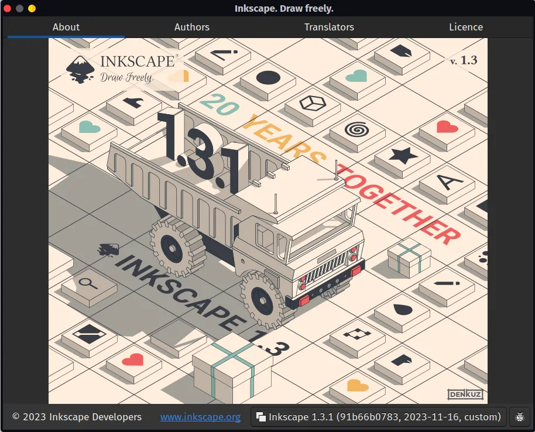
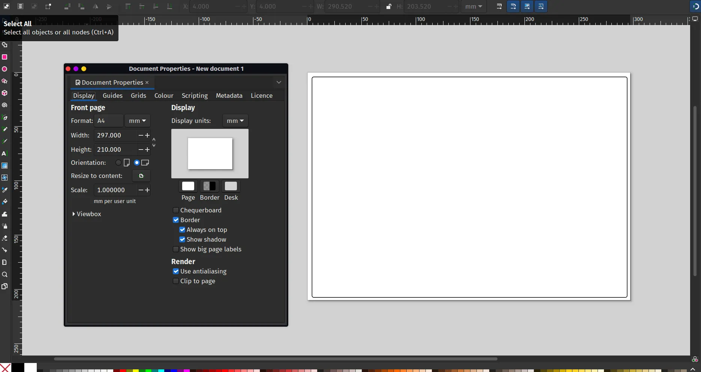
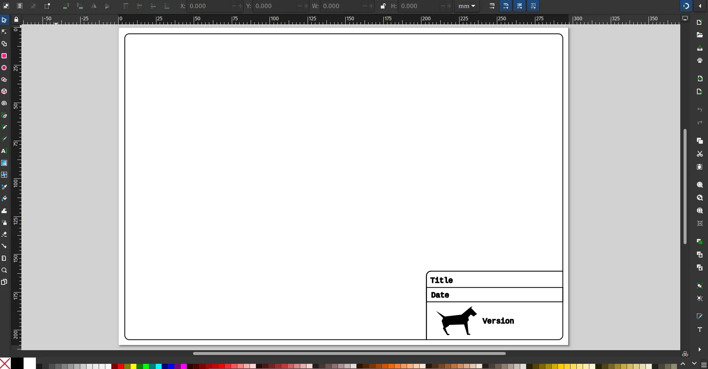
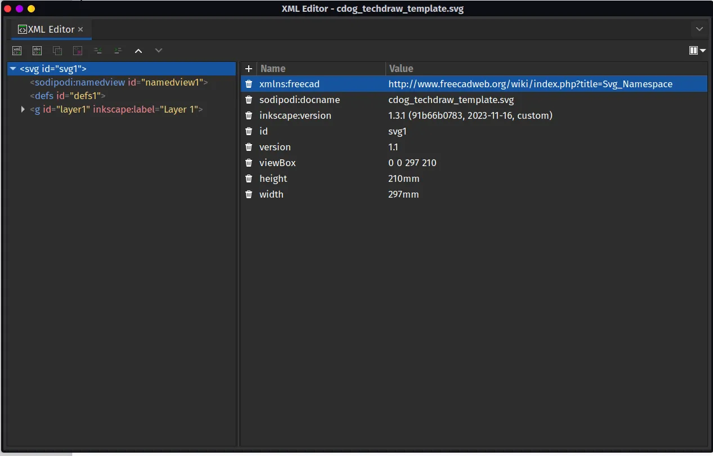
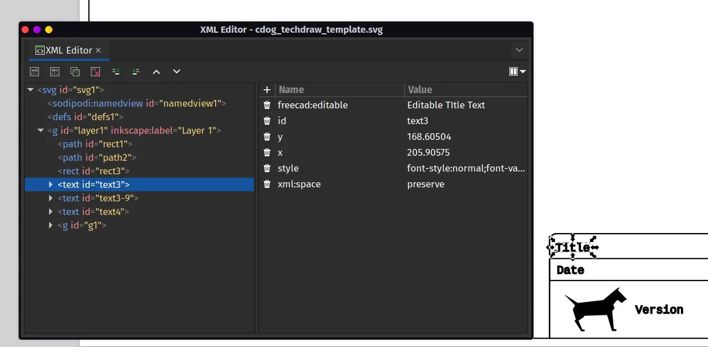
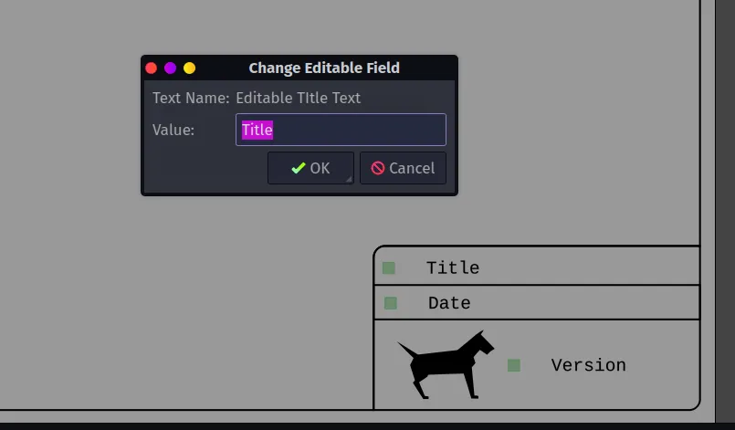
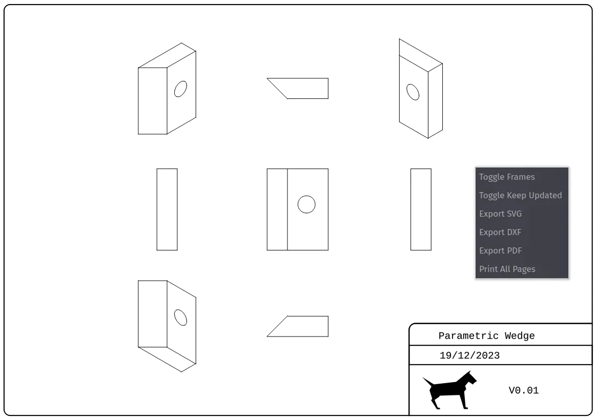

The Technical Drawing or [TechDraw workbench](https://wiki.freecad.org/TechDraw_Workbench) is an integral part of FreeCAD allowing us to create beautiful technical drawings of our parts or assemblies. In a world of CNC milling and 3D printing it's still essential at times to be able to supply someone with a technical drawing to help plan the making of a part. A technical drawing can also be extremely useful as part of documentation and could form part of a technical standard for a project or product, so it's important to be able to create technical drawings that meet our needs.

In FreeCAD the TechDraw workbench has a nice collection of page templates for us to use to insert our part views, dimensions and other technical information into. In a stock FreeCAD installation when you use the "Insert Page Using Template" you get to choose between an array of standard templates. However you can create and add custom templates allowing you to have precisely what information you need as well as personalised branding and anything else you require. Let's look at creating such a template using some of the techniques described in the [official template documentation](https://wiki.freecad.org/TechDraw_TemplateHowTo) and using the excellent, free and opensource [Inkscape](https://inkscape.org/).

For this mini tutorial we've used Inkscape version 1.3.1 and FreeCAD version 0.21.1. Also, as a reminder, when we describe a tool and a tool icon in either Inkscape or FreeCAD we'll use the rollover text description as the name. This hopefully encourages you to explore all the tool icons in a given environment as you look for the one you need.

Starting in Inkscape let's set up a document using "File-Document properties..." to the overall dimensions we require. We've used an A4 canvas in Inkscape set in landscape orientation. We have created a fairly simple template design by first adding a large rectangle that sat 4mm from the edge of the page at each side with radius corners of 3mm.

Next we drew a small rectangle at the lower right hand corner of the page snapped to the lower right corner of the page. The smaller rectangle again had 3mm radius corners but we then, group selecting the large and the small rectangle used the "division" tool from the "path" dropdown menu to remove the portions of the smaller rectangle that sat outside the larger one.

This lower right hand area is where we are going to place a logo and some text that will be editable later in FreeCAD. We created and placed smaller rectangles into this area to form 3 smaller areas and used the "Text Tool" to add some place holding text. This text describes what each box area should be eventually be edited to contain, we went with Title, and Date. In the lower larger area we imported a small logo and added some placeholder text that will become a version number for the drawing.

Now that our design looks like what we want we need to use Inkscape's XML editor to make it work correctly in FreeCAD. Fuller instructions are available on the official documentation but let's step through the basics here. First of all open the XML editor by selecting "XML Editor" from the "Edit" dropdown menu. In the XML editor window you'll see a panel on the left hand side where the first line reads something similar too `<svg id="svg1">`. Highlight this line by left clicking on it. In the right hand side of the XML editor you'll now see a list of attributes under 2 column headers labelled "Name" and "Value". In the upper left hand corner you should see a "+" tool icon next to "Name". Click this to add an attribute. In the "Name" section of the attribute you created add "xmlns:freecad" without the quotes and in "Value" section you need to add [Svg_Namespace](http://www.freecad.org/wiki/index.php?title=Svg_Namespace "Svg_Namespace").

Back on the left hand column of the XML editor we now need to left click the lower dropdown menu which will have a label similar to `<g id ="layer1" inkscape:label="Layer 1">`. In the dropdown you should find a list that represents all the items in your drawing. If you left click to highlight items you should see that the item is selected on the actual drawing on the Inkscape canvas. This is useful to identify which text or graphic item is which when working with the XML editor. You can also do this in reverse, selecting the text or item on the canvas highlights the corresponding line in the XML editor.

If you have added static text there is no need to make any adjustments to the XML but for the text in our example we want it to be editable. Select your target text item you want to make editable in the XML editor and then add an attribute to this text item. In the "Name" section you need to add "freecad:editable" and in the "Value" section you can add a recognisable description such as "Editable Title Text". Repeat this for all your editable text items.

You now need to save your Inkscape project as a plain SVG, save it to any folder of your choosing.

Finally you need to check that the template opens and works correctly in FreeCAD. In a FreeCAD project open up the TechDraw WB and then left click the "Insert Page using Template" icon. Navigate to your saved template and select it. You should see a "Page" item is created and in a new tab in the preview pane a technical drawing is created with your template.

You'll note there are some small boxes next to the text items when the TechDraw preview has frames active. Clicking these allows you to edit the field and replace the placeholder text with the correct information for your project. You can also right click and use "Toggle Frames" to switch frame visibility. When you eventually export your technical drawing (right click on the preview and select the export type) the resulting technical drawing won't have the little square marker buttons.

There's lots of information and lots of user guides out there for using the TechDraw workbench. As well as the [official documentation](https://wiki.freecad.org/TechDraw_Workbench)it's well worth joining and reading the [TechDraw specific section](https://forum.freecad.org/viewforum.php?f=35&sid=edc5ab54e7d4028bef35b2009b4aeb27) on the [FreeCAD forum](https://forum.freecad.org/).