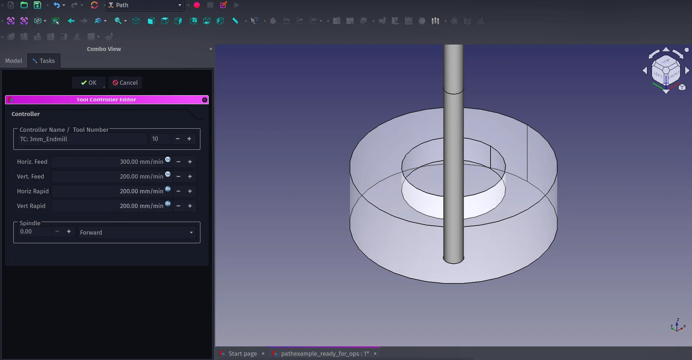
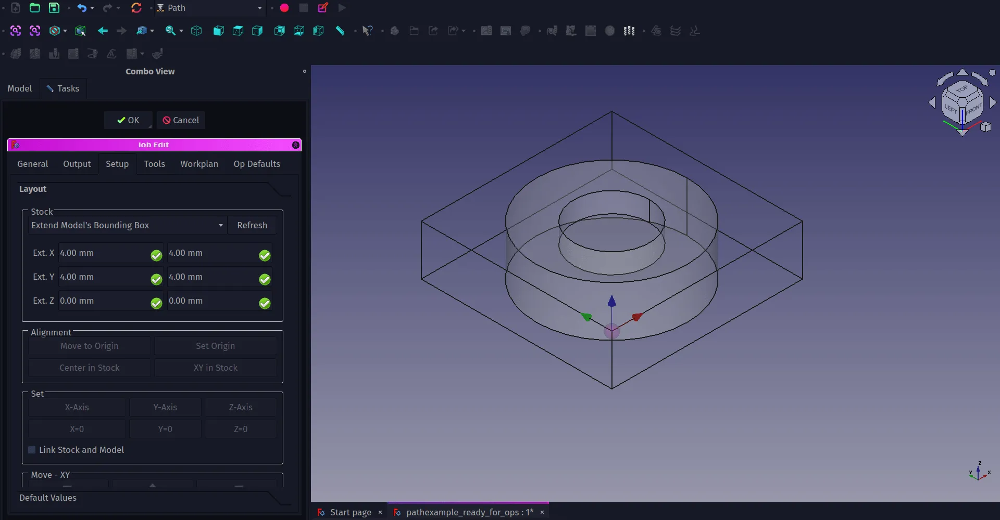
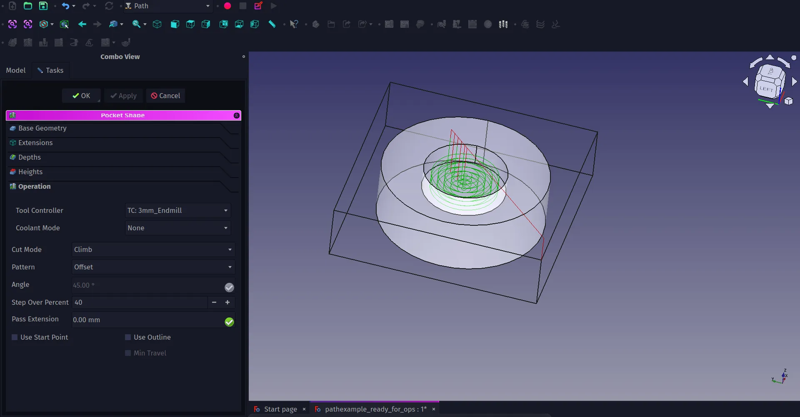
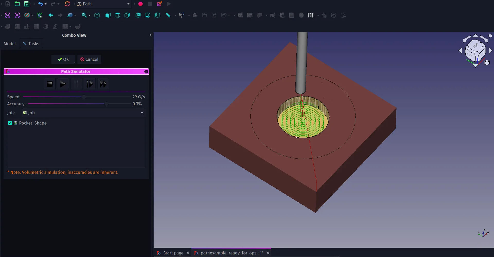
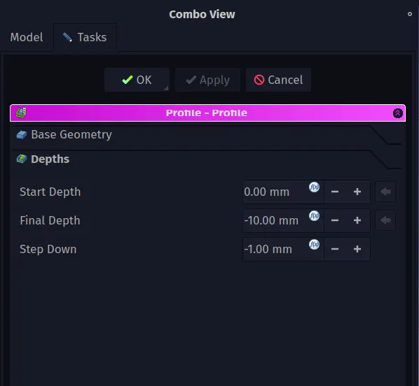
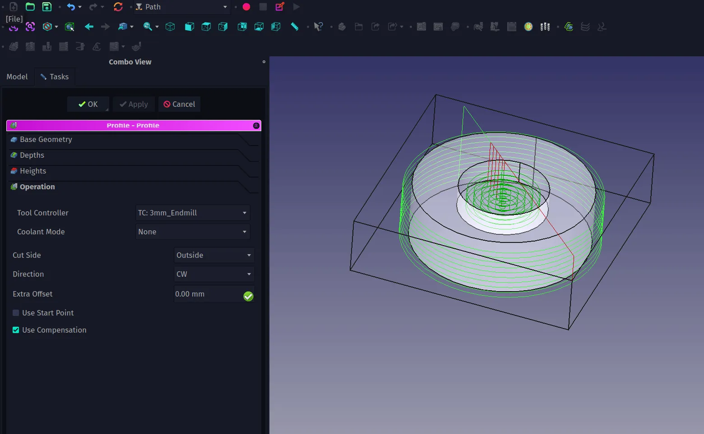
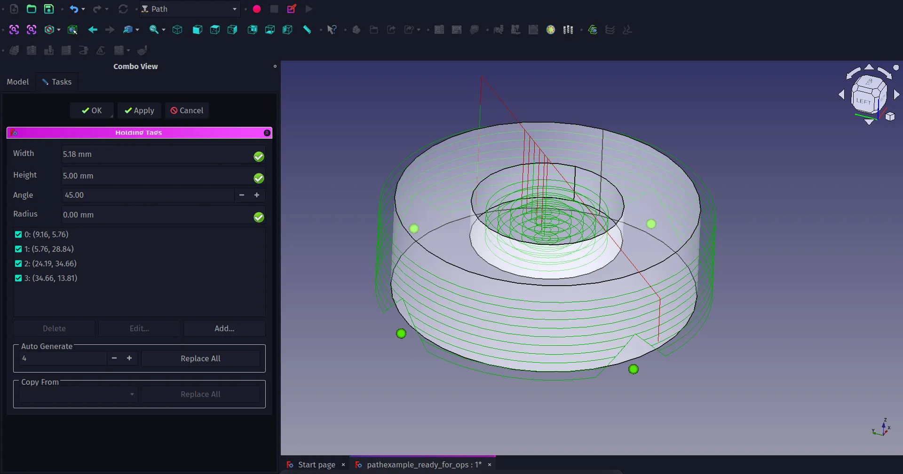
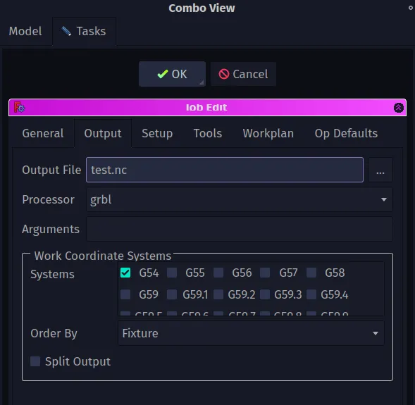

In the [first part of this tutorial](https://blog.freecad.org/2023/11/24/tutorial-getting-started-with-the-path-workbench-part-one/) we looked at setting up the Tool Bit Library when running the Path WB for the first time and creating a custom 3mm endmill tool. As a reminder in these tutorials we will describe tool icons by the text description that is displayed when you rollover an icon. This means you'll have to explore the rollover texts which is a great way to explore the basics of what tools are on each workbench. Also, as a reminder, this tutorial was written using FreeCAD version 0.21.1.

Continuing from where we were at the end of the first section, in the combo view you can now see the TC:3mmEndmill object. In the TC:3mmEndmill dropdown you can see the 3mm_Endmill object. If you double click on this you will see the shape and attributes dialogue where you can make changes, although its probably more common practice to change shape and attributes in a new tool in the tool library editor. You'll see in the preview window that you have a basic model representation of your 3mm_Endmill tool bit. You can toggle the visibility of this in the preview window in the usual way by highlighting the 3mm_Endmill object in the combo view and clicking the space bar.

Back in the combo view if you double left click the TC:3mmEndmill object, where "TC" stands for "Tool Controller", you can see the "Tool Controller Editor" window and it's in here that we can set the feed and speed rates for our tool. Obviously we can't state what these should be as it's dependant on your cutter geometry, the material you are cutting and the machine you are using. The Path WB is really useful in that it separates the tool library object and the tool controller. This means that, sensibly, you can use any tool multiple times in either the same job or across numerous projects setting the feed rates in each instance rather than having a library full of tools that have the same geometry but wildly different feed rates for different materials. A good example of this is you can use the same tool with two different tool controllers to create a "roughing" pass where the tool moves faster and removes material quickly and a second "finishing" pass where the tool makes a high quality light cut travelling slowly and removing less material.

With our tool, tool controller and feed rates set we can begin to create operations and toolpaths. There are lots of different operation types and they are described well over on the [Path WB documentation page](https://wiki.freecad.org/Path_Workbench). For our simple object we can create a "Pocket" operation to mill out the central area and we can create a "Profile" operation to cut the outside geometry of our object. We'll also finally look at adding tags, small modified areas the toolpath avoids cutting fully through, to keep the object connected to the stock rather than becoming loose on our machine.

When we created the job in the first section it created the "Job" object in the combo view. If we double click the Job object we can then move to the "Setup" tab in the "Job Edit" dialogue which appears. One thing we need to consider is the origin point for our operations, this will be the point from which our tool begins its operations. Usually by default we will see that the origin point is at the 0,0,0 co-ordinate of the XY and Z axis. You should see the "axis cross", the object made from blue, red and green arrows aligned with each axis. The axis cross will be sat right in the centre of the base of our object. We probably, for this job, want the origin point to be in a known position on the top surface of our stock so that on our machine we can zero the tip of the tool to this point. To do this highlight a corner of the job bounding box and on the "setup" tab then click the "Set Origin" button in the alignment section.

On the "Model" drop down is the "Model-Cut" item which is a copy of our object which was created when we made the Job item. For next section where we create operations we are going to use this Model-Cut copy rather than the original "Cut" item which should be greyed out and not visible. Double check this is the case, the original cut object should be toggled to non visible and the "Model-Cut" object should be visible.

To create the pocket first lets select the face that is the base of the cutout section on the Model-Cut object. Then click the "Pocket Shape" tool icon. Once pressed a small dialogue with a drop down menu will ask you to select the tool controller you want to assign to the operation, select the TC:3mm_Endmill option. You should now see a "Pocket Shape" dialogue in the combo view. The Pocket Shape dialogue has numerous tabs and should automatically be open on the lowest tab "Operation". Within this tab are the fundamental options for the operation. Of course this differs on what type of operation you are creating. For a pocket operation one of the common options to play with is the "Pattern" by default this is set to "ZigZag" but for creating a cylindrical pocket you might opt for an "offset" path instead. Select the offset option in the "Pattern" drop down and set the step over percentage to perhaps 40%. You may well want to adjust other aspects of the operation before applying it. Moving to the "Depths" tab we can adjust the final depth of the pocket cut if needed but it will default to pocket clearing to the face geometry we selected, in our case -4mm. Also on this tab is the "Step Down" value which is the depth of cut on each pass, this defaults to a step down value equal to the tools diameter, so in our case 3mm. This may be far too deep a cut dependant on your machine or the material so may need adjusting. Click the small icon in the corner of the input box and clear the "OpToolDiameter" value and then you can set the step down to whatever you chose, we went with 1mm to make the pocket operation complete in 4 passes. You can now hit Apply, or OK and you'll see the green lines of the toolpath appear. Notice that the tool travels to a safe height over the work before beginning it's cuts. Back in the "Pocket Shape" dialogue you can click on the "Heights" tab to set the safe and clearance heights to suit your work setup.

With the pocket tool path created you can now click the "CAM Simulator" tool icon to simulate the pass. Once clicked you will see the bounding box is now filled with stock material in the preview window and you have a set of controls in the combo view. You can reduce or increase the speed of the simulation and also the quality. Reducing the quality of simulation is a good idea on slower performing systems. Clicking play you should see the pocket operation take place. If you click OK after the simulation you create a new object which is the cut stock, you can toggle the visibility of this item or delete it as needed.

Setting up a profile operation is a similar process. If we click the outer edge on the top of our object we can then click the "Profile" tool icon. A familiar looking dialogue appears called "Profile-Profile" we can see the same heights, depths and other familiar tabs from the Pocket operation. This dialogue opens on the "Operation" tab and we can set which side of the geometry we are going to cut on, so in this case "Outside" we can set the tool controller, and we can set other options such as direction and offset. Offset is useful for if we want to do a profile cut slightly larger than the desired object size we can offset the operation, then we could add a finishing operation separately to bring the object to size.

As we have selected a single edge we need to give the profile operation a target depth to cut too. On the "depths" tab we can click the formula editor icon in each input box to clear the default values of the start depth, final depth and step down. We can then set the depths to what we require, so we have a start depth of 0mm, a final depth of -10mm and a step down of 1mm. Click apply to see the paths in preview and OK to close the dialogue.

Depending on the work holding methods we use on our target machine, it's worth quickly looking at adding tabs to a profile toolpath. Tabs are where material is left uncut to keep the part connected to the stock material so it isn't thrown out of the machine. In the combo view we can highlight the "Profile" operation object we just created under the "Operations" dropdown. Next click "Path - Path Dressup -Tag". This should automatically create 4 triangular tabs in profile toolpaths. You can adjust the dimensions and geometries of tabs and increase and decrease the number of them and the placement of them in the "Holding Tags" dialogue. When you are happy with the tags click the apply or OK button. Notice that a "Dressup Tag" object is created and the profile object is now nested in it's drop down. You can now use the simulator again to view all the toolpaths and check your tag geometry and placement.

Finally to create G-Codes to send to our machine we need to look at the output options. In the combo view double click the main "Job" object and in the "Job Edit" dialogue move to the "Output" tab. In this we can set up which post processor to use to create G-codes compatible with our machine. There are lots of post processors available, our target machine runs on GRBL so we selected GRBL from the list. Finally we use the "Output File" input box to set up a filename and location. We then click OK. To create the G-code using the selected post processing and save it to the specified file we highlight the "Job" item and then click the "Post Process" tool icon and save our file.

We've covered the basics in this two part tutorial. As with many workbenches there are lots and lots more tools and features available and it's definitely worth looking around both the [official documentation](https://wiki.freecad.org/Path_Workbench)and also the dedicated [Path/CAM forum](https://forum.freecad.org/viewforum.php?f=15) area.