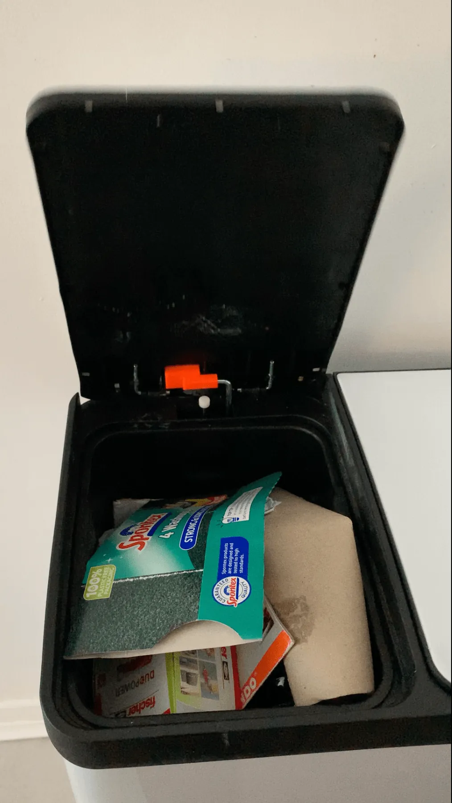
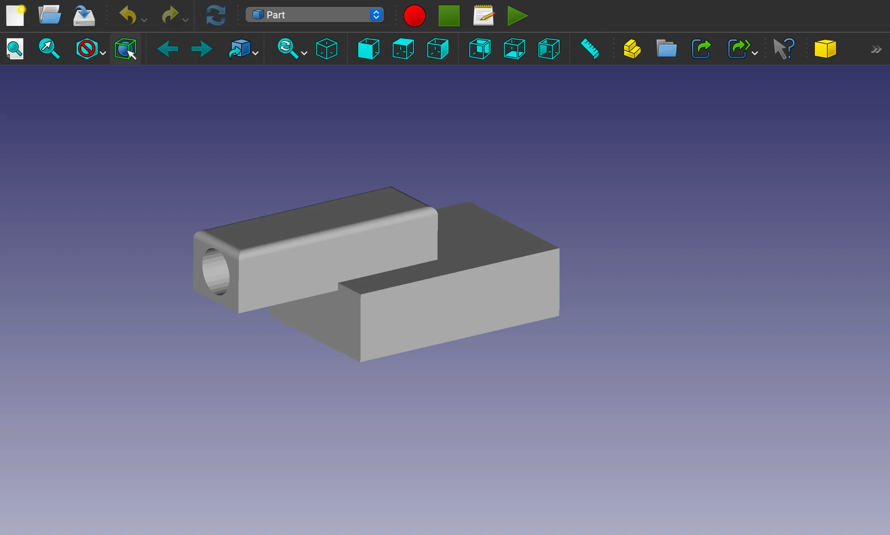

It's wonderful to see people taking their first steps in CAD using FreeCAD and it's even better when someone's first project is to create something useful. In this case, new to FreeCAD Angharad, was motivated to learn to mend a faulty kitchen bin which she really liked.

Chatting with Angharad she outlined the motivation to learn and how she found the process.

  "*I had never done any CAD before, It had always appealed to me but I found it quite intimidating to get started so when I learned about FreeCAD I thought I'd give it a go! I was renovating the kitchen in my first home and spent a bit too much on what I thought was a decent bin that suited the space. It was a pedal bin that had two compartments fitted with independent pedals. After a couple of months the plastic part that connected the pedal mechanism to the bin lid on both sides had snapped so the pedals no longer worked.*

  *I tried repairing the bin with different bits I had around the house but nothing worked so when I started attending a local makerspace and learned about Free CAD I was encouraged to have a go at designing a part that would fix the pedal mechanism.*"

Angharad used Sketcher and the Part Design to design a replacement glue in section for the plastic part that had broken. Whilst not a hugely complex part it needs a variety of CAD approaches, sketching on faces, extruding and pocketing as well as chamfering. It certainly is enough of a project as when totally new to CAD. Angharad then learnt how to 3D print the design in her local makerspace using PETG to print the component. Finally she used epoxy resin to glue the replacement part into place.

When asked, Angharad seemed to have enjoyed her first experience of FreeCAD and is keen to explore and learn more.

 "*I found the FreeCAD interface quite intuitive after a couple of test pieces which meant that once I had created the basic shape of my design, the process of refining and altering felt very easy. The variety of specific functions to build and shape your design also makes the software feel very user-friendly. I will definitely continue to use FreeCAD, I feel I've barely scratched the surface and It's already saved me money and allowed me to be more sustainable in repairing something rather than replacing it, I look forward to further developing my skills and finding out what else it can do!*"