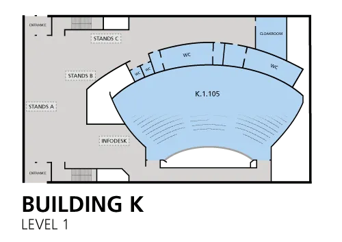

This weekend in Brussels lots of members of the FreeCAD community will be at [FOSDEM](https://fosdem.org/2024/), the amazing free event for all things opensource. If you are attending FOSDEM please come and spend some time at the FreeCAD stand which will be in the K Building. We have some excellent neighbours, [Pine64](https://pine64.org/) and [Prusa](https://www.prusa3d.com/) and we hope that FreeCAD sponsors [Libre Space Foundation](https://libre.space/) should also have a presence in this space.

As a reminder FOSDEM runs from 9 am on Saturday with [it's amazing program of speakers and talks](https://fosdem.org/2024/schedule/). On Sunday FreeCAD core developer Yorik will be delivering a [FreeCAD State of the Union](https://fosdem.org/2024/schedule/event/fosdem-2024-3086-freecad-state-of-the-union/) address. If you want to check this out it will be at 10.15 in room H1308 (Rolin).