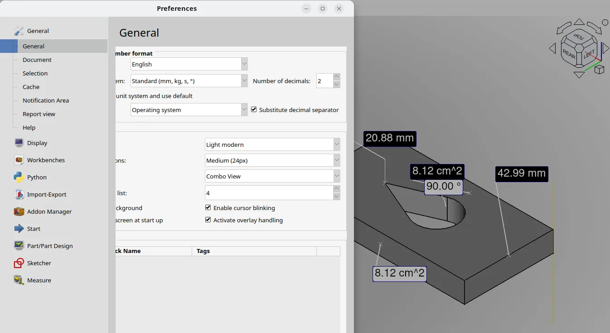
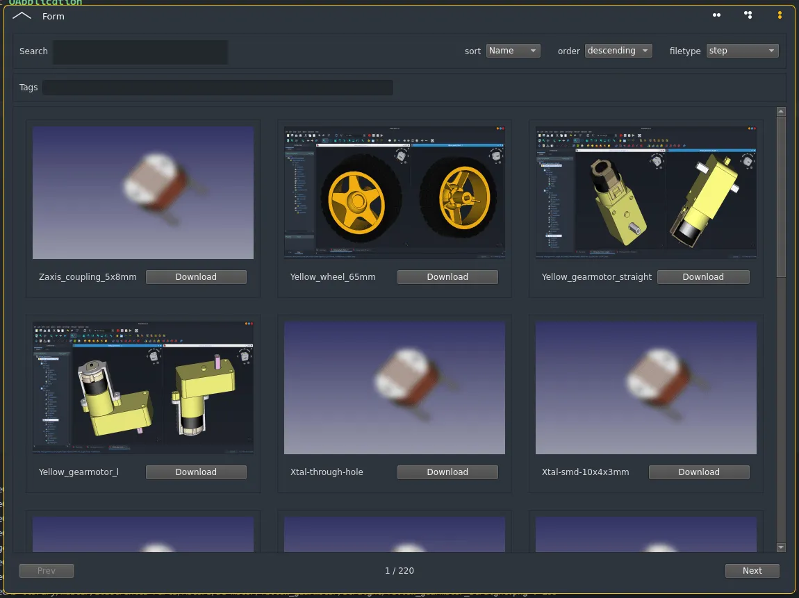
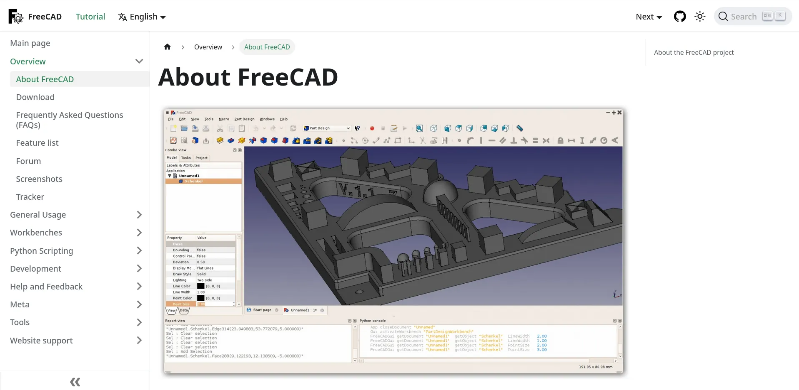
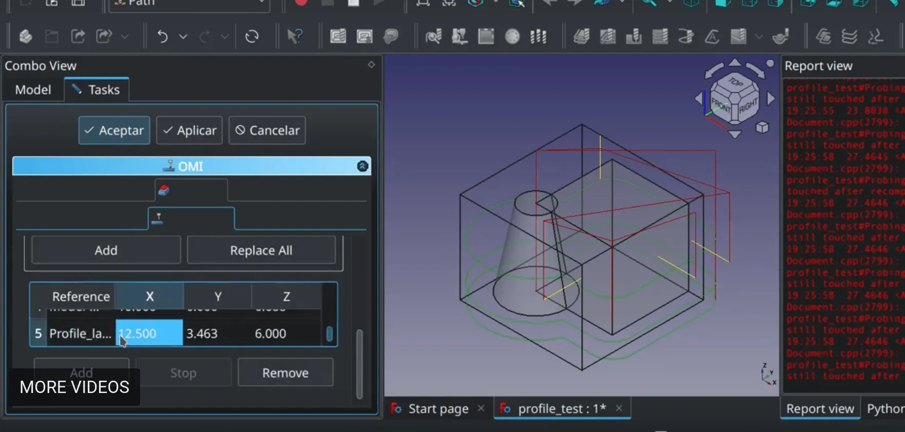

FreeCAD is a already long-term participant to the [Google Summer of Code](https://summerofcode.withgoogle.com/) (GSoC) program, which is Google's program to fund students to work on Free and Open-Source Software (FOSS) projects. Each year, students submit proposals to work on their favorite FOSS project during the school holidays, and Google awards them a grant.

FreeCAD has been participating since 2016, together with some other FOSS CAD projects like [OpenSCAD](https://openscad.org/), [BRL-CAD](https://brlcad.org) or [KiCAD](https://kicad.org) under a same umbrella. Last year, we decided we're old enough to try, and participated on our own. It was a great experience, we got no less than four awarded students working on FreeCAD. All of them produced good results, and got to know and interact with the FreeCAD family.

The aim of GSoC is not only to get people to work on FOSS projects, but also to give students a chance to dive in to a FOSS project and experience first-hand the dynamics of open-source development (which I think are totally awesome, and definitely something any computer science student should know about). Finally, it also tries to create long-lasting bounds between students and communities they work with, so they stick to the project after GSoC finishes.

### GSoC 2023

This happened last year:

- **hlorus** worked (and is still working!) on **measurements tools in FreeCAD**. FreeCAD has a very diverse set of different measurement tools, none totally complete, none totally finished. Hlorus, who already worked on other FOSS projects like Blender, started working on a unified system, that hopefully will provide a good FreeCAD-wide measurement solution. Check the project details on [GSoC 2023: Unified Measurement Facility - FreeCAD Forum](https://forum.freecad.org/viewtopic.php?t=78147)

- **Amulya** worked and is also still working on a **modern replacement for the FreeCAD library**. The [FreeCAD library](https://github.com/freecad/freecad-library) has become this huge, unmaintainable, unusable repository of FreeCAD models, pieces and parts provided by FreeCAD users. We needed a replacement which, while still relying on Git and content provided by users, allows a much easier management both by administrators and users, and has an easier integration in FreeCAD. Project details are on [[GSoC 2023] UI tool for fetching online content - FreeCAD Forum](https://forum.freecad.org/viewtopic.php?t=78124)

- **Gauri** worked on a **new documentation system for FreeCAD**. While the current documentation hosted on [the FreeCAD wiki](https://wiki.freecad.org) served and still serves us well so far, a series of growing problems made us think we need a better, more flexible and safer solution where the contents are dissociated from the platform. Gauri set up a markdown-based docusaurus system, and some FreeCAD community members have now picked up her work and are carrying it further. Check the details at [[GSoC2023] Upgrade the documentation system - FreeCAD Forum](https://forum.freecad.org/viewtopic.php?t=78143)

- **Tanasu** worked on **on-machine inspection tools** that allow a CNC machine equipped with a probe tool to "poke" a piece of material to determine its size and shape. Find more details about it on [[GSoC 2023] On-machine Inspection - FreeCAD Forum](https://forum.freecad.org/viewtopic.php?t=78215)

Everything that happens with GSoC in FreeCAD is in its [own section of the FreeCAD forum](https://forum.freecad.org/viewforum.php?f=46). Be sure to check what's happening there!

### GSoC 2024

This year again, FreeCAD [has been accepted to the GSoC program](https://summerofcode.withgoogle.com/programs/2024/organizations/freecad). The store is now open, and students can start looking and asking questions and building their proposals. Are you interested in participating as a student? Be sure to check our [GSoC 2024 page](https://wiki.freecad.org/Google_Summer_of_Code_2024) page with proposal ideas and everything there is to know about the program. Also look at the [GSoC timeline](https://developers.google.com/open-source/gsoc/timeline) to have an idea of where you would be going.

See you there?