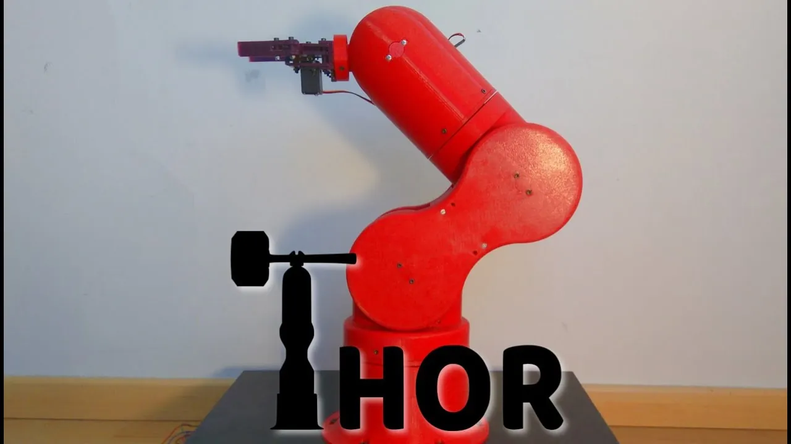
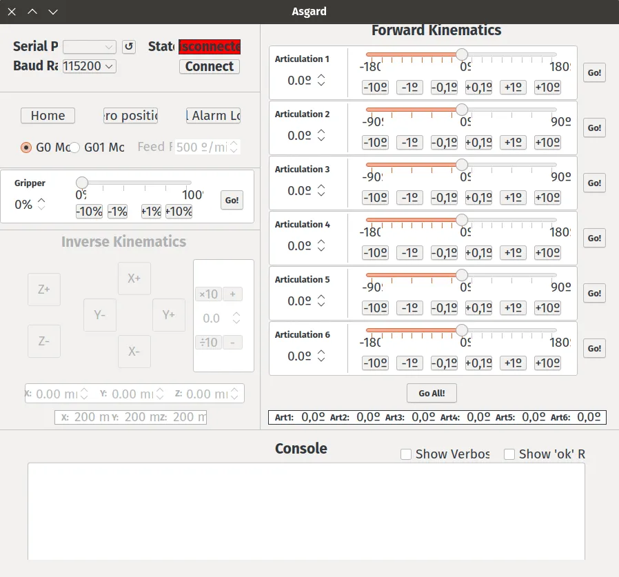
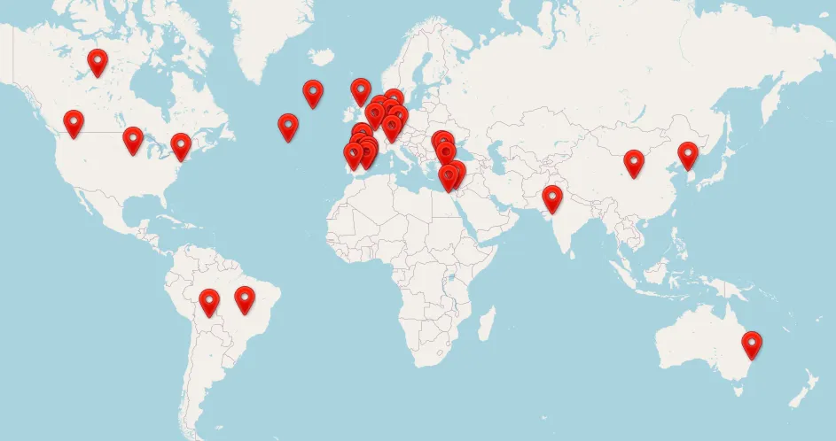

We imagine most visitors to this blog will already know that amazing things can be achieved or designed using opensource tools like FreeCAD. [The Thor opensource robotic arm](http://thor.angel-lm.com/) is a great example of a complex opensource project built using a totally opensource tool chain.

It's a primarily 3D printed 6 degrees of freedom robotic arm which looks, and performs much like it's industrial counterparts. Once printed and assembled the 625mm tall arm is able to handle around 750 grams which means it's pretty capable and could well be tasked with useful work.

Of course, we feature it here as it's been modelled in FreeCAD, if nothing else it's worth downloading the FreeCAD files as an example of of excellent quality computer aided design and it's fun to look around the parts and assembly. Aside from FreeCAD the Thor project has leveraged [KiCad](https://www.kicad.org/)for the PCB components and the opensource G-code interpreter and motor driving platform [GRBL](https://github.com/gnea/grbl/releases). Once assembled there is an opensource piece of software "Asgard" which acts as a controller interface for the arm. In other words, it's opensource all the way!

If you plan to make a Thor, there is around 200 hours of 3D printing and then a stack of assembly work. All the components, stepper motors, driver boards are all off the shelf items so although a complex design, it's totally doable. So far there have been in excess of 30 Thor arms built and a variety of them are shown on the project website. Whilst it might look a little complex for a beginners project for those new to hardware builds, it is very well documented. There is a burgeoning [forum](http://thor.angel-lm.com/forums/) where you can check out other peoples builds and ask questions.

