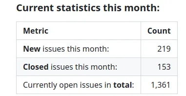

Based in Germany, Max is a mechanical engineer in the automotive industry working on electric drive systems for vehicles. In his work life Catia seats are more the norm but Max was interested in alternatives he could use at home to fuel his passion for 3D printing. Of course this led Max to FreeCAD. Max has some lovely personal projects he has created using FreeCAD which you can check out over on [Max's Printables Page](https://www.printables.com/@maxwxyz/models).

Having got to grips with using FreeCAD, excellently Max became interested in contributing to the project. Max taught himself, with help from the community, to build FreeCAD and began to contribute simple fixes to documentation and tool tips and more.

When the [FPA announced the grant allocation for the bug triage role](https://forum.freecad.org/viewtopic.php?style=4&t=84689) Max was the successful applicant and he has now completed his first month delivering this work. As a recap the role is centred around managing the GitHub [FreeCAD bug tracker](https://github.com/freecad/freecad-homepage/issues). The role places emphasis on various related activities such as, checking new bug submissions for relevance and/or duplication. Another task is to rephrase issues raised to make them addressable points so that required action is clearly identifiable. Max also acts as a facilitator between issue authors, seeking clarifications and further information, to feed to the relevant maintainers and developers.

As part of his first month of activities Max has now produced his first report [available to view here](https://github.com/freecad/fpa/blob/main/reports/BugTracker/maxwxyz_report.md). The report begins with some context and some statistics for the month. It's a really easy straightforward read and obvious to see the quality work Max has done.

It's great to see that in this first month every new issue has been checked for quality and classified, a valuable first step in the journey to issues getting fixed and closed. Beyond this Max provides a list of manually closed issues this month with one line descriptors of the reason for closing, many are closed as a duplication, some are unresponsive but many are fixed or implemented.

Max closes out the report with planned activity in the coming months. Max plans to deep dive into the pile of older issues mostly imported from the older bug tracker system. Max also will continue to manage the [FreeCAD Complaints Day project board](https://github.com/orgs/freecad/projects/20/views/1) assessing and integrating the issues raised in that session into the system.

As part of the work Max is also keeping an eye on most of the different FreeCAD community areas, the [official forum](https://forum.freecad.org/), discord, Reddit etc. On the FreeCAD forum Max is Maxwxyz.