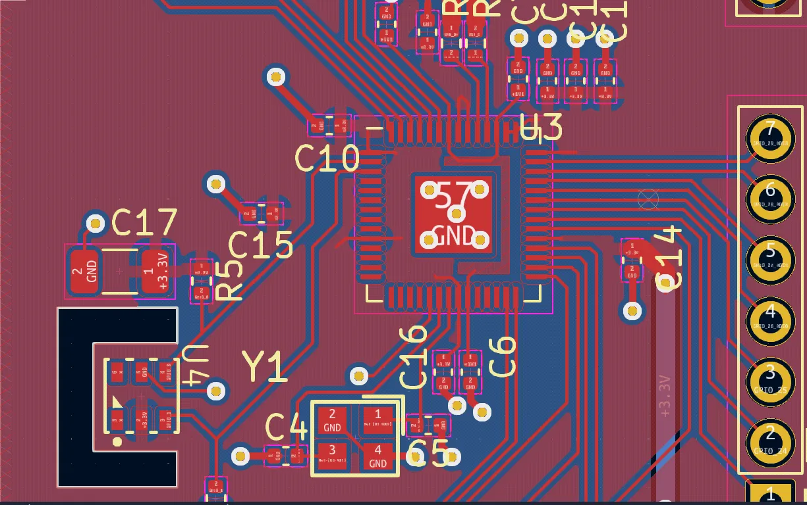
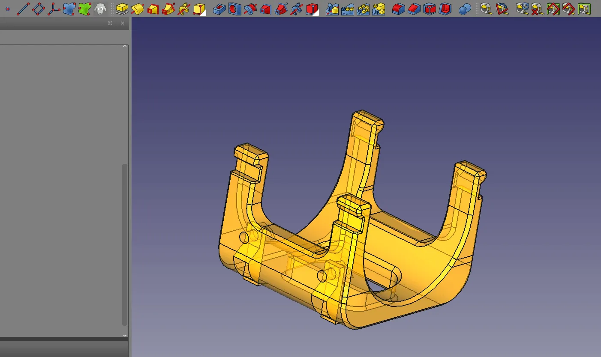

It's an amazing age for making things, and an even greater age for making things using open source solutions. At our recent [FOSDEM](https://blog.freecad.org/2024/02/16/fosdem-and-freecad-2024/) stand we shared the booth with [KiCad](https://www.kicad.org/), the open source electronics environment. It was fabulous at the event to see items and machines made using KiCad and [FreeCAD](https://www.freecad.org/) in combination. It's also quite amazing to consider the complex printed circuit boards (PCB's) KiCad can create with the tiny component packages placed and soldered into highly accurate positions.

Beyond the mere wonder of it all, it's interesting to delve into how these components might be placed on a PCB. For small, single unit, home hacking, adding solder paste and placing each component with a pair of tweezers before heating the entire PCB is not uncommon. Stepping up in complexity you may manufacture a stencil to add the solder paste quickly and accurately. However, when it comes to making lots of devices with lots of components then the best solution is "Pick and Place".

Pick and place uses a robotic system to load the components from reels with some kind of actuator picking up the component and accurately placing it onto the PCB. It's exactly the technology that large PCB assembly houses use to create all manner of devices.

[LumenPnP](https://www.opulo.io/) is an open source pick and place machine and brilliantly all the CAD parts have been designed in FreeCAD. From a distance LumenPnP might look like a CNC router as it has X, Y and Z axis created with precision linear rails. The tool head however features two nozzles each of which provides suction to carry electronic components. The machine cleverly has two camera's which enable it to detect fiducial markers to accurately align to PCB jobs.

LumenPnP uses a very slightly tweaked version of the open source [Marlin Firmware](https://marlinfw.org/), more commonly found in 3D printers. For software the system relies on [openpnp](https://openpnp.org/) - a great choice with baked in support for KiCad. This makes it trivial to set up positional files for the components on project PCB's.

The machine is available to purchase from Opulo, but everything is open source and you could build your own. It's a great system that could save you time and money depending on what volume of PCB's you are planning to populate.

Looking through the repository you can find that all the CAD work for mechanical components is completed in FreeCAD, with KiCad being used for all the PCB's. So if you own a LumenPnP you can easily create replacement parts, or indeed you might think of a way to make a modification to the design to suit your particular needs. It also means that it's open to community contributors without tying them into proprietary tool chains.



Looking around the Opulo site we can also see that there are probably more overlaps and uses for FreeCAD. In one video, a brilliant PCB, shaped like the OSHW logo, is being populated with LED's. It's mounted onto the machine in what appears to be a 3D printed conformal jig. This work holding approach means that it's fast to swap in unpopulated PCB's accurately keeping the process running with minimal resetting. We'd hazard a guess that this model was made in FreeCAD, with step output export in KiCad, it's pretty easy to make a jig like this. There's even more crossover between FreeCAD and KiCad with the excellent [KiCad step up workbench](https://wiki.freecad.org/KicadStepUp_Workbench/it) that makes it pretty trivial to make custom component models that integrate into the KiCad footprint system perfectly as well as mechanically modelling to your PCB design.

All in all it's excellent to see all these open source projects and communities overlapping creating new and interesting tools and approaches.