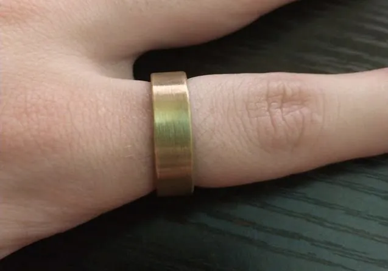
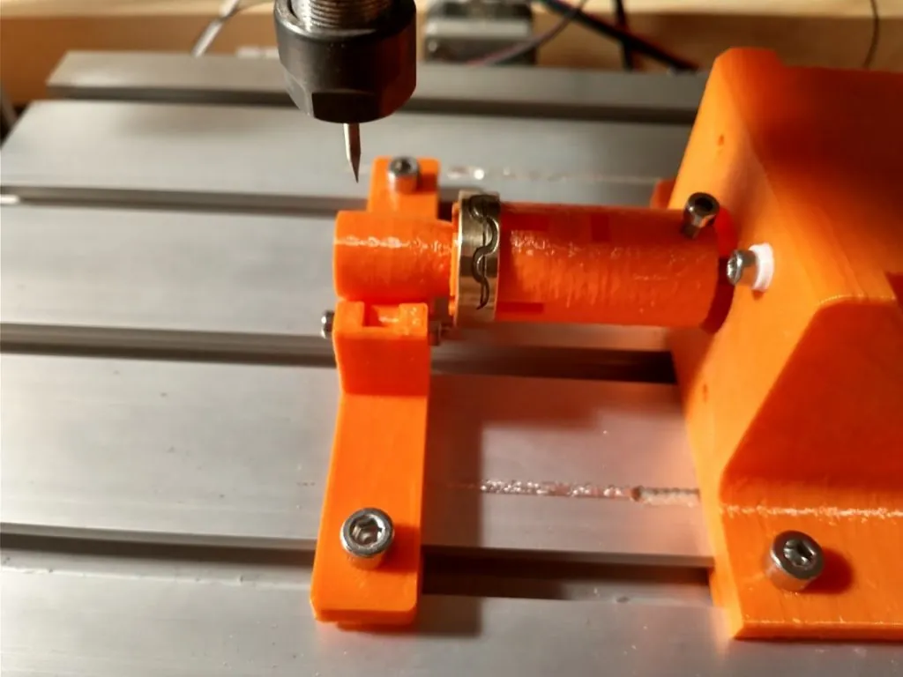

We've featured a few projects under the "Forged In FreeCAD" title but what caught our eye with this one is that FreeCAD was used to not only create an innovative solution, but also was used to then help operate the created machine.

Project creator Jordan Poles had a burgeoning interest in lathes and wanted to make an engraved brass ring. The lathe aspects were covered as Jordan owned a small 7*14 style lathe and so turning a ring blank from a piece of brass bar stock was no problem.

For the engraving side of the project Jordan wanted to utilise their CNC3018 machine. If you don't know the CNC3018 it is an affordable entry point for desktop small form factor CNC routing. They are small and, whilst there are lot of bigger and better options, it has enough capabilities for those newer to CNC to do lots of projects. As such it's not uncommon to see hacks and modifications carried out on them.

Jordan's mod was to create a 4^th^ axis which could also be referred to as a rotary axis. The design consists of a NEMA 17 stepper motor in an enclosure that allows it to be bolted to the bed of the small CNC router. Attached to the output shaft of the NEMA 17 is a work holding section designed to receive the blank stock ring. It's sort of a mandrel work holder with the ring inserted over a flexible jawed section with the jaws pushed out with a wedge device. The end of the work holding section is supported on a "tail stock" of sorts which consists of some rollers in a 3D printed enclosure again bolted to the bed of the CNC. This allows the part to be machined with minimal deflection as both ends of the mandrel are supported. FreeCAD has been used for all of this design and the files can be found over on [the project Thingiverse page](https://www.thingiverse.com/thing:4778215).

For the engraving process Jordan has created a design as an SVG file which is then imported into the [Draft workbench](https://wiki.freecad.org/Draft_Workbench) in FreeCAD. Moving to the [CAM workbench](https://wiki.freecad.org/CAM_Workbench), Jordan then creates the tool paths as if the object is a flat piece of work and not cylindrical. The CNC3018 is controlled by a board running GRBL and the rotary axis assembly is actually connected to and replaces the Y axis of the machine. This means that if the X and Z axis are positioned carefully and accurately above the ring in the rotary attachment then the work underneath the tool bit is the same as a flat piece of stock as the ring rotates.

It's excellent to see FreeCAD being used in this multi-functional way. There's [lots more detail over on Jordan's blog](https://blog.jpoles1.com/archives/183) and some videos of the setup in use.