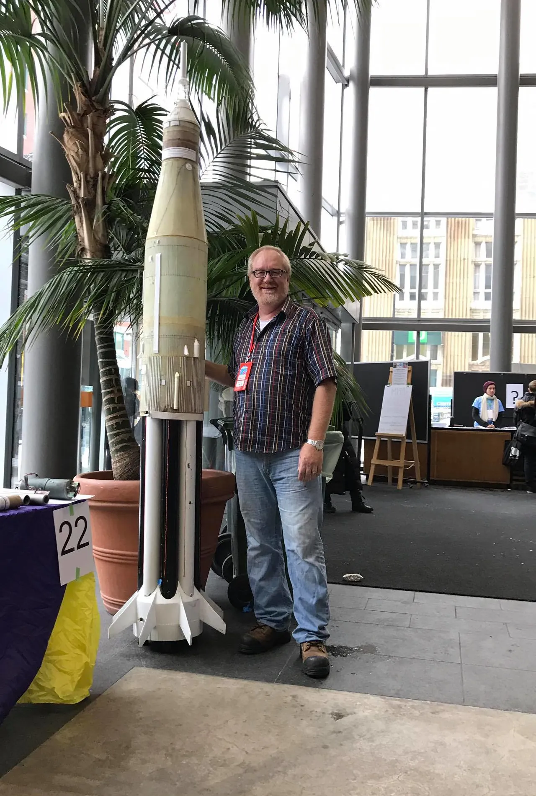
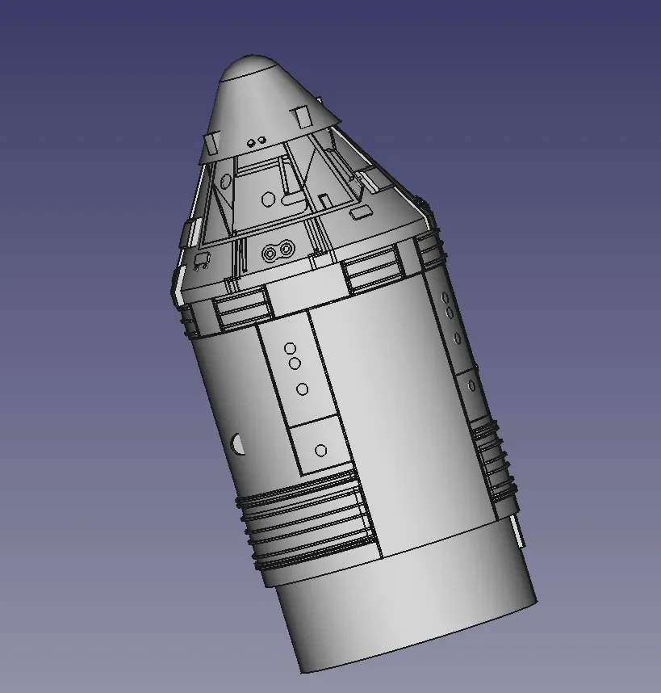
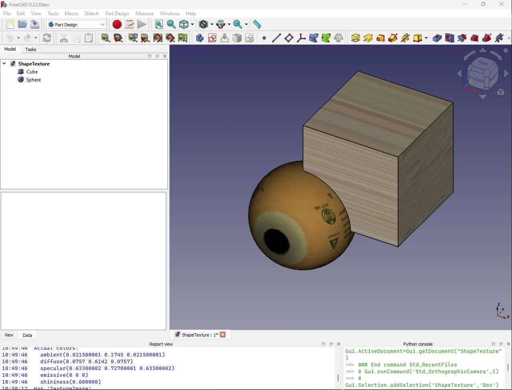

Dave is a rocketeer!

Based in Canada, Dave was very interested in model rocketry as a youngster and returned to the hobby later in life becoming very actively involved in larger high power rocketry. Along the way Dave also got interested in 3D printing in his rocketry designs and, as a by product, interested in CAD.

Many rocketry types, beyond simple off the shelf kit building, are lured into 3D printing as a method of creating accurate nosecone designs which can be challenging to create accurately using other means. Dave initially utilised [OpenSCAD](https://openscad.org/)to create parametric nosecone scripts for many different types of nosecone geometries and released his scripts out into rocketry communities. Moving beyond "simple" nosecones Dave began exploring [FreeCAD](https://www.freecad.org/) as it enabled him to create incredibly detailed scale model designs for 3D print and indeed Dave has some [excellent tutorials over on his youtube channel](https://www.youtube.com/channel/UC4xGgMHU40BHQAXmDcR9IuA).

Dave majored in Physics with a minor in Computer Science and has spent most of his working career as a solutions architect across a variety of industries and government departments. Dave has also worked as a technical trainer delivering all over the world. Everywhere Dave has travelled and worked he has promoted rocketry and tells great stories of bringing rocketry into South Africa and more. Travelling a lot, Dave was drawn first to OpenSCAD and then into FreeCAD as it met his CAD needs whilst not needing ubiquitous connection to the net.

Prior to all his work on FreeCAD Dave created a really useful for rocketry nosecone generation script in OpenSCAD. Having extensively worked with C++ and Python OpenSCAD presented a pretty straightforward route for Dave to get working with 3D models for 3D print. When Dave started exploring FreeCAD it was pretty straightforward to port the OpenSCAD nosecone generator to work as FreeCAD Macro.

Dave's involvement with FreeCAD grew when community member "[concretedog](https://forum.freecad.org/memberlist.php?mode=viewprofile&u=27513)" (who also coincidentally is the author of this blog post) started a [thread on the FreeCAD Forum suggesting that a Rocketry Workbench could be an interesting and useful addon](https://forum.freecad.org/viewtopic.php?t=54496). In the global rocketry community there is another excellent opensource piece of software for rocketry "[Openrocke](https://openrocket.info/)t". Openrocket enables users to design and simulate rockets and doing a lot of the heavy lifting around calculating centres of pressure and centres of gravity, as well as flight duration and characteristics. It's an excellent piece of software, however it is mainly focused on simulation of designs and has no real model outputs to create real components. Dave was already an Openrocket user and with his attention captured, he began to create a rocketry workbench in FreeCAD which makes it trivial to create rockets and their components for fabrication.

The [rocket workbench](https://wiki.freecad.org/Rocket_Workbench) has numerous primitives for nosecones, tubes, fins, fin cans and more and, wonderfully for the rocketry community, Dave has made the parametric inputs similar to Openrocket. This makes it more accessible for those new to FreeCAD but used to Openrocket. Openrocket calls on a large open database of commercial components and Dave has utilised this open data set within the FreeCAD rocketry workbench so you can quickly call up a part that you can buy in the real world. Some rocketeers are also interested in up and down scaling commercial designs so the Rocketry WB in combination perhaps with the draft workbench is incredibly useful.

It's fair to say, at this point that Dave has contributed enough, but no! Dave is really interested in how FreeCAD's capabilities in FEM and CFM can be used in conjunction with rocket designs. It's complex stuff but Dave is working towards having fin flutter and other analysis within the Rocket WB. One challenge is FreeCAD's materials system, in Openrocket components can be assigned to be made from different materials as this obviously effects their weight and therefore the flight characteristics of the rocket airframe. Dave is currently working on a materials manager and database that will be applicable across FreeCAD as well as texturing and other material related capabilities. It's a long road project but once incorporated it will open up a heap of possibilities in and beyond the Rocketry workbench.

As if all this isn't enough, Dave is passionate about outreach particularly around taking FreeCAD into rocketry communities. NARCON is the largest rocketry conference and Dave has given extremely well attended and popular talks on the Rocketry WB and more.

Dave is hoping to attend the [North America FreeCAD Day](https://forum.freecad.org/viewtopic.php?style=5&t=85180) this year in Illinois between the 15th and the 18th of August. If you're attending make sure to say hello to this fantastic and dedicated contributor.