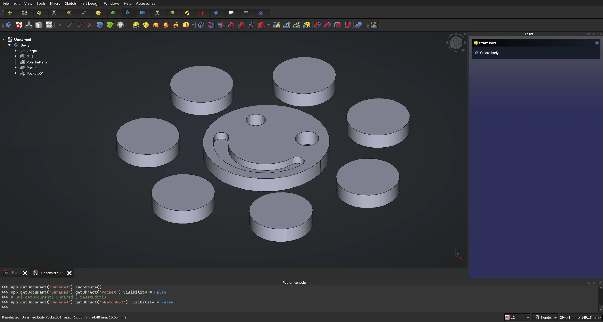
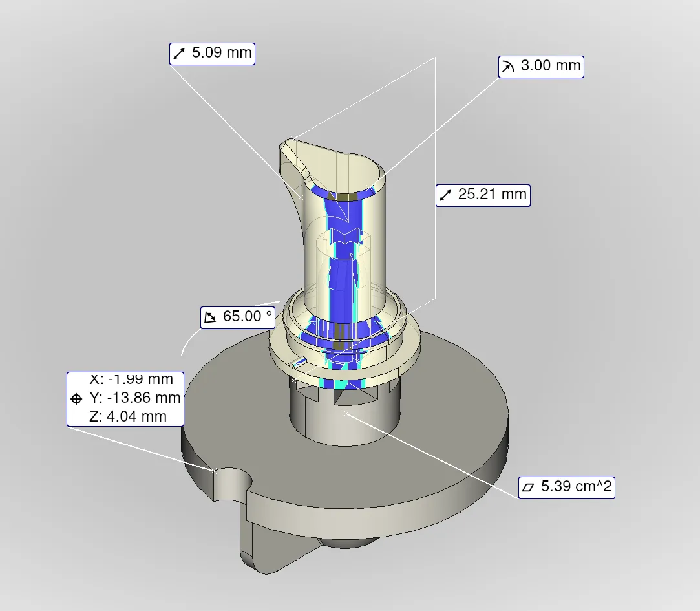

This week in FreeCAD development:

**Toponaming**: the main phases of the project have now been officially completed. The patchset was enabled in the main development branch by default this Monday, weekly builds now ship with the fixes. For more information, please see [this forum post](https://forum.freecad.org/viewtopic.php?t=87791). Kudos to everyone involved: RealThunder, chennes, Pesc0, bgbsww, CalligaroV, JohnAD.

**Part Design**: kadet1090 added an experimental option to disable the single-solid checks and allow compound shapes as value of the body. For details, please [see here](https://github.com/freecad/freecad/pull/13960). Here is a quick example, courtesy by MisterMakerNL, note multiple solids inside one body:

**CAM**: Shai Seger contributed a new Mill simulator that is faster and more precise than the existing solution. Because it's implemented with low-level OpenGL functions, it isn't integrated into the main window and opens in a new window instead. You can read [this forum thread](https://forum.freecad.org/viewtopic.php?t=87174) for more info.



**Arch**: Yorik van Havre started merging Arch, BIM, and NativeIFC workbenches into one workbench called BIM. This is an ongoing project, expect further changes.

**Draft**: Roy-043 fixed several bugs, and furgo16 updated Draft preferences for clearer terminology.

**FEM**:

- marioalexis84 added support for load and boundary conditions, he also implemented highlighting of active analysis according to user defined color.
- NewJoker updated static analysis check for boundary conditions, further improved the misleading constraint descriptions regarding the geometry selection, and improved the task panel for the newly implemented rigid body constraint.

**TechDraw**:

- HowThatWorks added the autofill attributes to the ISO template series.
- Wandererfan improved existing workbench preferences and added preference for default symbol directory and one for displaying the section cut line.
- Hlorus made the new smart dimension tool by Paddle the default one, all current tools are grouped under it.

**New measurement tool**: hlorus added measurement icons to the labels in the 3D view, the elements in the tree view, and the measurement group in the tree view.

**UI/UX**:

- MisterMakerNL fixed the issue in the menu that occured when a menu was selected but not active.
- maxwxyz update some icons for legibility and consistency. He also updated toolbars in Part Design. So now there a new command group for datums in the toolbar and a new command group for sketch based actions. Additionally, ShapeBinder has been removed from the toolbar (issue #13044), Part_CheckGeometry has been added to the toolbar and menu to validate the body, and toolbars have been split into smaller ones (Helpers, Features, Dressup, Patterns) so that they could be easily rearranged.
- Reqrefusion started improving TechDraw icons.
- marcuspollio updated Spreadsheet icons.

Some of the **other changes** are:

- wwmayer fixed various bugs.
- davesrocketshop corrected an issue in the new materials API where a new material may not have a UUID.
- PaddleStroke fixed several issues in Sketcher (including Symmetry tool segfault) and improved support for cones surfaces when doing JCS selection in Assembly.
- chennes added privacy policy to the About box

**PR stats**: In the week from Wednesday, 15 May to Wednesday, 22 May there were 84 pull requests merged. 39 new pull requests were opened.

**Issue stats**: we closed 63 issues, and 57 new issues were opened. Overall, 1,630 issues are currently open.