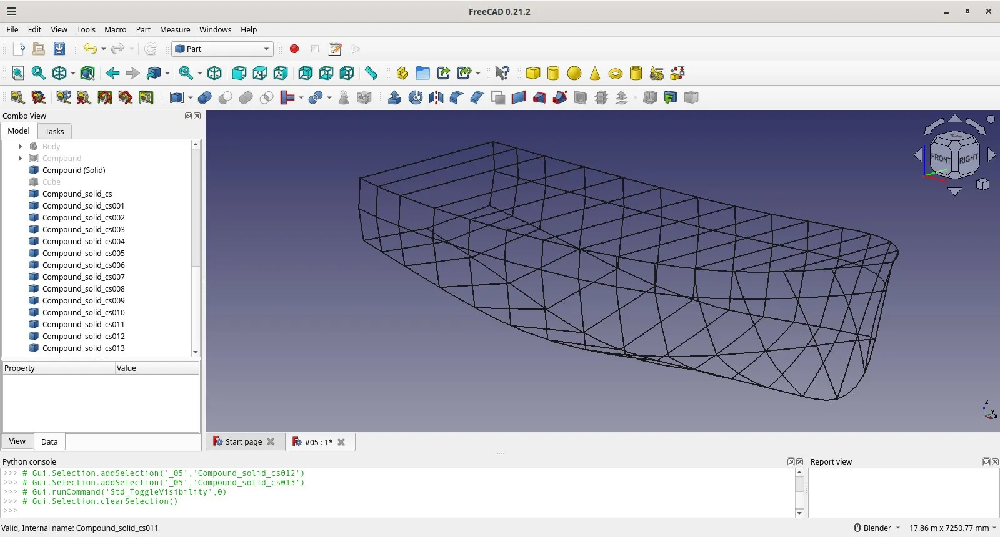
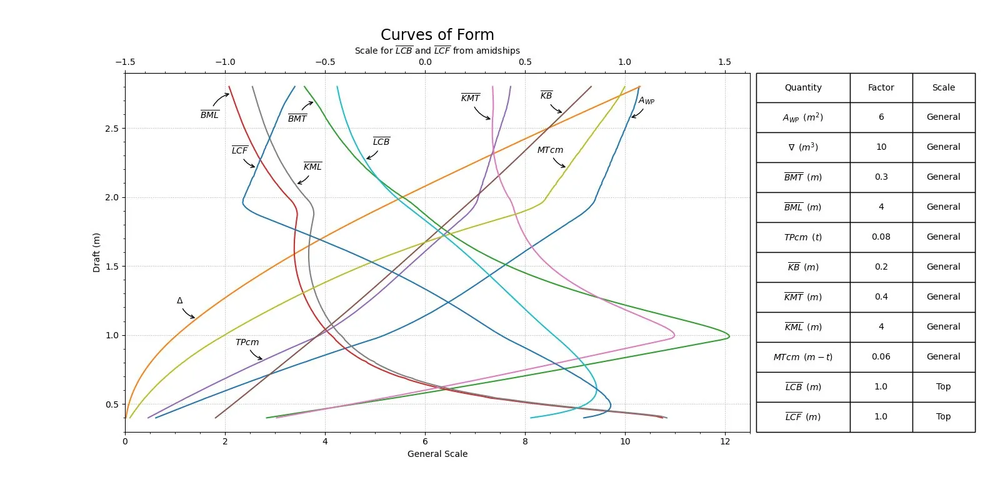

Pretty much everyday someone somewhere is doing something spectacular with FreeCAD!

Spotted last week over on the [FreeCAD forum](https://forum.freecad.org/viewtopic.php?t=88520&sid=b2d6cf127e3d87e02417b63d3cb8b845) BlueHorizon posted about a proof of concept project to model a boat hull and then perform a hydrostatic and stability analysis to work out how well the design performs.

The project began creating a model of the hull section of the target vessel. This was achieved by a combination of sketches, B-splines and surfaces. With the surfaces constructed, they then converted the object to a compound and, in turn, into a solid.

With the hull geometry now complete the analysis was performed in the Python console running numerous Python scripts. We can't claim we understand the output particularly but reading generally about ship hydrostatic and stability analysis it's incredibly useful to see how a hull reacts in different conditions, but also important in terms of designing thrust and drive systems that can provide adequate amounts of actuation for the vessel. BlueHorizon has posted the full code examples over on the forum post and the analysis uses the NumPy library with the results plotted using the Matplotlib.

If you are interested in delving deeper into this project do check out the [forum post](https://forum.freecad.org/viewtopic.php?t=88520), also if you are interested in boat design there is also the [Ship workbench](https://wiki.freecad.org/Ship_Workbench) add on which can be explored. We look forward to seeing the first vessel afloat designed in FreeCAD!