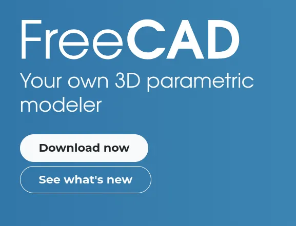
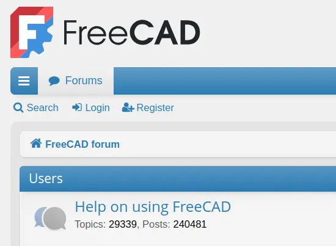
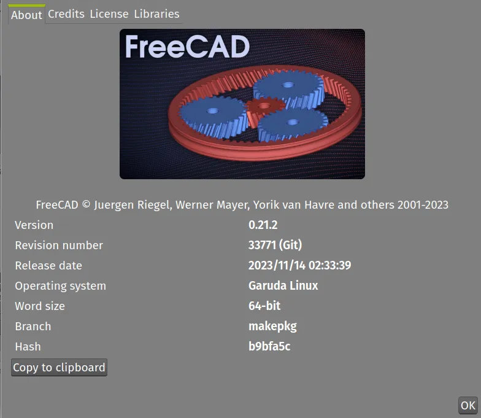
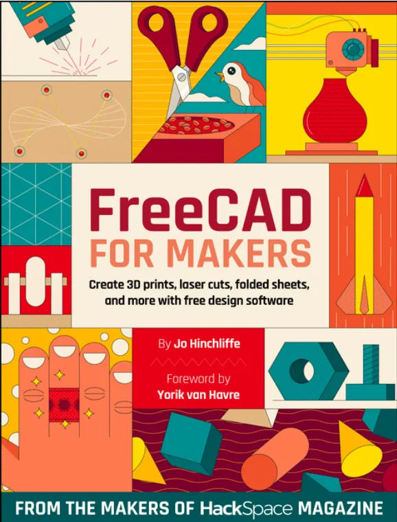

There are so many community areas around FreeCAD. Apart from the excellent official [FreeCAD forum](https://forum.freecad.org/) almost every conceivable messaging platform or social media camp has a FreeCAD presence. From Facebook and X, through Discord, Matrix and Fosstodon there are lots of places with FreeCAD discussion. Whilst we all might have our favoured places to chat FreeCAD it's interesting to look across a few of these community areas and see what unites them. On a daily basis looking across a few of these sites will reveal that "How do I get started in FreeCAD?" is possibly the most common enquiry.

We probably all have our standard answer and our go to methods, signposting to the tutorial or resource that was most useful to us. We thought we might list some of these here as options for people to explore.

It can be really useful to point beginners at the [FreeCAD Forum](https://forum.freecad.org/). The FreeCAD forum is frankly amazing in what it contains, it is an absolute treasure trove of information and inspiration. It's definitely worth mentioning searching there and reading results for a while before posting a question with many subjects having been discussed widely before. The other note worth mentioning to those new to FreeCAD and the forum is that if asking for help it's always worth clicking the "about FreeCAD" tab in "Help" menu and copy pasting your FreeCAD version and operating system information into the top of your post.

The second place that is definitely worth pointing newcomers is the [official documentation](https://wiki.freecad.org/Main_Page). Again the official documentation has heaps of information and many pages of it actually have small examples and mini tutorials on particular tools and their use. It is fair to say that some parts of the documentation might not be 100% up to date with current FreeCAD releases but usually differences are small and the principles of operation are the same. If people are interested in helping develop and maintain the [official documentation then check out this link](https://wiki.freecad.org/WikiPages) to find out how to get involved. The official documentation sits on the FreeCAD wiki and the information is presented in numerous different ways. There are numerous "hubs" for Users, Power Users and Developers as well as a more [linear readable manual](https://wiki.freecad.org/Manual:Introduction).

Outside of the official FreeCAD resources there are lots of resources to learn FreeCAD from. Looking around all the different community areas recommendations for online video tutorials are common. There are lots of people creating great video tutorials across a range of services. Whilst Youtube is by far the most common, there are increasing amounts of FreeCAD video tutorial content on Peertube and other non proprietary platforms. Searching Peertube we came across this German language video tutorial which also has a sign language interpretation, excellent work.

[CAD, CAM & CNC-Workshop mit ripper - Teil 2: FreeCAD Part Design, TechDraw on PeerTube](https://peertube.tv/w/8PP9C5LKL6UZyWYb8Jh4qp "CAD, CAM & CNC-Workshop mit ripper - Teil 2: FreeCAD Part Design, TechDraw on PeerTube")

We'd be remis not to mention the two most commonly recommended Youtube channels serving excellent FreeCAD and general CAD content. These channels have playlists specifically for FreeCAD for those absolutely new to CAD as well as an astonishing array of more advanced tutorials:





Sometimes people prefer a written guide to FreeCAD rather than video and a common recommendation is ["FreeCAD for Makers" which is a freely downloadable 16 chapter book from the Raspberry Pi Press](https://hackspace.raspberrypi.com/books/freecad). In full disclosure the author of this also is the author of this post and the book also has a foreword written by Yorik. The book works from the premise that if you can work through and understand the first two tutorials ( a small project using the Part workbench and a small project using Part Design) then you can skip to any other section of the book and work through any of the other tutorials.

A less common recommendation but one that some people find incredibly useful when they have learnt a little FreeCAD is to look at other peoples project files. A great source of this, again, can be the FreeCAD Forum, however it's hard to ignore the amount of FreeCAD projects shared on 3D printing related sites. Whilst there are many sites. Thingiverse, Grabcad and more, [Printables](https://www.printables.com/) is a popular option. Using the search term "FreeCAD" returns page after page of results, and whilst we can't claim to have checked them all, most of the resulting projects include the FreeCAD project file as well as some exported 3D objects. Of course, these projects are all aimed at 3D printing technology but they are fascinating and often useful to download, look at, and tweak, broadening the pool of FreeCAD approaches you've seen.

Finally, thank you, if you are one of the many many people in our community who answer the "how do I get started?" question and help others start their journey, we salute you.