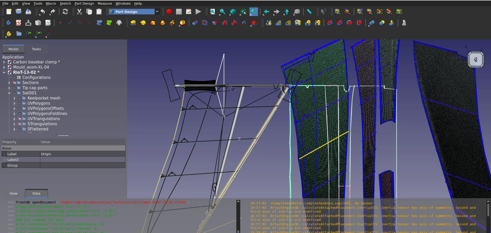
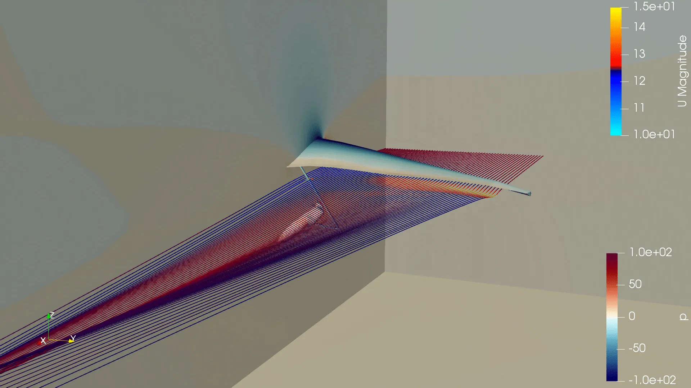
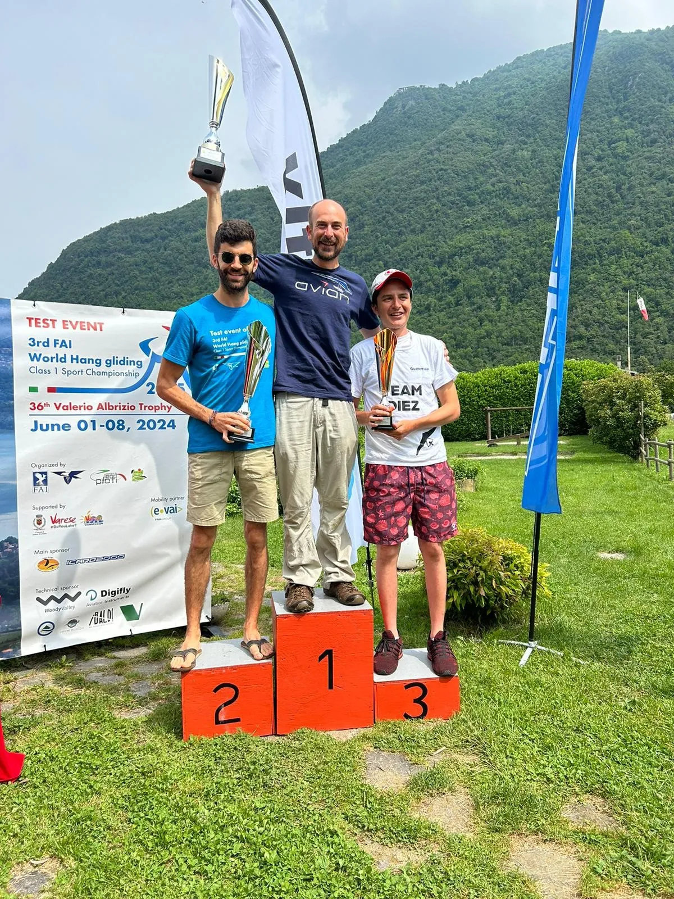

Hang gliders are mesmerizing when you see them in the sky. Silently cutting through the sky smoothly, often spotted in fine weather and in beautiful locations there's a lot to be said for them. Over on fosstodon we've seen a UK based hang glide company [Avian Hang Gliders](https://www.avianonline.co.uk/index.php?osCsid=1c2e1500a740b436df943e614dd407de)mentioning how they use [FreeCAD](https://www.freecad.org/) to develop their newest generation of gliders using clever simulation and advanced manufacturing techniques. We caught up with the owner of Avian, Tim Swait to chat about their process.

Tim explains that he took over the company some years ago and they still sell a range of gliders from before his tenure, and have added to the roster of gliders with a newer design "RioT". The older designs had some components designed in CAD but this was limited to individual components, usually those that needed CAD for Computer Aided Machining (CAM) and the proprietary CAD used for this was limited in that it didn't have any type of analysis tools and no real approach that could be used to help design the wing sail panels critical to the performance of a glider.

It's fair to say that hang gliding is a fairly niche business and as such a complete suite of proprietary CAD tools wouldn't be cost effective for Avian and, even if it was, wouldn't offer the level of flexibility and functionality that Avian have developed using open source tools. Part of the inspiration came from seeing [looo's Glider workbench](https://github.com/booya-at/freecad_glider)which, to the lay person with regard to human suspended gliding might look like a perfect solution, but is in fact built for paragliding rather than hang gliding. However there are parts of that code that are of great use and interest to Avian, particularly the functionality where that a fabric wing design, full of complex curves and seams, can be flattened to create a dxf export.

Working with [Julian Todd](https://forum.freecad.org/memberlist.php?mode=viewprofile&u=21998) who has contributed to FreeCAD in many ways, work began on creating tools to help design the next generation of hang gliders. This hasn't taken the form of a fully fledged workbench but rather is a [set of macros and tools](https://gitlab.com/HG-dev)that can speed up the design iteration process. Tim describes a fascinating workflow that bounces between FreeCAD and another open source tool from NASA, [OpenVSP.](https://openvsp.org/) OpenVSP stands for Open Vehicle Sketch Pad and is a tool to essentially perform aerodynamic and flight analysis on any aircraft geometry. OpenVSP is parametric and so much of Avian's design work centres around a file Tim refers to as a dictionary.

A dictionary file is a parametric list of a desired wing sails properties and cleverly this file can be processed by the FreeCAD macros they've developed to create compatible geometries in both FreeCAD and OpenVSP. This means that it becomes pretty trivial to create a design idea and test it's flight characteristics in OpenVSP, tweaks can be made in OpenVSP and this can be pulled back into the dictionary file to be then pushed into FreeCAD to update the geometry there and also to use tools like the excellent [Cfd-OF (OpenFOAM) workbench](https://github.com/jaheyns/CfdOF). OpenVSP uses a vortex lattice method (VLM) of analysis, which in simple terms means that it analyses airflow just on the surface of the geometry. Compared to other forms of analysis that may analyse a large 3D volume, this VLM technique, with it's more focused surface approach, means that analysis can be quick, often reduced to a few seconds. Therefore it's pretty easy for Avian to run thousands of simulations in a pretty small amount of time.

When a wing design is ready for real world testing Tim describes how it's reasonably trivial to create a flattened pattern in FreeCAD which can be sent to industrial sail cutters who use huge laser cutters to cut the composite fabric panels to incredibly high tolerances. Avian then have a preferred sail maker partner who does a fantastic job sewing the panels together. Tim describes that over the entire length of a wing a seam drifting just a couple of millimetres can make a wing turn in an undesirable way and whilst this can be tuned/trimmed out they pride themselves on wings that are so accurately made they fly straight on assembly.

They say the "proof of the pudding is in the eating" and Tim proudly speaks about how the Avian Puma wing has helped him win the Sport Pilot class in the 2025 Sport Class Pre-World competition, a practice event for the 2025 world hang gliding competition. It's great to think that FreeCAD and open source tools have helped create a world class hang glider system!



Finally Tim has an excellent Youtube channel for if you are interested in learning some of the science of flight relating to hang gliders, the channel also contains lots of interesting information about FreeCAD and OpenVSP and definitely is a fascinating watch. Tim also currently is using Patreon to fund raise for the development of a new wing and you can find his [Patreon page here](https://www.patreon.com/hgdev).

Many thanks to Tim for taking time out to chat to us.