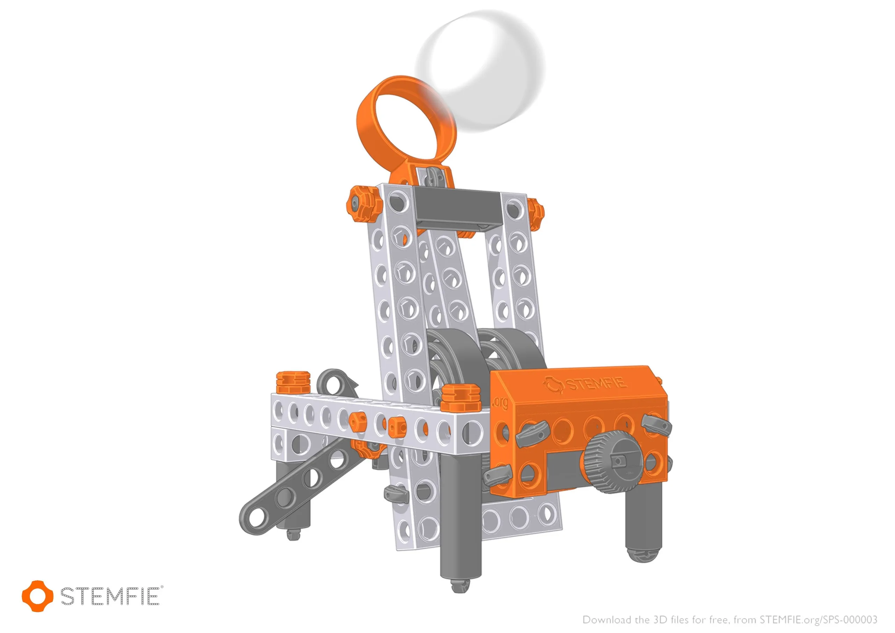
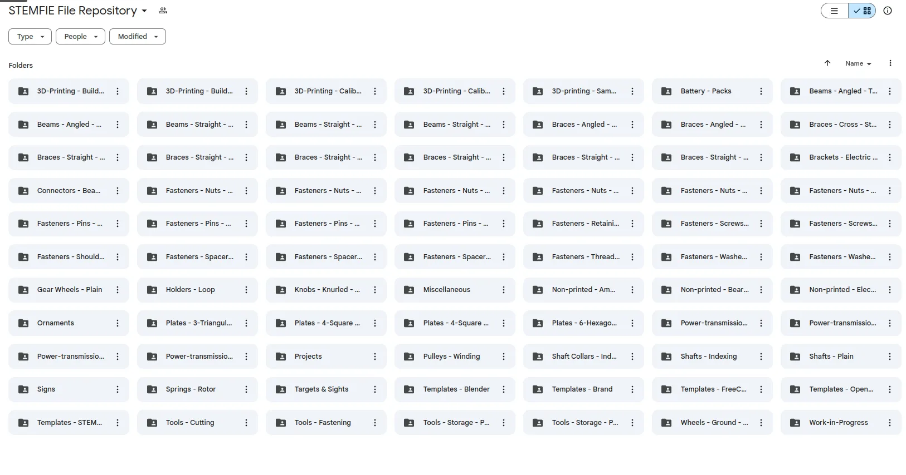
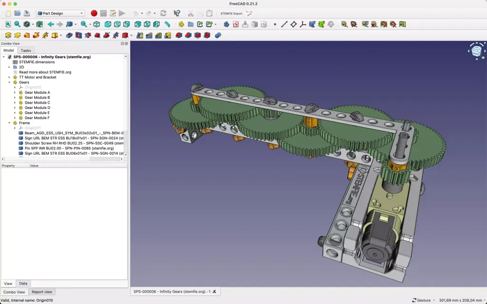

[STEMFIE](https://www.stemfie.org/) is an amazing, unique project that feels a little like an imaginative 3D printed hybrid of LEGO Mindstorms and Meccano. All the part designs are freely shared and available. This means people can 3D print locally building their own part collection, it's mind boggling how many parts and projects there are!

A good start is to look at some of the [projects featured on the STEMFIE website](https://stemfie.org/projects)which are beautifully rendered in [Blender](https://www.blender.org/). This gives you a taste of some of the parts available and perhaps gives some inspiration of what you can build. The project section features curated list of parts needed to make a specific projects, a great way to begin to explore the STEMFIE parts. There are numerous standards in the STEMFIE parts families to make everything work together well. Speaking to Paulo Kiefe, the driving force behind STEMFIE, he is really keen to talk technically, diving into chat about why he went with a particular beam hole spacing, or how he optimises threaded part designs for filament based 3D printing. This passion and dedication to creating decent design solutions really shows itself in the interoperability of the STEMFIE parts.

Having looked at a few projects you might want to dive straight into looking at the full parts collection. Paulo shares the part files as `.3mf` across a range of file sharing sites. This includes Bambu labs Maker World as well as OneDrive and Google Drive so it's easy to set up a synchronised copy of the part collection that updates for you as new parts are designed or changes are made.

Diving into the part library, it's immense! There are thousands of parts available, from simple beams and fasteners through to complex parts that host "vitamins" or non printed components like bearings or small motors. There are heaps of gears and gearboxes and just looking at the parts inspires project ideas. Talking with Paulo it's obvious how complex some of these parts are to design to the high standard he maintains: He discusses that it's reasonably easy to design compatible parts to a standard, but when you introduce external objects for inclusion inside 3D prints it ramps up the complexity.

Paulo develops new parts in FreeCAD and as such has a [FreeCAD template available](https://www.stemfie.org/download/46-stemfie-file-templates) for those looking to design their own parts, he has also replicated this template into [Blender](https://www.blender.org/) and [OpenSCAD](https://openscad.org/) so everyone should be able to find an opensource tool they need to make STEMFIE parts. It's obvious Paulo is very knowledgeable and skilled in CAD environments. Paulo previously owned Creative Tools, a large European company that was a reseller of CAD packages and also provided training and support into the CAD industry. Paulo and the team at Creative Tools are famed for being the creators of a very well known 3D printing calibration and test model, Benchy!

So if you are a school, college, Makerspace, Fablab a STEM education provider, or simply a curious home builder, then we'd urge you to take a look around STEMFIE, there are so many brilliant and imaginative things you could build!