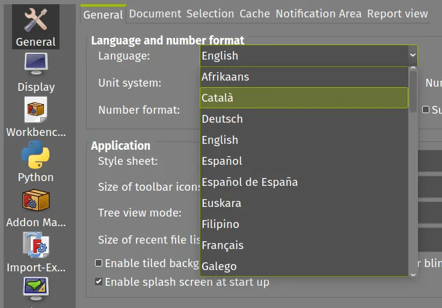
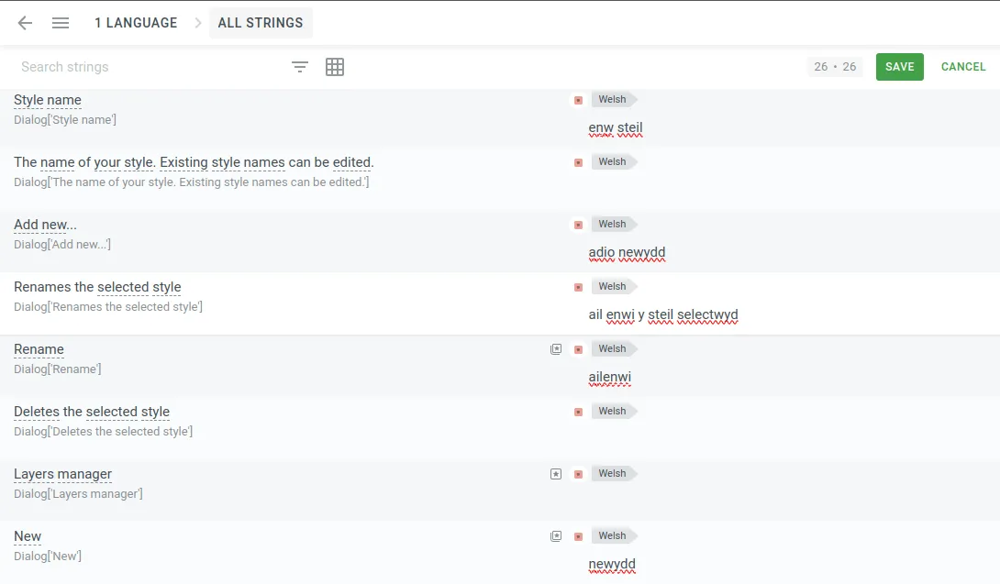

In case you didn't know FreeCAD is available in lots of different languages. If you want to check out the list, launch FreeCAD and click "edit - preferences" and you'll see a language dropdown at the top of the window and you can scroll to see lots of different language packs that FreeCAD contains. So how do these translations happen?

FreeCAD uses an online platform called [Crowdin](https://crowdin.com/) to crowd source it's language translations. All the language strings are uploaded to the Crowdin platform and then anyone can contribute and attempt to translate as much or as little as they like in whatever language or languages they choose.

It's reasonably straightforward. You need to supply and email account to sign up for a Crowdin account once logged in you can navigate to the [FreeCAD project dashboard](https://crowdin.com/project/freecad). From here you can select a language you are interested in and click on it. The FreeCAD strings are loaded and the Crowdin page is populated with the collections of phrases for translation.

You can jump to any part of the FreeCAD project by clicking the "All Strings" button so you can perhaps focus on areas you use the most first and move to less well known areas later. Don't worry that your translation will automatically be in the next FreeCAD version, in our experience it's common to feel you have exactly described the string that you are attempting. When you have typed in a translation click the "SAVE" button. It will prompt you to make your translation match the input string, for example if the original text has an ellipsis following the phrase it will prompt you to add this in.

The brilliant thing about Crowdin is it automatically weighs and collates all suggestions and then proof readers, who are adept in both a language and FreeCAD, can then choose and amend the closest translation. So what is very important is for lots of people to attempt to translate and give it a go without worrying!

Finally, if you don't see the language you are interested in helping with on the list you can contact the FreeCAD Crowdin team and get it added!