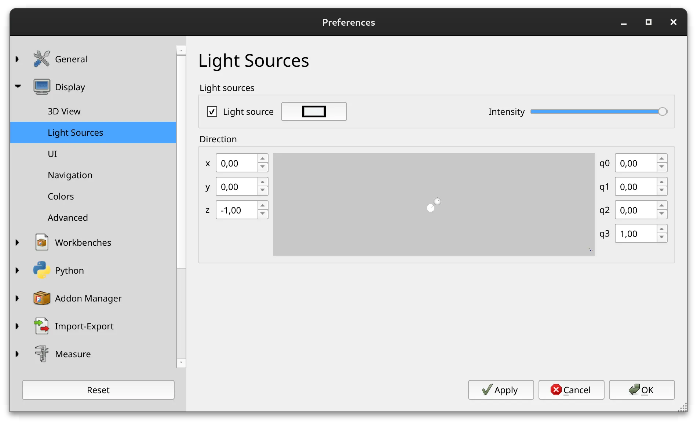

This week in FreeCAD development:

**Sketcher**:

- AjinkyaDahale fixed a few bugs related to auto-constraining concentric circles.
- kadet1090 fixed a bug where the Sketcher constraints toolbar icons would sometimes disappear.

**Part Design**:

- FlachyJoe fixed three issues with subtractive helixes.
- alfrix made the Size combobox larger in the Hole task panel.
- bgbsww fixed a bug where groove and revolution couldn't be created from ShapeBinder and SubShapeBinder sketch.

**Materials**: jbaehr did a followup to his previous contribution (machining data from metallic materials) and added some wood card with a machining model. The information was taken from the German textbook ["Zerspanung von Holz und Holzwerkstoffen"](https://www.hanser-fachbuch.de/fachbuch/artikel/9783446477698) (pure information and facts not copyrightable by German law).

**User interface**:

- MisterMakerNL patched the panel overlays to work better with the built-in light theme.
- kadet1090 made sure that overlay panels are not displayed in the Start page. He also patched the Preferences dialog so that it would fit all pages properly but would not take more than 80% of screen.
- xtemp09 reimplemented the Light Source page in the Preferences dialog. It now actually loads settings from the configuration file when you open that page and provides spinboxes to adjust the light direction using XYZ and orientation quaternion notations.

**Arch/BIM**:

- paullee0 fixed bug/regression in ArchWall/Draft-OffsetWires ellipse support.
- azuk fixed a crash when using box selection with Arch Survey.

Among other changes:

- bgbsww and CalligaroV fixed a couple of issues and did some cleanup in the toponaming code.
- WandererFan fixed a bug in TechDraw that would result in distortion of curved geometry.
- marioalexis84 and mosfet80 fixed a couple off minor issues in FEM.
- chennes updated Addon Manager code again for Qt6 compatibility.

**PR stats**: since the previous report, 40 pull requests have been merged, 29 new pull requests have been opened.

**Issue stats**: overall, there are 1881 open issues in the tracker, up by 16 from last week. 14 of them are v1.0 release blockers, down by 4 from last week.