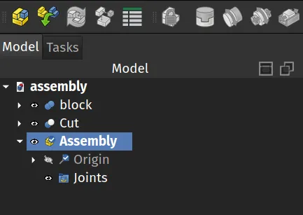
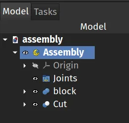
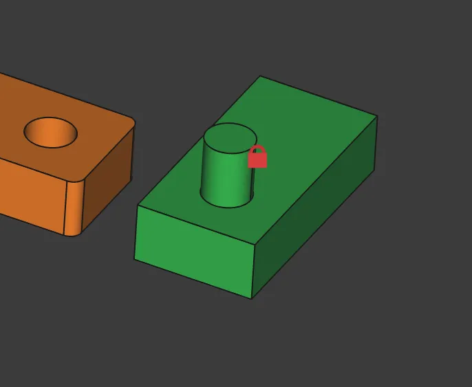
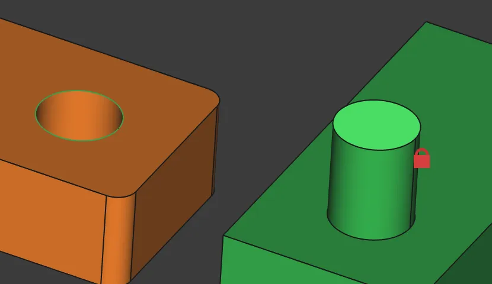
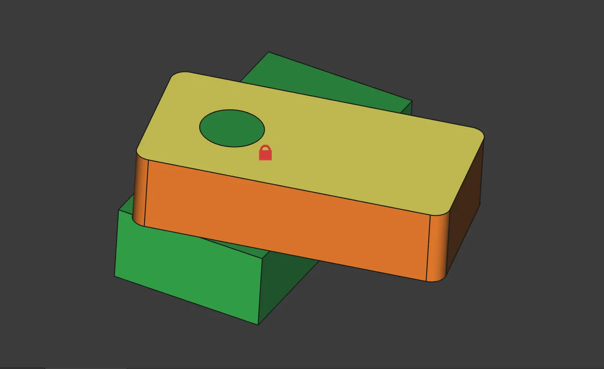

With the [Version 1.0 release candidates coming thick and fast](https://blog.freecad.org/2024/09/24/the-second-release-candidate-of-freecad-1-0-is-out/) it's a good time to explore some of the new features that Version 1.0 will have to offer. One of the most eagerly anticipated new features is the Assembly workbench. Documentation and a great tutorial can be found for the Assembly workbench [here](https://wiki.freecad.org/Assembly_Workbench) but it can be fun to just quickly work through the most minimal viable example to get a quick idea of a basic workflow.

In our tutorials we always refer to tools by the name of the tool that appears in the tool tip when you roll over the tool icons. Rolling over tool icons and reading tool tips is a great way to learn what functionality a workbench offers.

In this example we first used the part workbench to create two parts in the same project. Both are 20mm x 10mm x 5mm cubes, one is a union with a cylinder and the other is a cut with a cylinder removed. We right clicked and used the "random colour" option to set each object to a different colour and placed the objects next to each other not overlapping.

Moving to the Assembly workbench we first click the Create Assembly tool icon. This creates an Assembly object in the file tree with Origin and Joints labels created inside it. Next left click each part we made in turn and drag them on top of the Assembly object in the file tree. This should move the parts inside the Assembly object and so can be included in the assembly.

Next select our part that is the union object with the protruding cylinder (the green object in our example) and then click the Toggle Grounded tool icon. In the preview you should now see that this part has a red lock symbol placed over it and it means that it is locked in it's current position and cannot be moved or rotated.

We want to assemble the other part so that the hole is centred and constrained around the small cylinder/axle. To do this, in the preview window click to select the upper edge of the hole and then use the control key to also select the upper face of the cylinder.

With these selected we simple click the Create Revolute Joint tool icon and then click OK. You should now see that our simple assembly is complete and if you left click on the non grounded block you can rotate it freely around the cylindrical axle object but not move it away from that connection.

This is a super simple way to dip a toe into this workbench. If you want to explore a little further the example in the documentation linked above is well worth working through to introduce you to different types of motion and joints. We look forward to seeing what the community makes!