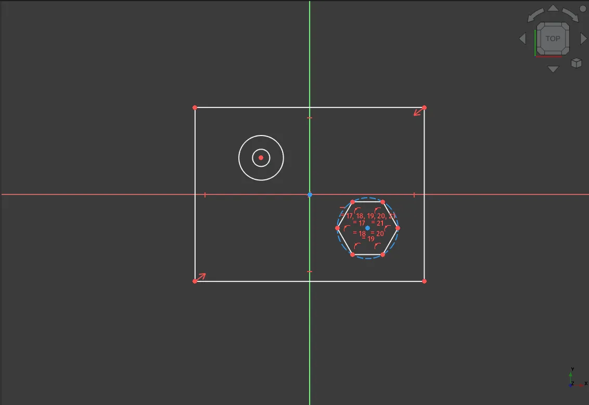
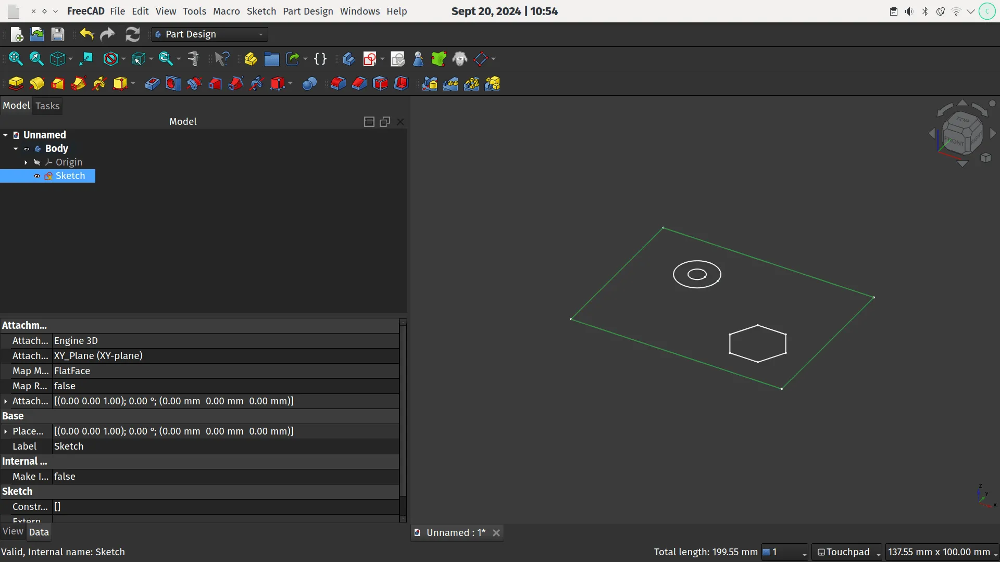
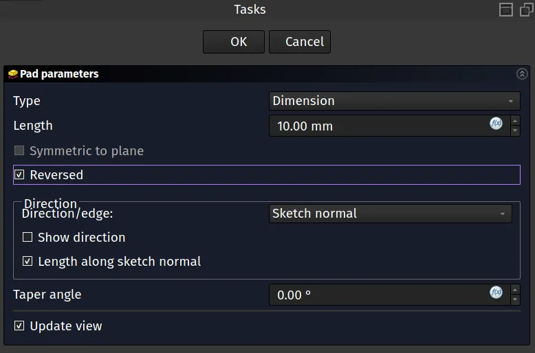
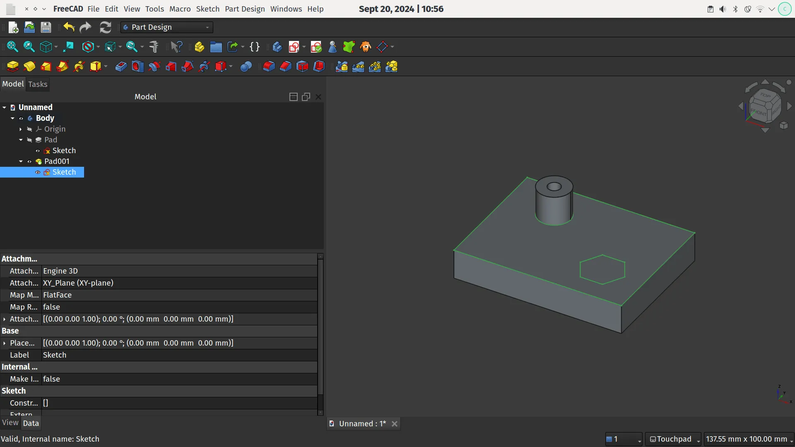

With the [release candidates for version 1 appearing](https://github.com/freecad/freecad-Bundle/releases/tag/1.0rc1) it's a nice time to explore some of the new features and functionality that FreeCAD now offers. You can read a long detailed list of new features here, and it's fair to note that many areas and workbenches of FreeCAD have received improvements.

The Sketcher workbench has numerous improvements, one of which is that we can now perform multiple operations within a single sketch whereas in older versions each operation would require a different sketch containing geometry. As a simple example of this we've opened up a new project in the Part Design workbench, created a new body and then created a sketch in the XY plane which takes us to a blank sketch in the sketcher workbench.

Next we've quickly drawn an unconstrained example sketch which contains a rectangle, a pair of circles sharing the same centre point and a hexagon. If we close the sketch, as usual, we are returned to the Part Design workbench and we can see the sketch in the preview window. Notice along the way that the new [On View parameter boxes](https://wiki.freecad.org/Sketcher_Workbench#On-View-Parameters) appear as we draw allowing us to input dimensions as we sketch!

Using the control key we can click each line of the rectangle in turn to select them all in the preview window. Next click the Pad button and in the dialogue in the combo view check the "Reversed" radio button so the pad is created below the sketch item in the Z axis. You should see that the Pad created is just the rectangle and the sketch is now toggled to non visible inside the Pad item. Click the Pad item, highlight the sketch item and use the space bar to toggle it's visibility so we can see it again on top of the Pad we just created in the preview window.

We can now multi select the 2 circles we created in the sketch and use the Pad function again to Pad the hollow cylinder rising up from the rectangular base. Likewise we can perform other operations, for example we can multi select the lines creating the hexagon and use the pocket tool to create a hexagonal hole extend down into the rectangular pad.

Whilst all this was possible in previous FreeCAD versions it's really optimised workflow allowing us to minimise clutter in our hierarchies and maximise the use of sketch elements.