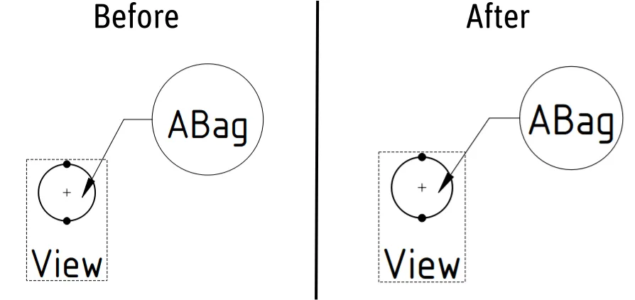

This week in FreeCAD development:

**FEM**: marioalexis84 rewrote meshing with Netgen to use Netgen's Python bindings rather than a broken plugin in salomemesh. He also rewrote the way meshing with Gmsh is executed, so it's now possible to cancel the entire process thanks to running it in a separate thread.

**BIM**: Roy-043, pinkavaj, and hoshengwei fixed several bugs including two in UI, and yorikvanhavre updated the workbench to support recently released IfcOpenShell 0.8.

**TechDraw**: WandererFan fixed a bug where the 'Save a copy...' command would be unavailable with an opened page, and benj5378 significantly improved the centering of labels inside balloons.

**GUI**: pinkavaj, qewer33 and benj5378 fixed various UI annoyances, and kadet1090 forced Qt6 to load OpenGL immediately, otherwise the first new document would be temporarily hidden. Please note: we are not planning to ship FreeCAD 1.0 built with Qt6, but we still need to fix these bugs.

Among other contributions:

- bgbsww and CalligaroV fixed several toponaming-related issues in Sketcher.
- hlorus and benj5378 fixed several issues in the new measurement tool, including one where the tool would get incorrect data from linked elements.
- bgbsww fixed a blocker issue in Part Design where a new sketch in a link would not open at the correct location.
- yorikvanhavre and Roy_043 fixed several minor bugs and regressions in Draft.
- furgo16 patched the legacy DXF importer to support importing dimensions.
- shaise improved the compatibility of the new mill simulator in CAM with less beefy GPUs.

**PR stats**: since the previous report, 52 pull requests have been merged, 38 new pull requests have been opened.

**Issue stats**: overall, there are 2051 open issues in the tracker, up by 53 from last week. 11 of them are v1.0 release blockers, up by 4 from last week.