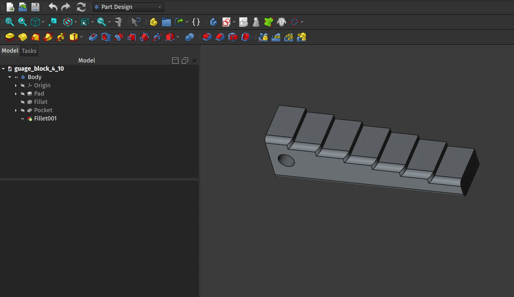
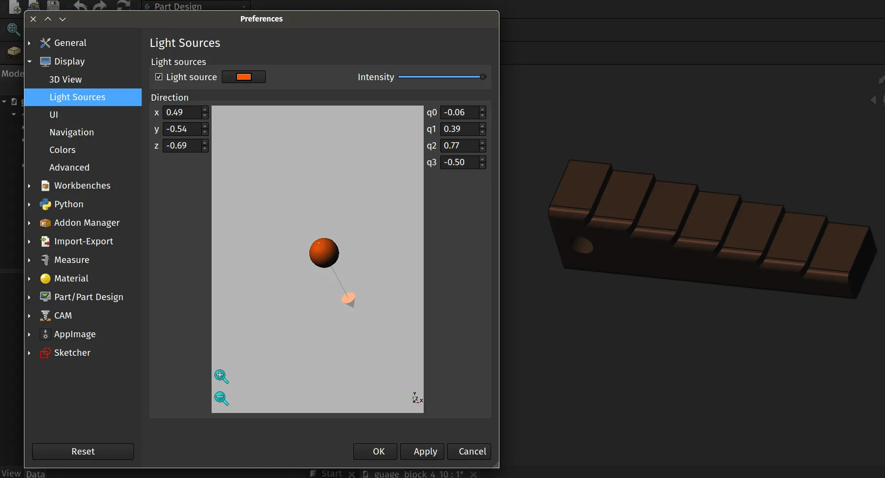

We've written numerous tutorials recently looking at some of the larger changes and developments in the upcoming FreeCAD version 1.0 which can already be found in the current release candidate and the weekly developer versions of FreeCAD. The recent tutorials include the [On View Parameter](https://blog.freecad.org/2024/10/20/tutorial-on-view-parameters/) features in the Sketcher workbench and the new [Assembly workbench](https://blog.freecad.org/2024/09/30/tutorial-getting-started-with-the-assembly-workbench/).

A smaller, but perhaps quite noticeable feature, is that we now have an adjustable light source in our preview window to provide some light and shade on our models. Let's look at how to adjust this new feature.

Open a FreeCAD project with a model in the preview window and take a moment to look at the way it is lit. Next, from within any workbench, let's click "Edit - Preferences". In the preferences dialogue click the "Display" drop down item from the list on the left hand side. In the drop down select the "Light Sources" option.

It's reasonably straightforward to make adjustments to the lighting source. A colour selector menu is available labelled "Light Source" where you can alter the colour of the lighting. Note that next to this is a checkbox, if you clear the tick from this checkbox you can turn off and on the light source. At the top of the dialogue you will see a slider labelled "Intensity" you can adjust the level of lighting using this.

With the light source check box ticked you can adjust the angle of the light source relative to your model by grabbing the handle arrow attached to the grey ball. You do this by left clicking on the handle arrow and dragging it around. The preview window changes the lighting source conditions on the grey ball at the centre of the window giving feedback of how the lighting source will look once applied to your model.

Once you have adjusted the lighting source to your satisfaction click the "Apply" button, if you move the preferences window to the side of your display you can see the effect and readjust if needed. Once happy click OK to close the the preferences dialogue.