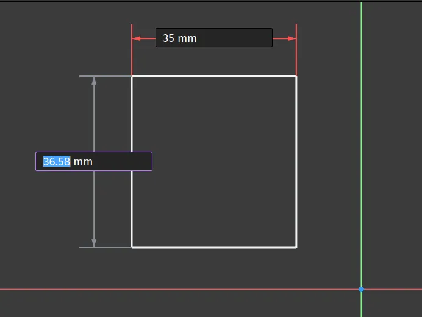
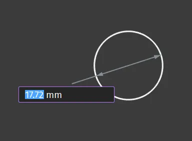
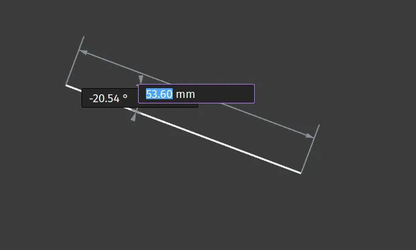
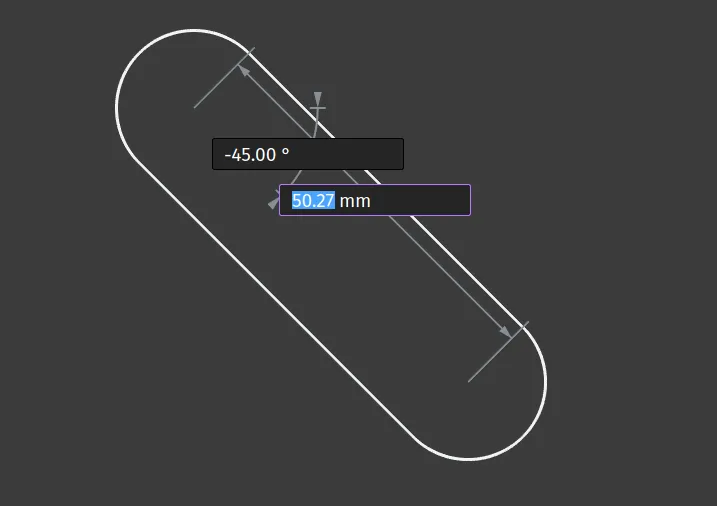
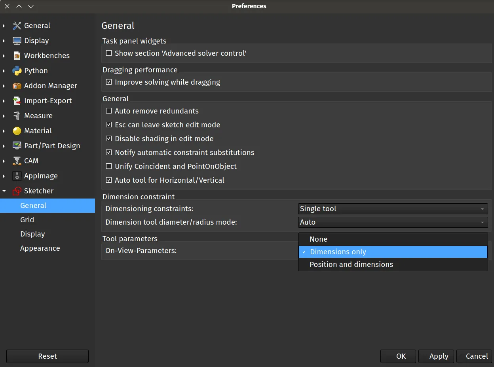
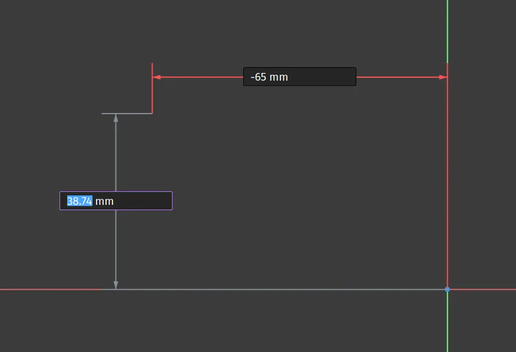

One of the excellent new features in the upcoming version 1.0 release is the addition of "On View Parameters" for many of the tools in the sketcher workbench. These are parameter inputs boxes that appear automatically when you use sketcher tools mean to add dimensions and more as you create the geometry.

In the default preferences for version 1.0 the on view parameters will be available for dimensional input when you start to draw many objects in sketcher. As a simple example let's draw a rectangle in a new sketch on the XY plane. Click the "Create rectangle" tool icon and left click and drag to begin to create a rectangle or square. As you draw you will notice the on view parameter boxes appear. The X axis box will be active so you can type a value for the X axis length of the rectangle. Type in your value and then click the enter key. The X axis value will be set and the Y axis on view parameter input will now be highlighted. Type a value here and then click enter once more to finish your rectangle.

As a second example lets create a circle. Click the "Create circle by center" tool. Left click to begin to draw a circle and notice that there is only one on view parameter box into which we can type a value for the diameter of the circle. Type a value and click enter to complete your circle.

Moving beyond simple height, width or diameter parameters, let's draw a single line to look at adding angle values. Click the "Create line" tool icon and left click to start drawing a line. Dragging across a line will be created with a length parameter input. Type a value and click enter. The next on view parameter highlighted will set the angle of the line relative to the start point. Again you can move the line to the desired position and the parameter will update or you can type in a value in degrees. Note that if you hold down the control key whilst the angle parameter view is highlighted you constrain the movement of the angle into 5 degree steps. Click enter to finish the line.

Moving to a slightly more complex example we can draw a slot. Click the "Create slot" tool icon and then left click to begin to draw a slot in the sketch. Notice that there are 2 on view parameter input boxes initially. The first highlighted input defines the length of the slot between the radius end centre points. Insert a value for this and press enter. The next active on view parameter is the angle of the slot. You can rotate the slot and see this figure change or of course you can type in a value in degrees. Once you have typed or placed your correct angle hit the enter key again. You now should have a new on view parameter input appear, this input receives a value for the radius of the slot ends, which obviously sets the width of the slot, again move the slot object to the value you require or type a value and press enter to finish your slot.

With a little practice it becomes second nature to cycle through the on view parameters as you sketch but it's also worth knowing that you can turn off these on view parameters or indeed you can expand on their functionality using the sketcher workbench preferences. Click "Edit - Preferences" and then select the "Sketcher" tab from the list. At the bottom of the resulting window you should see a "Tool Parameters" section with an "on-view-parameters" drop down available. Clicking on the drop down reveals 3 options. Selecting "None" allows you to turn off this feature and you can revert to adding dimensions and values using other methods. The default option "Dimensions only" is the setting we have used so far but we can switch to "Position and dimensions". Selecting "Positions and dimensions" expands the on view parameters to include co-ordinate data.

 If we apply this option and draw a rectangle notice that when you select the tool, before you click to start a rectangle, you have on view parameters for the co-ordinates of the start point. Again you can type in the X co-ordinate of the start point, click enter and move to the Y co-ordinate. Pressing enter after the Y co-ordinate you then start to draw a rectangle with the on view parameters for the length and height as we did earlier. Completing these parameters we should then have a fully constrained rectangle in our sketch.