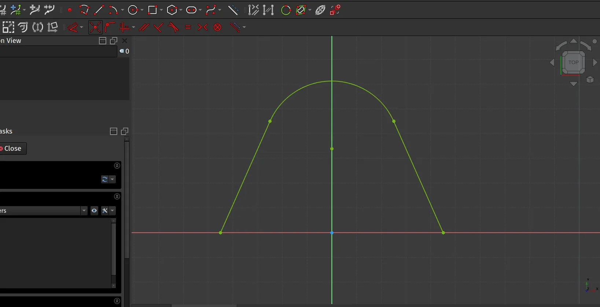
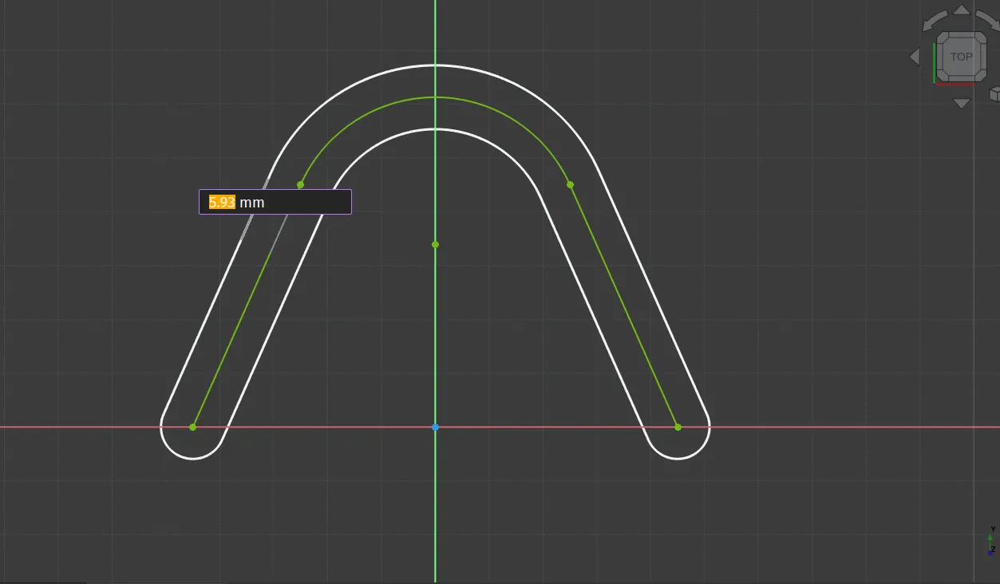
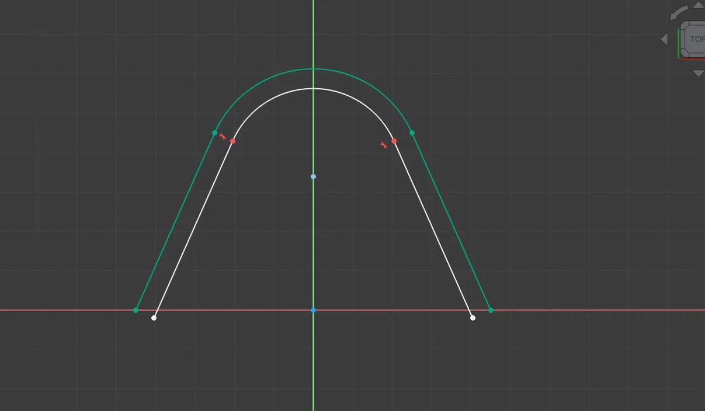
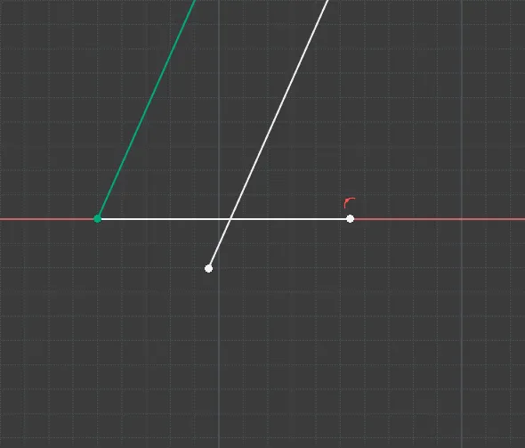
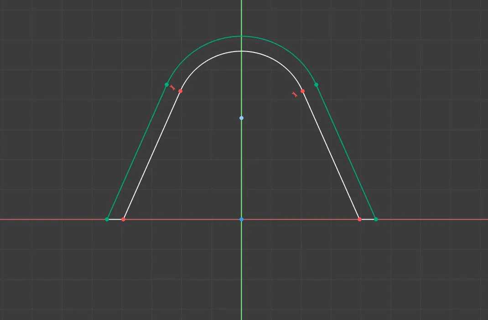

In the version 1.0 release candidates and the upcoming version 1.0 a new "[Offset Geometry](https://wiki.freecad.org/Sketcher_Offset)" tool can be spotted on the sketcher workbench. Let's have a look at how this tool can be used to help create sketch geometry more efficiently.

In a new sketch we used the Polyline tool to create this simple "A" shape with an arc at the top. We set the various vertices so that is is constrained as symmetrical around the Y axis. Let's now apply an offset to this polyline.

Use the control key and left click each section of the line to multi-select them all. Then click the "Offset Geometry" tool icon. With the tool selected if you hover over the line in the live preview you should see the offset geometry appear with an [On View Parameter](https://blog.freecad.org/2024/10/20/tutorial-on-view-parameters/)input box. You can now type the offset dimension into the input box to create the offset geometry all around the original polyline at the desired offset. We went with a 5mm offset in the example.

You'll see that with the default settings the Offset Geometry tool adds an offset at all points referencing the underlying sketch components at the offset input. This creates an offset line on all sides of the underlying sketch component. Of course is possible to edit the Offset Geometry in the same way as any other sketcher item. As an example, if we were aiming for an internal offset only that we then wished to close to the original sketch item we can first delete the offset items on the outside of our original item.

With the extra offset items deleted we are left with the internal offset parts and we can close our sketch ready for pad or other operations by adding line sections and trimming them. Simply drawing lines and then using the "Trim Edge" tool to remove overlapping sections of our drawn lines and the offset lines.

With the sketch wire now closed, we can pad our sketch as seen in the image at the top of the article.