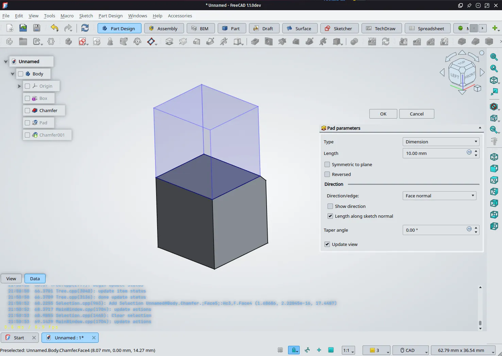

The FPA General Assembly approved two new grant applications.

**Kacper Donat** aka kadet will work on a [new feature preview system](https://github.com/freecad/fpa-grant-proposals/issues/22) that can be used in Part and Part Design. Whenever you need to apply Pad or Loft or any other command, you will get a transparent preview of what you are getting right in the viewport.

Development already started weeks ago, the plan is to complete it by the end of 2024. Kacper was awarded a grant of EUR 1,500.

This is the first part of a larger project intended to unify Part and Part Design. Further planned stages, that are out of scope for this grant, are:

1. Add more multi solid capabilities to Part Design

2. Allow using features from other workbenches in Part Design workbench

3. Merge duplicated features together (Extrude / Pad / Pocket, Chamfer, Fillet etc.)

**Dr. Rajeevlochana G. Chittawadigi**, **Dr. Ravi Kumar V.**, and **Dr. Mohan Kumar S.** will develop a [Sketcher addon](https://github.com/freecad/fpa-grant-proposals/issues/12) for teaching how to use the workbench. Users will follow step-by-step instructions, and the wizard will highlight mistakes (if any) after each step. The project deliverables are spread across 9 months. The team was awarded a grant of USD 6,000 (to be paid to one representative in three steps).