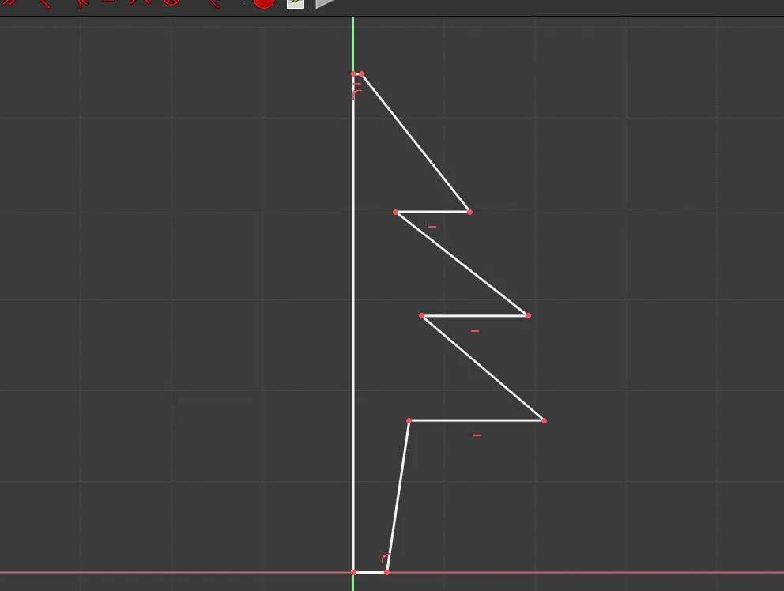
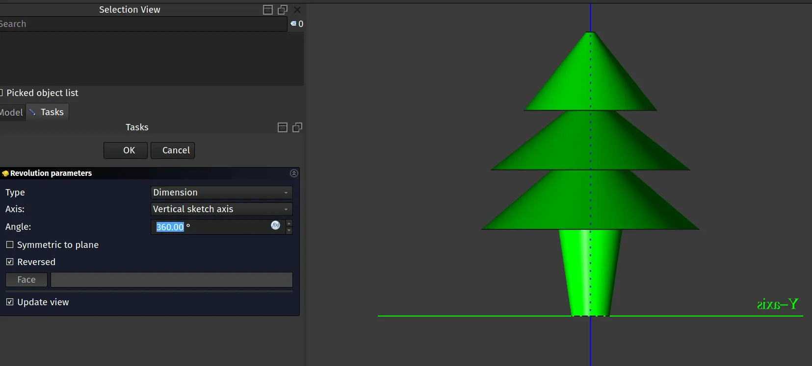
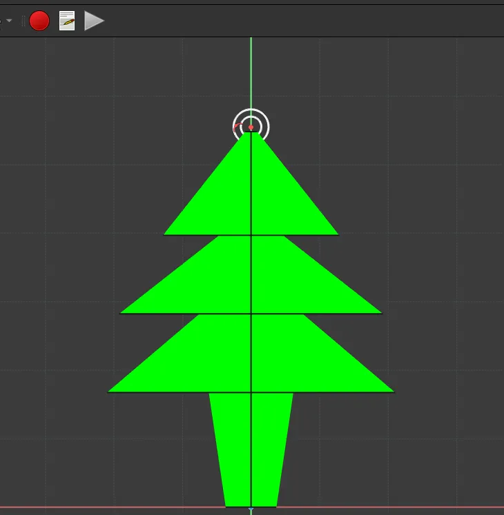

The FreeCAD community is a wonderful diverse place and certainly not everyone in the community will be involved in traditions of bringing trees into their homes and then decorating them! However a festive tree decoration, in the shape of a tree, can be a good mini project for playing with the Revolution tool.

 Note that in all our tutorials on this blog we describe tools using the tool tips that appear when you hover your pointer over tool icons. This encourages everyone to look through the tool icon descriptions!

To begin open up FreeCAD and create a new project. Move to the Part Design workbench and then in the combo view click "Create Body" and in turn "Create Sketch" and select the XZ plane to sketch in. You should now see that you have jumped to the Sketcher workbench.

We are going to create a sketch that forms a profile of one half of our basic festive tree design. Click on the "Create Polyline" tool. Staring from the Z axis line draw a profile roughly matching ours. Notice that we have left a small flat section at the very top and we've closed the polyline with a final line up the Z axis to create a closed sketch. Whilst you can constrain the sketch correctly it's not too critical to do so when creating a festive tree decoration!

Close the sketch to return to the Part Design workbench and then highlight the sketch in the combo view panel. Next click the "Revolution" tool icon. You should now see that your sketch has been extruded revolving to create a circular profile of a tree. Note that you can change the angular amount of rotation, whilst we have left ours at the full 360 degrees you might consider, for example, revolving the object 180 degrees so it has a flat back, perfect for 3D printing in two halves.

To add our little hanging loop to our decoration we simply added another sketch and use the Pad tool to create the loop clicking the "Symmetric to plane" option to position it correctly.

Finally, we are sure that wonderful FreeCAD users could create much better designs than this! Do feel free to share any festive designs you are working on!