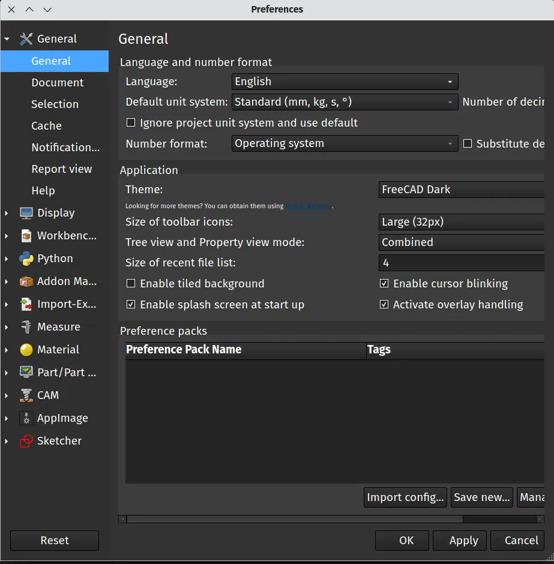
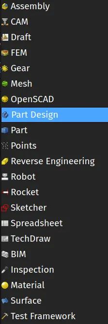
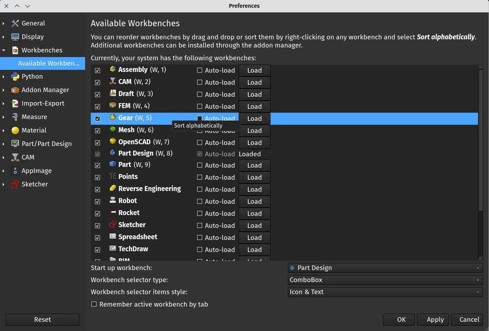
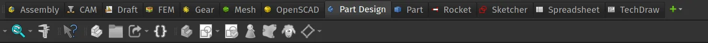

With the arrival of version 1.0 it's a good time to take a look at some of the basic appearance options available to adjust to our preferences. So let's look at the basics of switching themes and changing the listing and appearance of workbenches in FreeCAD.

If we launch FreeCAD and then navigate to Edit-Preferences we will land on the main "General" tab. On the General tab we should find a box labelled "Application" and the top item in this box is "Theme". There is a drop down menu next to "Theme:" and in a default new installation FreeCAD version 1.0 comes with 3 themes, FreeCAD Classic, FreeCAD Dark and FreeCAD Light.

Rather nicely if you swap theme using the drop down menu you can click the "Apply" button at the bottom of the Preferences page and you will switch into the new theme without having to close the window or restarting FreeCAD so it's easy to have a look at, and choose, from the built in themes.

If you are new to FreeCAD you'll probably have learnt that FreeCAD works using a range of different workbenches. This saves clutter in terms of having related groups of tools collected into a workbench and we can switch near instantly between workbenches bringing our work to the new collection of tools. As we use and learn FreeCAD we all tend to have some workbenches we use regularly and others we use rarely and some we may never even explore. You may also know that we can add on additional workbenches which are developed and contributed by our brilliant community. As such, it's likely that after some time learning and using FreeCAD you might want to edit your workbench list and appearance.

Again, in the preferences panel, move to the "Workbenches" tab which appears in the list on the left hand side. In the workbenches dialogue there is a list of all the workbenches you have installed in your FreeCAD setup. This will include any workbenches you have added using the Addon manager. You can simply check or uncheck workbench items in this list and that will toggle their visibility in the default workbench drop down combo box. Notice that you can also left click over a workbench listing and then drag it up or down in the list changing the order in which the workbenches appear in the list. You can, at any time, right click on any workbench list item and select "sort alphabetically" to arrange the list in alphabetic order.

Finally you can also switch between "ComboBox" and "TabBar" in the "Workbench selector type" drop down. By default this is set to "ComboBox" which shows the workbench as a dropdown list. If you select "TabBar" and click apply and then "OK" the preferences tab will close and you will be prompted to restart FreeCAD. Once restarted you should see that your workbench list now appears as a collection of tabs across the top of the screen. This can provide a quick way to jump between commonly used workbenches.

We've only really scratched the surface in this mini tutorial, there are many ways to customise the appearance of FreeCAD, it's worth looking through the [forum](https://forum.freecad.org/), and exploring community contributed style sheets and themes in the [Addon manager](https://wiki.freecad.org/Std_AddonMgr).