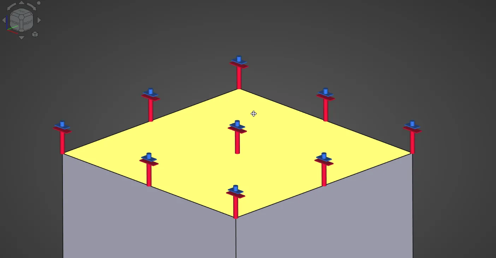

This week in FreeCAD development:

**FEM**: marioalexis84 added an electrostatic constraint symbol to the 3D view. He also made it possible to run CalculiX on one core and added an optional Laplacian smoothing filter to the contour filter to get a smoother result when the generated isosurfaces are too coarse.

**TechDraw**:

- WandererFan fixed an issue with leader and welding symbols on a rotated base view, an issue with balloon bubble shape fills, and a bug where the workbench would not respect locale settings when performing template date autofilling.
- Another fix arrived from 3x380V, and PaddleStroke reverted an earlier fix for exploded views until he comes up with a better solution.

**PartDesign**:

- FlachyJoe added the Freeze toggle to the context menu. He also fixed an issue where an additive Helix with a negative cone angle would break with height over one revolution.
- CalligaroV fixed a regression that was introduced when merging the toponaming code.

**Sketcher**:

- VincidaB fixed a UX issue where it would take two right mouse buttons to exit the polyline tool after creating a closed shape.
- Additional improvements and fixes arrived from pinkavaj and wwmayer.

**CAM**:

- davidgilkaufman added multi-pass support for profile operations.
- LarryWoestman fixed the code so that the rotary axis parameters are not converted when the "--inches" argument is passed to the refactored postprocessors.

**GUI**: Syres916, chennes and marioalexis84 contributed various fixes. kwahoo implemented a method to select objects with a 3D ray using motion/VR controllers, this is intended for his [FreeCAD XR workbench](https://github.com/kwahoo2/freecad-xr-workbench):



Also:

- Multiple fixes in Part by wwmayer.
- Various fixes contributed to BIM by yorikvanhavre, Roy_043, luzpaz, and ronnystandtke.

**PR stats**: since the previous report, 65 pull requests have been merged, and 33 new pull requests have been opened.

**Issue stats**: overall, there are 2408 issues in the tracker, up by 80 from last week.