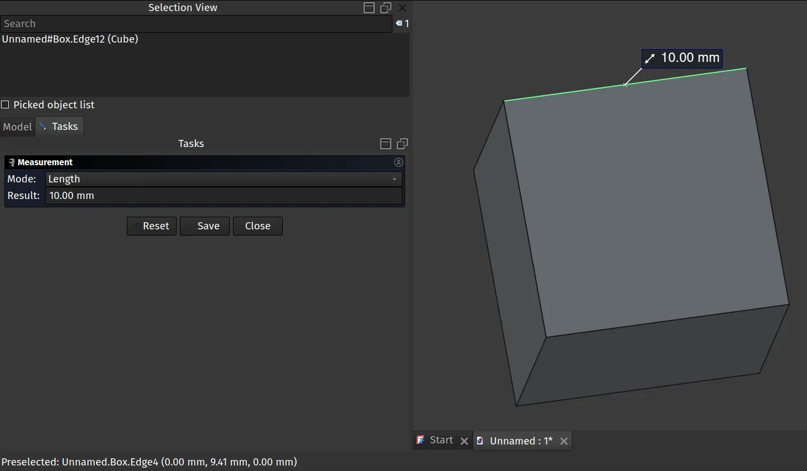
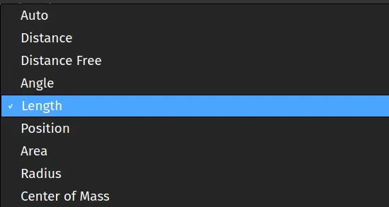
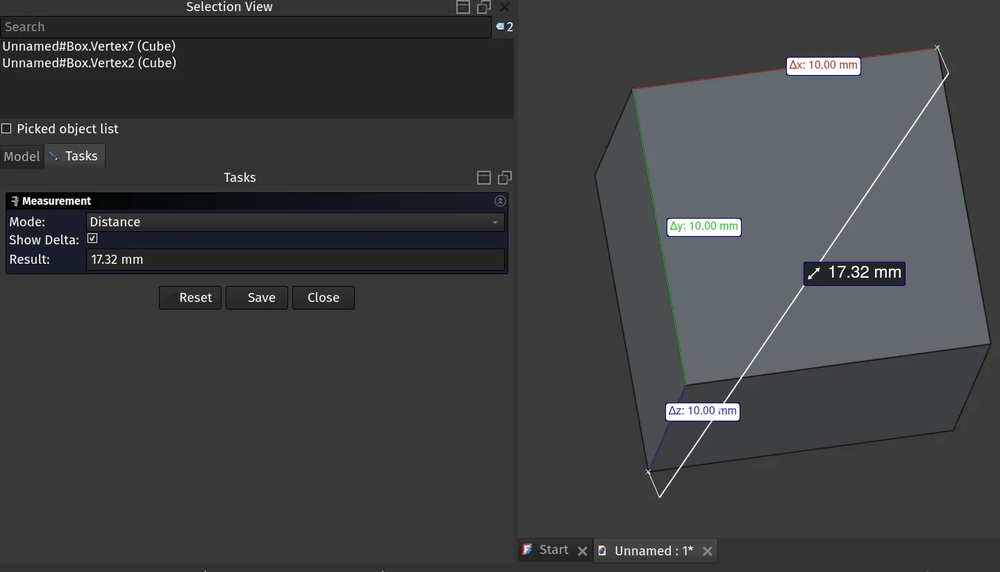

Amongst the many changes you may have noticed in version 1, the Standard Measure tool icon has changed from an image of a tape measure to a set of Vernier Calipers. It's not just the icon that's changed though, the underlying measuring tools have been improved and expanded.

Clicking the measure tool icon opens a dialogue box and, if you have no geometry selected the drop down menu at the top of the dialogue should have the Mode set as "auto". In this state the Measure tool is ready for you to select some geometry and it will make it's best guess at what you want to measure. So for example clicking an edge of a cube the tool will automatically switch the mode to "length" and return a result in your default units.

Notice though that you don't have to use the automatically selected mode, using the mode dropdown menu you can switch between the various options for this tool.

As a more complex example we have created a rocket nosecone using the fabulous Rocket Workbench addon (see the header image above). If we select the nosecone object in the selection view and then click the Measure tool icon we can switch the mode to the Centre of Mass and the tool will return co-ordinates for the centre of mass, often important if you want your rocket design to actually fly. However we can also click the edge at the lower end of the ellipsoid nosecone and the Measure tool mode will move to "Radius" and return the radius.

Finally lots of time we might want to measure a distance between two point. Using control and left clicking 2 points and then clicking the Measure tool icon and it should auto switch the mode to "Distance" note that in distance mode it will return the change in X Y and Z axis as delta X, Y and Z values, all incredibly useful. If you haven't played with the new Measure tool, it's definitely worth exploring.