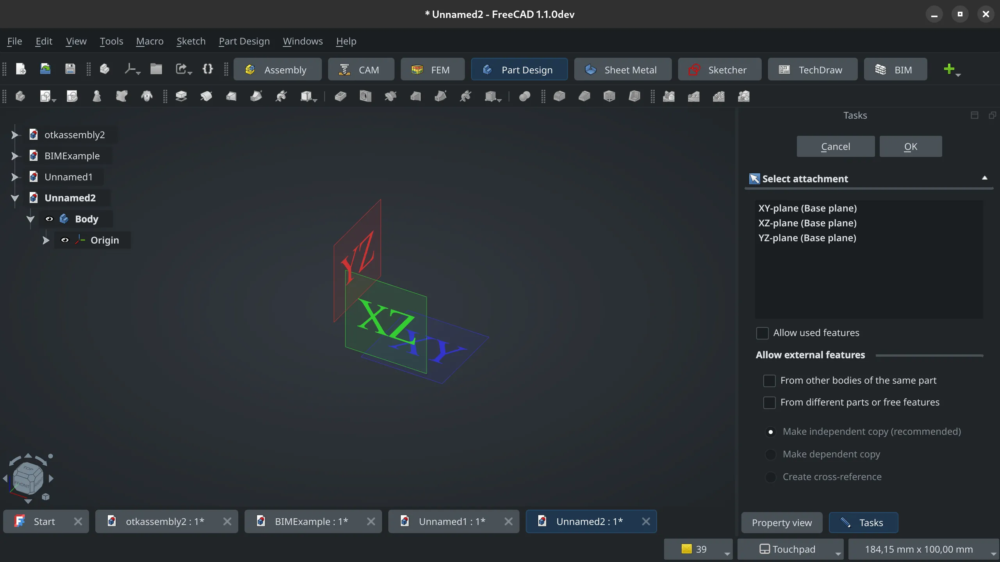

This week not much has been happening in FreeCAD development due to the winter holiday season. Nevertheless:

**Core**: PaddleStroke improved the new LCS style to address [concerns](https://github.com/freecad/freecad/issues/18337) raised by users who rely on the weekly builds.

**Draft**: Roy_043 removed unnecessary CamelCase in the names of some functions.

**PR stats**: since the previous report, 2 pull requests have been merged, and 32 new pull requests have been opened.

**Issue stats**: overall, there are 2457 open issues in the tracker, up by 23 from last week.