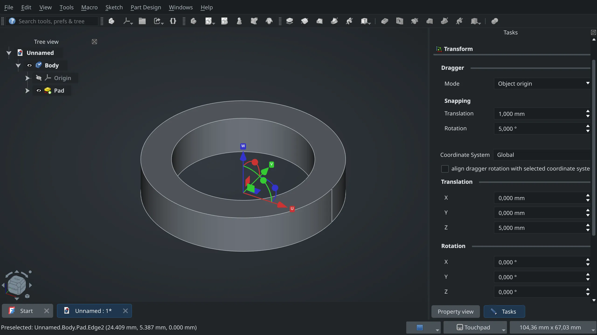

This week in FreeCAD development:

A major user-visible change is the introduction of the Transform task panel that simplifies precise translation and rotation of objects in 3D space:

This patch is part of kadet1090's [grant project](https://github.com/freecad/fpa-grant-proposals/issues/22). There are a few more **GUI** changes:

- tritao improved the Coin scene inspector dialog to make the information human-readable.
- PaddleStroke improved the stylesheet to get the correct background color displayed after moving a toolbar in the menubar and backported extended branding options from Ondsel's soft fork.

**Part and Part Design**: wwmayer improved several aspects of the new datum objects; he renamed the user-visible menu items and added methods to get the base and direction of datum elements.

**TechDraw**: WandererFan fixed the slow transform in ShapeFinder and dimension font clipping.

Other changes:

- BIM: various fixes by yorik, Roy_043, paullee0, galou, and tritao.
- Draft: several fixes by Roy_043.
- Sketcher: wwmayer fixed issues in ellipse creation.

Additional changes arrived from FEA-eng, coldtobi, chennes, mosfet80, wwmayer, tritao, hyarion, BootsSiR, ovo-Tim, and kpemartin.

**PR stats**: since the previous report, 35 pull requests have been merged, and 40 new pull requests have been opened.

**Issue stats**: overall, there are 2509 open issues in the tracker, up by 4 from last week.