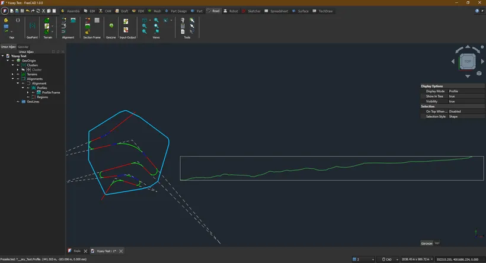

This week in FreeCAD development:

**Sketcher**: wwmayer introduced a new option to to always add external geometry as a reference so that the old workflow was still possible.

**Draft**: Roy_043 fixed several bugs and made two changes worth mentioning separately. He improved the make_sketch command to use Sketcher methods for adding constraints when converting Draft objects to sketches. He also introduced base classes for Draft tests.

**TechDraw**: Syres916 fixed a bug in importing SVG files containing text in UTF-8, and WandererFan fixed a couple of other bugs.

**BIM**:

- Thanks to yorik, you can now add and edit [classifications](https://ifc43-docs.standards.buildingsmart.org/IFC/RELEASE/IFC4x3/HTML/lexical/IfcClassification.htm) for IFC and non-IFC objects. Another new feature by yorik is explicit quantities - quantity values, such as length or area, that are attached to objects and can be read by applications without the need to process the geometry.
- je-cook contributed improvements to the WebGL exporter to make it faster for more complex scenes.
- Additional fixes arrived from SurajDadral, Roy_043, paullee0

**FEM**:

- NewJoker added an accuracy parameter for CalculiX buckling analysis and removed the check for electrostatic potential constraint in the Elmer magnetodynamic 3D analyses.
- marioalexis84 added a suppressible extension to mesh regions, groups, and boundary layers to temporarily defeature them (about a year ago, FlachyJoe did the same for FEM constraints).

Further improvements arrived from wwmayer, davesrocketshop, rostskadat, MisterMakerNL, mosfet80, hyarion, ein-shved, and looooo.

**PR stats**: since the previous report, 35 pull requests have been merged, and 32 new pull requests have been opened.

**Issue stats**: overall, there are 2505 open issues in the tracker, up by 48 from last week.

In community news, Hakan Seven recently resumed his work on transportation and geomatics engineering in FreeCAD and created a new 3rd-party workbench called [Road](https://github.com/HakanSeven12/Road) (his previous project was [Trails](https://github.com/joelgraff/freecad.trails), made with Joel Graff).

