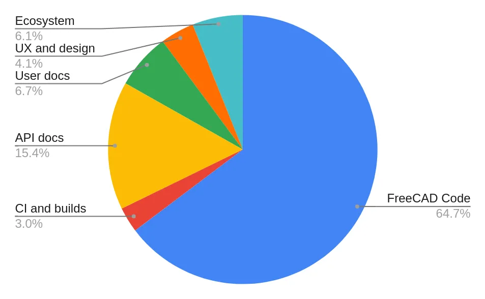
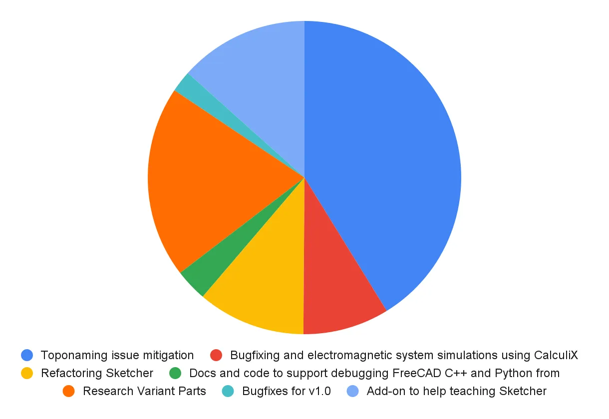

Since its inception in late 2021, the FreeCAD Project Association (FPA) has been collecting the community's donations with the intention of spending them on improving FreeCAD and its ecosystem. In 2024, the FPA launched its first annual grant program. Here is a recap of how this went.

## Program and out-of-program participation

The idea behind the annual program was to batch the review of grant applications, similar to what the team does for Google Summer of Code (GSoC). However, we received only four applications by the initial deadline:

- Sketcher refactoring, by Ajinkya Dahale;
- Code transfer completion in the toponaming project, by Bradley McLean;
- Designing furniture and parametric components for the FreeCAD library, by Francisco de Assis Rosa;
- C++ API Documentation, by Pieter Hijma.

The first three projects have been successfully completed, the last one is an ongoing project.

After this initial batch of grants, we started receiving more out-of-program applications: more toponaming fixes, API documentation improvements, user guide updates, UX/UI improvements, etc.

The total number of approved grants since the annual program launch in 2024 was 17. Three additional grants were given prior to the launch, in January and February 2024.

## Budget allocation

The overall monetary allocation for all 20 projects in 2024 was $82,350-significantly above the original $50,000 budget. Despite this overrun, the FPA is still receiving money faster than it is spending it.

This is how the expense allocation for the approved grants breaks down by type of work:

Here is a breakdown of the allocation for code contributions:

Please note that all this is allocation, not actual spending. The distinction is important because not all projects have been completed yet. Some of the funds allocated in 2024 will only be disbursed in 2025.

More information about the 2024 spending will be published in FPA's annual report later this month.

## Aftermath

Overall, we think we are on the right track with the grant program. The FPA went from spending $4K in 2023 to allocating over $80K in 2024. The idea of paying contributors to do focused work that benefits the community is getting normalized, and that's a good thing.

There are certain things we think we need to improve.

- The annual program didn't get as many grant applications as we hoped for. The idea of batching reviews is still sound, so for 2025, we are making changes in how we run the program (see below).
- Currently, we have a minor overlap between the grant review committee and the FPA general assembly. So, some of the people who make technical recommendations also have voting power. We think this needs to be corrected by getting more people involved with technical reviews, eventually eliminating voting FPA members from the initial review process.
- The voting process was highly variable in how much time it took to achieve a quorum. That's why the work on one of the first grants (by the late Bradley McLean) was completed before we even announced the first approved grants. The FPA will continue to work to ensure that all members vote in a timely manner so that grants aren't delayed due to lack of member participation.

## Going forward

For 2025, we are replacing the annual program with four waves of grant reviews, on a quarterly basis. We are also raising the overall allocation cap to $80,000 for the entire year. This does not affect or include either 2024 projects or the only grant application that was submitted in 2024 and approved in 2025 (Ajinkya's second Sketcher refactoring project). Stay tuned for a separate announcement.