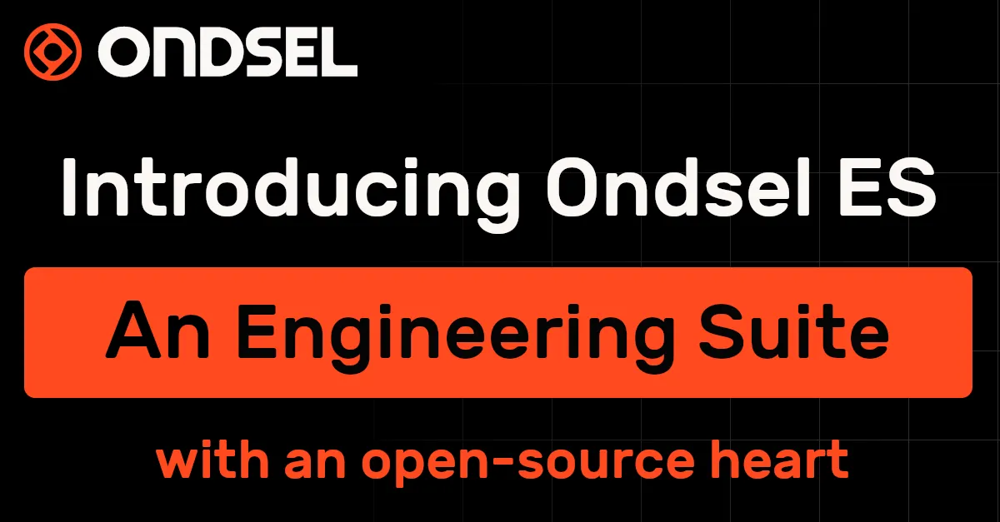

Ondsel was a great project which brought huge benefits and development into the wider FreeCAD project. One of the main projects at Ondsel was the creation of Ondsel Lens, a cloud-based platform for sharing and collaborating with CAD files. With the closing of Ondsel there has been some interest in these functionalities of Ondsel being made available to the wider community.

To this end, a one-time donation of EUR40,000 has been given to the FPA with a request that it be spent on modifying some of the Ondsel codebase so that it can be used by the wider community.

In a meeting with FreeCAD project association administrators it was decided that this fund would be administrated via the regular grant application and review process held by the FPA. The fund will be allocated towards work that refactors the code for the software developed by Ondsel so that it is more useful for the wider community within their own projects and organisations. This is especially applicable to teams working on Open Hardware. Applications to this fund are open so feel free to contact the FPA about this work package.

[Erratum: The original version of this article suggested the the funds would only be used for server-side code, but in fact any of the code developed at Ondsel is eligible for consideration.]