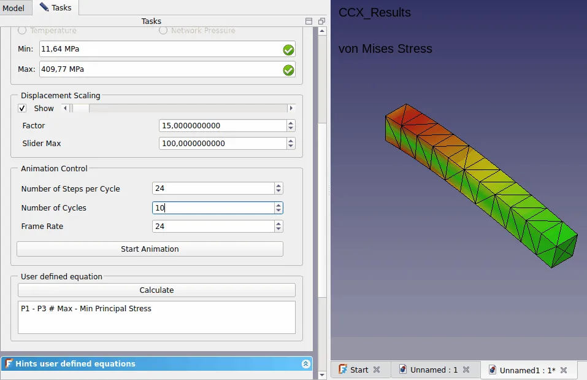
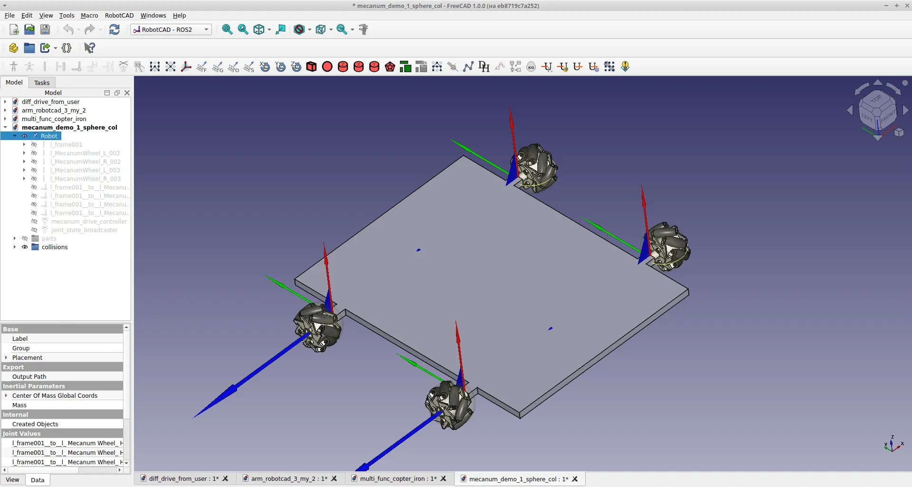

This week in FreeCAD development:

**Part Design**:

- Ziad-ashraf7 patched Part Design's [Draft tool](https://wiki.freecad.org/PartDesign_Draft) to allow negative angles.
- alfrix continued tweaking the UI of the Hole task panel.

**BIM**:

- rostskadat improved the SH3D (Sweet Home 3D) files importer: it now supports windows that span multiple floors and properly places door & window elements, as well as furniture.
- yorik, paullee0, and furgo16 fixed a couple of bugs.

**FEM**:

- marioalexis84 added Z-refinement support for Netgen.
- mac-the-bike implemented the animation of results; here is an older screenshot:

**CAM**:

- LarryWoestman patched the CAM workbench to fix a bug where the refactored postprocessors wouldn't handle the feed rate correctly when rotary axes are involved.
- hyarion fixed a blocker where Pocket and MillFace wouldn't cut to full depth.

**Toponaming**:

- CalligaroV ported another piece of toponaming code from LinkStage3.
- Another toponaming patch by the late Brad McLean landed after some tweaks.

**Among other changes**:

- Various fixes and code improvements in TechDraw by benj5378, FlachyJoe, and chennes.
- Roy-043 fixed several bugs in Draft.
- furgo16 brought back the ability to specify an additional custom folder to show its contents on the Start page.

Additional fixes were contributed by tritao, hyarion, alfrix, xtemp09, mosfet80, bofdahof, benj5378, PhoneDroid, hasecilu, bofdahof.

**PR stats**: since the previous report, 44 pull requests have been merged, and 36 new pull requests have been opened.

**Issue stats**: overall, there are 2613 open issues in the tracker, up by 45 from last week.

Elsewhere in the community, drfenixion released a new version of the URDF-generating [RobotCAD](https://github.com/drfenixion/freecad.robotcad) workbench with the following features:

- New controllers: Mecanum drive controller (with option to generate all code of wheels friction), GPIO controller.
- New sensor: Wide angle camera.

