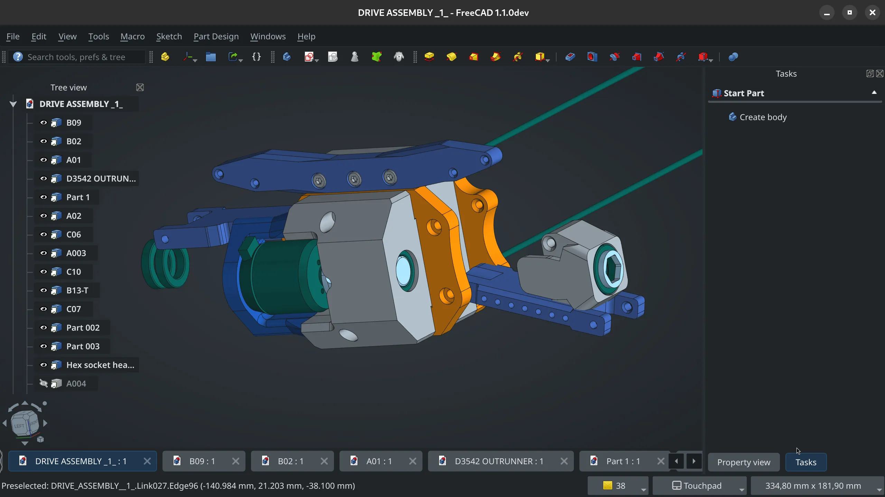

This week in FreeCAD development:

**Sketcher**: Shkolik fixed a bug in Sketcher where it wouldn't be able to project a BSpline from another sketch.

**TechDraw**:

- WandererFan fixed several issues, including one where arrow style settings would overwrite existing dimension objects.
- benj5378 did more code refactoring.

**FEM**:

- marioalexis84 added a FRD format converter to VTK (the former is used in CalculiX to read results of previous calculations like displacements and stresses)
- PaddleStroke and colinRawlings contributed two small fixes.

**UI changes**:

- kadet1090 implemented three-point lighting (main, back, and fill lights); the viewport is now prettier than ever before. Following that change, maxwxyz removed his workaround to help see sketcher geometry in front of planar geometry normal to the camera.

- kadet1090 also implemented an option to show the placement (or origin) of the object: the center point, normal direction, and axes of the sketch.
- Rexbas fixed an issue where clicking navigation cube buttons too fast-before the current animation finishes-would result in incorrect view rotation.
- theepicviolin added SolidWorks navigation style.
- Zen-cronic added a right-click menu option "Open File Location/Reveal in Finder" in the Tree view for models.
- alfrix simplified the 'fx' icon for expressions to be more legible at small sizes.

**Among other changes**:

- Jonezzzzz and chennes fixed a couple of bugs in Sketcher.
- Roy_043 fixed two minor issues in Assembly and incorrect alignment of sketches in SVG and legacy DXF export in Draft.
- leoheck and furgo16 contributed several improvements to the Addon Manager's internal mechanics, in particular, for Snap builds.
- LarryWoestman backported some of his earlier CAM fixes and improvements to the v1.0 branch for future point releases.
- tritao introduced a new Python-based C++ bindings generator.
- adrianinsaval fixed a bug where spnav (Space Navigator support) would not be enabled by default on Linux.

Additional fixes were contributed by tritao, PhoneDroid, mosfet80, Shkolik, adrianinsaval, benj5378, chennes, furgo16, Syres916, kpemartin, looooo, serkonda7, kadet1090, bofdahof, jose01carrillo30, oursland.

**PR stats**: since the previous report, 61 pull requests have been merged, and 47 new pull requests have been opened.

**Issue stats**: overall, there are 2634 open issues in the tracker, up by 21 from last week.