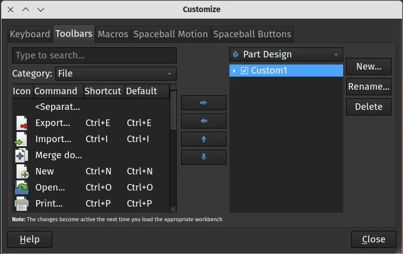
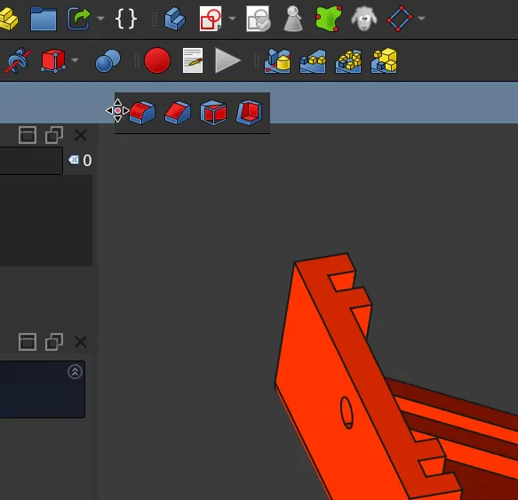
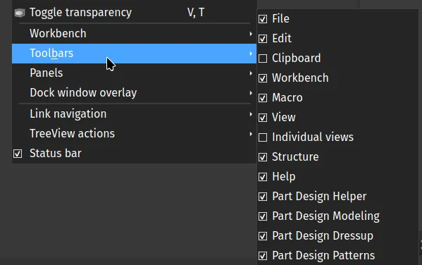
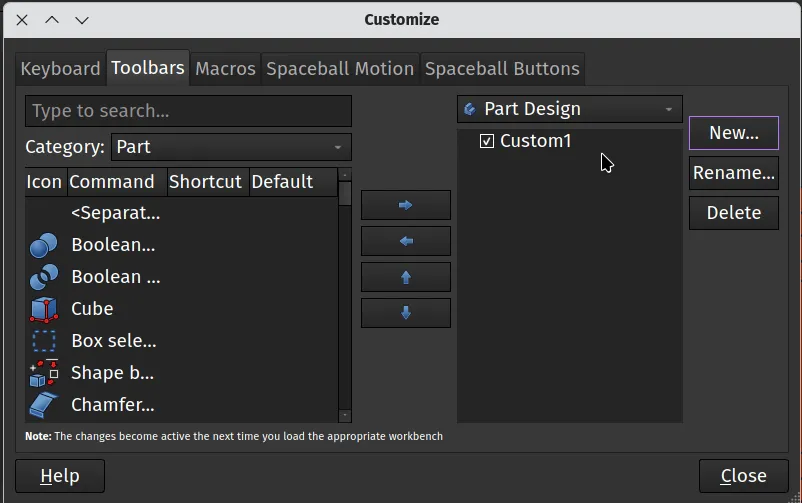
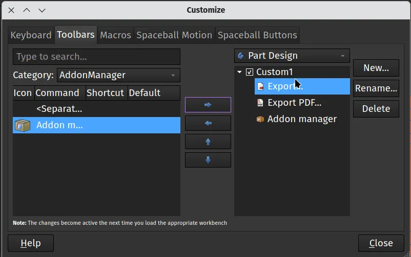
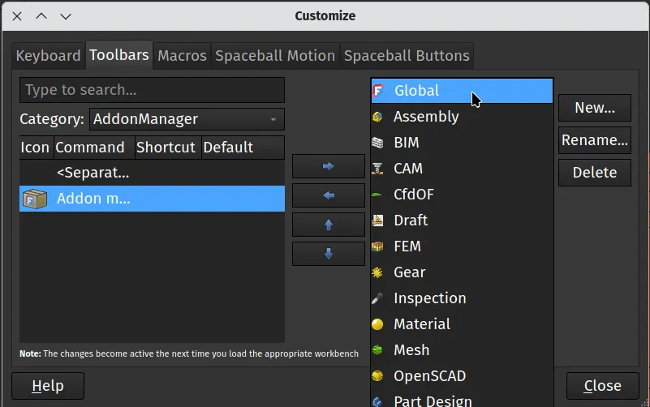

When you use any tool for a while you often build a more personal connection to it. Perhaps you have that old screwdriver in a drawer that's become polished with years of use and fits your hand perfectly. We've looked previously at [changing the appearance of FreeCAD using themes and also different workbench listing options](https://blog.freecad.org/2024/12/03/tutorial-themes-and-workbench-layout/) as a method of personalising our FreeCAD, in this tutorial though we'll look at toolbars and tool icons.

So all workbenches have their own collection of tools arranged into toolbar groups. One of the fundamental things to know is that you can left click on the 3 dots at the edge of a toolbar and you can then drag the entire toolbar to another position and can also drag it to an automatically created new toolbar line.

You can also navigate to `View - Toolbars` and you will see a tick list of toolbars that are available for the particular workbench you are in. You can then show or hide these toolbars by checking or un-checking them in the list. Notice that this list changes as you access it from different workbenches.

It's also possible to create your own custom toolbars which can feature any tool from any of the built in FreeCAD workbenches, these custom toolbars can be added to any workbenches you like or even be added globally to all workbenches.

For example, lets create a custom toolbar that will include the export function, the export to PDF function and the icon to launch the Addon manager. From the Part Workbench click `Tools - Customize`. In the resulting window click the "Toolbars" tab from the available selection. You'll see on the left hand side that an area populates with tools, icons and commands that you can choose from. There is a drop down menu titled "Category" and you can use this to jump to collated selections of tools. These categories can either be sections of FreeCAD like the "File" menu etc or they can be a workbench.

On the right hand side of the window click the "New" button to create your new custom toolbar. You can give it a recognisable name, or leave it as the default "Custom 1". With your new toolbar created you then scroll through, or use the search function on the right hand side to identify the tool or command you want to add to your custom toolbar. With the tool highlighted you then click the arrow point right to add the currently selected tool over into your new toolbar. We added the export function, the export to pdf function and the icon to launch the Addon manager. When you are happy with the contents of your custom toolbar click close. You may need to reload the Part Design workbench by moving to another workbench and then returning to Part Design but then you should see your custom toolbar. Note that on other workbenches this toolbar will not be shown, but it will appear in the `View - Toolbars` list we mentioned earlier so can be added to other workbenches.

If you want to create a custom toolbar that appears by default on every workbench as you use FreeCAD you can easily do so. Once again click `Tools - Customize` from the Part Design workbench. In the resulting window click the "Toolbars" tab from the available selection. This time on the right hand side click the dropdown that currently reads "Part Design" (or your currently selected workbench) and then select "Global" from the list. Now when you create your custom toolbar it will automatically appear throughout FreeCAD.

