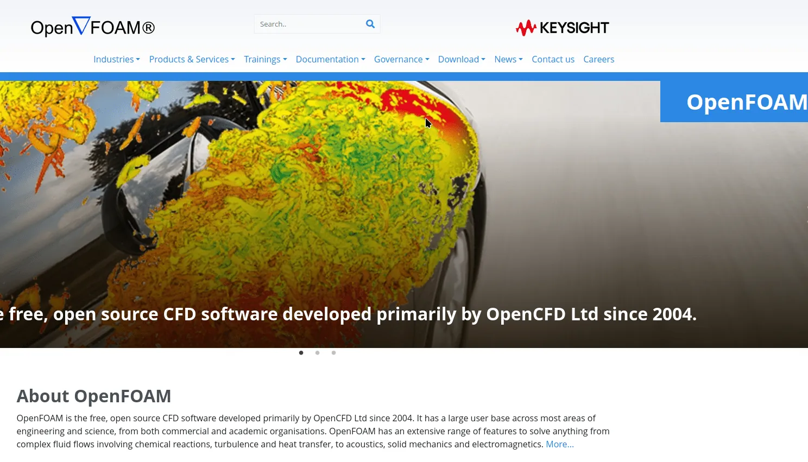
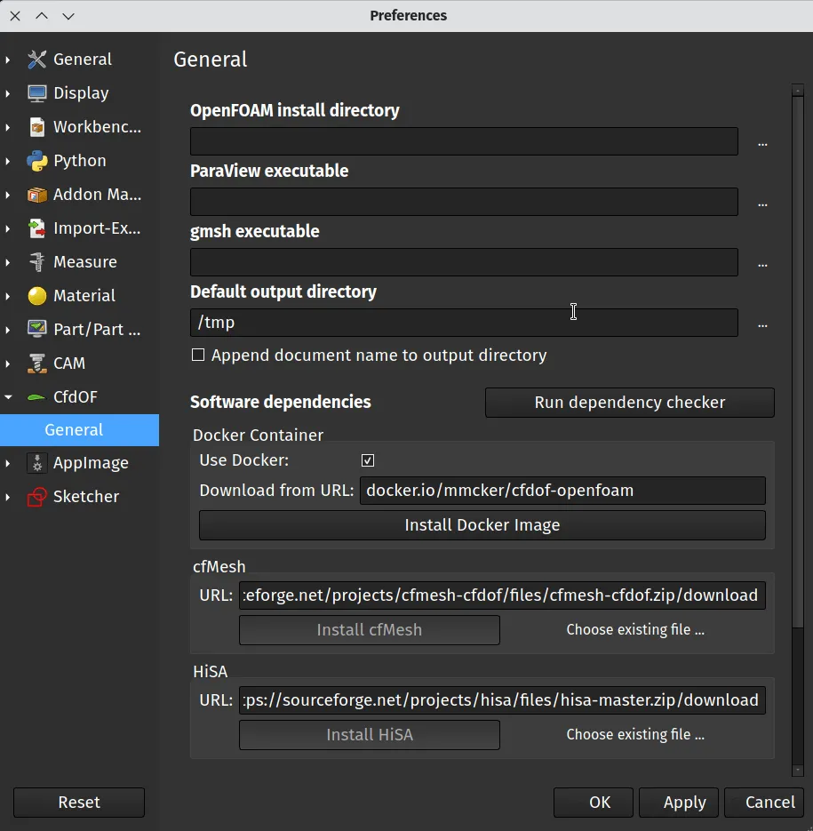
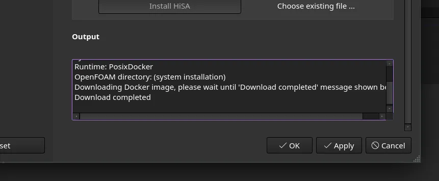
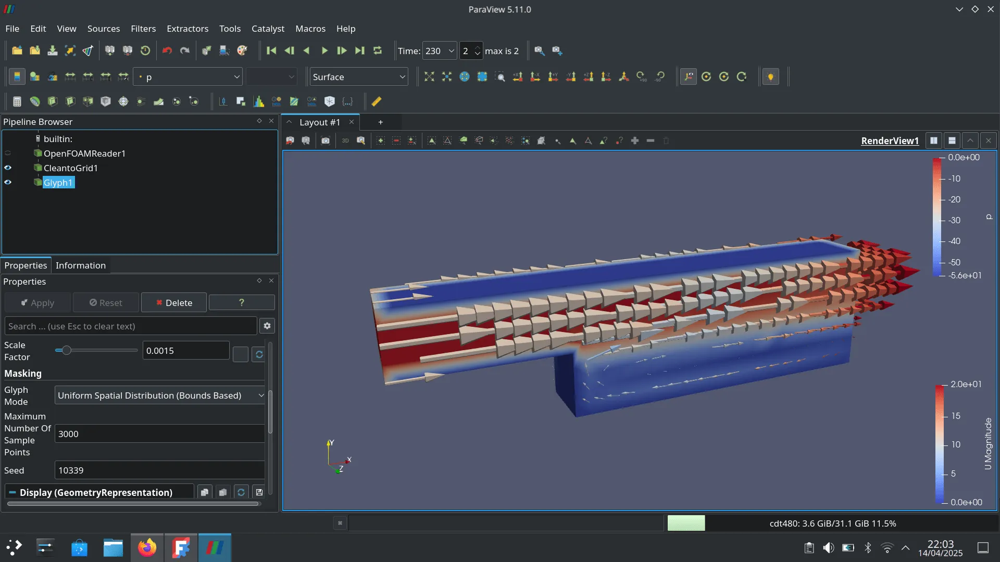
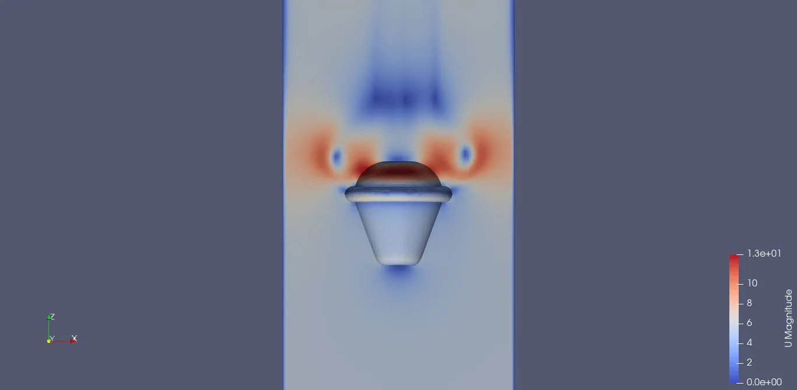

FreeCAD does many amazing things, allows us to create all kinds of geometries and assemblies, but we can also use FreeCAD for analysis of the things we make. One fascinating approach is Computational Fluid Dynamics or CFD.

CFD is essentially a tool to show how fluids interact with objects. You could model and assess water flowing through a pipe, or a boat in the sea, or for flying objects, airflow over a part and much more. Of course CFD can also help analyse and perform complex calculations on data so it's not uncommon to use CFD to work out the drag coefficient of an object or it's centre of pressure and much more.

It's fair to say CFD is a complex area and one that the author is only just beginning to scratch the surface of. Therefore this article isn't a tutorial on CFD directly, rather we'll look at installing the [CfdOF workbench](https://github.com/jaheyns/CfdOF) which requires the installation of some other tools on your system, and then point at some useful tutorials online for you to begin your CFD learning.

The CfdOF workbench provides an interface for numerous other opensource software's which combine to complete the CFD process. These include some meshing tools. CFD is commonly performed on meshed objects with the target object placed in a containing geometric space, a large cuboid or cylinder perhaps. A good analogy is the containing space is like a virtual wind tunnel, although you aren't limited to just air! The whole environment gets turned into a mesh and often within the mesh various different mesh settings are used (called mesh refinements) so that ultimately you get more detail around the surface of the test object. Therefore meshing is important and there are numerous mesh packages for differing meshing approaches built in to a successful CfdOF workbench install.



Another component piece of opensource software used by the CfdOF workbench is [OpenFOAM](https://www.openfoam.com/). OpenFOAM is the very heart of CFD operations and is a complex piece of software that can perform a wide range of complex fluid flows. It's not just capable in terms of things we might obviously think of as computational fluid dynamics, such as water/gases/air but can also solve problems involving chemical reactions, heat, magnetic fields and more. It's an incredibly versatile and complex bit of kit that gets used, often stand alone, in all manner of scientific and academic environments.


Finally there is also a piece of software called [Paraview](https://www.paraview.org/). Paraview is a post processor that, in the case of the CdfOF workbench, can allow you to visualise and analyse case data created with OpenFOAM. It has huge depth and complexity and can perform and create all manner of visualisation as well as performing calculations to aid further analysis of your models.

So we need to get all these components installed and configured. One advantage of the CdfOF is that it automates some of the setup for us using docker and a docker image. In the FreeCAD documentation there's [instructions for installing CdfOF](https://wiki.freecad.org/CfdOF_Install) on Windows and Linux (also Mac but support there is variable), also it's worth reading the notes on the [CfdOF workbench repository](https://github.com/jaheyns/CfdOF) which are also included in the Addon manager listing. We opted to install CdfOF on a machine running stock Debian 12, running the X11 windowing system, and we installed it with the FreeCAD version 1.0 app image.

To begin, open the FreeCAD app image (if it's the first time you might need to right click on the app image file, select `properties` and then under the `permissions` tab you might need to tick the `is executable` box).



Once FreeCAD has opened, install the CfdOF workbench in the usual way. Click ``tools-addon manager`` and then select and install the CfdOF workbench. Once the CfdOF workbench is installed and you've restarted FreeCAD, you can then click ``edit - preferences`` and you should see a CfdOF tab appear in the preferences dialogue. Select the CfdOF tab. You will see that it has numerous input boxes into which you can set paths to the directories where the various other pieces of software are installed. If you leave these blank then CfdOF workbench will use the default most common locations for the install locations which worked perfectly for us. So on our Debian 12 machine we used a the terminal application to first run an update to update all packages with

```py
sudo apt update
```

we then ran;

```py
sudo apt-get install openfoam
```

and after OpenFOAM had installed we ran;

```py
sudo apt-get install paraview
```

to install Paraview.

For the rest of the setup we needed to install docker. In the CfdOF FreeCAD documentation page there is a link supplied to a guide to installing up to date docker on Debian so we simply followed these steps. [https://www.linuxtechi.com/install-docker-engine-on-debian/](https://www.linuxtechi.com/install-docker-engine-on-debian/)

One thing that slightly tripped us up was that not only do we need to add our username to the dialout group, but we also need to log out and log back in to our computer having done so! Again in a terminal we used;

```py
sudo usermod -aG dialout "YOURUSERNAMEHERE"
```

and then (after having some problems we eventually remembered to) re login to the computer. Now with docker installed and OpenFOAM and Paraview installed we can fire up the FreeCAD app image, move back to the CfdOF preferences tab and then click the `Install Docker Image` button. Another quick tip is that it can be useful to have the report view panel open in FreeCAD at this point so you can see messages relating to the docker container and any potential problems. To open that panel you can click `view - panels` and then check the `Report view` box. There is also a small report window if you scroll to the bottom of the CfdOF preferences tab which yields useful information about the install process. Eventually you should be rewarded with a completion message indicating the docker image download has been successful.



Finally before diving headlong into your CFD career it's worth clicking the `Run dependency checker` button in the CfdOF preferences dialogue. This should hopefully report that everything is installed correctly.



If you are new at CFD then be prepared for quite a lot of learning to even get any tangible output! However, there are heaps of guides and tutorials out there to help you along the way. Whilst we'd urge you to look around, the first tutorial we worked through was this [Youtube tutorial](https://www.youtube.com/watch?v=OS4sbbBtZUw&list=PL9H9jQE7y0a5jhlyACRzsdfnx-42AYCCX&index=2&ab_channel=TechBernd) walking through setting up an analysis of water in a broadly L shaped square sided tube. It definitely introduced the general process and order of different operations. This is the first video in a long series of tutorials compiled into a playlist. Jumping to episode 6 in the same series the tutorial covers flowing air over a car design which was very useful for the authors particular areas of interest. After a couple of evening from zero knowledge of CFD the author got to the point of creating a crude analysis of a Ballute parachute design with 6 m/s airflow over it. Whilst the author is continuously discovering errors in approach and discovering better ways to mesh and simulate, it does show that you can begin this journey with very little underlying knowledge!



Finally, the CfdOF workbench has an excellent devoted section on the [FreeCAD forum](https://forum.freecad.org/viewforum.php?f=37). It's definitely worth reading through as many posts there as you can as it's a great source of valuable information by other people on the CFD path!