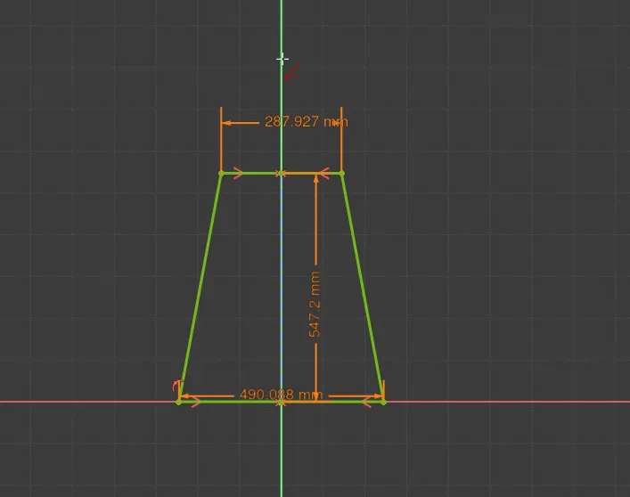
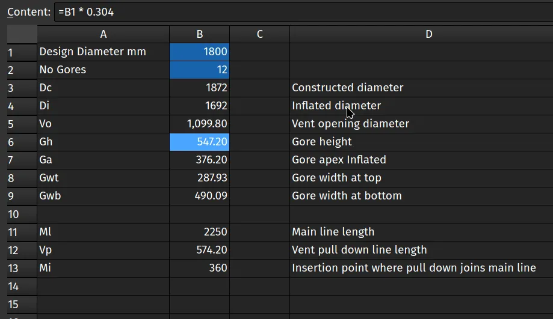
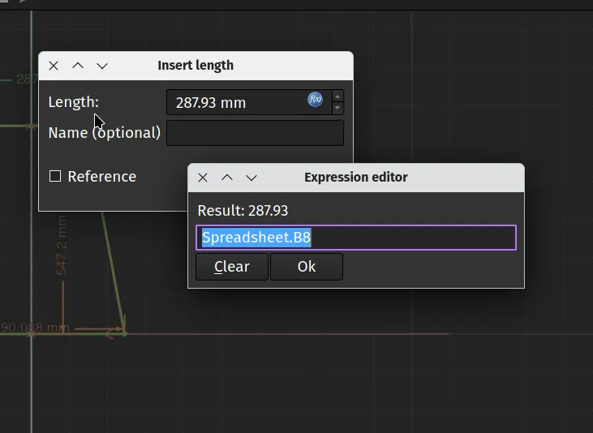

Amongst the built in collection of FreeCAD workbenches, you may have noticed one for creating and working with spreadsheets. Whilst you could use this to track your expenses, let's look at an example project where a spreadsheet is really useful! As a quick reminder, when we write tutorials we call tools by the tool tip names that appear when you rollover tools and show them as italic text in the article.


The aim of the project is to create a trapezium shaped sketch pattern for a panel or "gore" of a moderately complex annular parachute. The parachute project isn't really important, but it gives a good example of how a spreadsheet can be used in a parametric design. When designing an annular parachute you make two fundamental choices, one is the number of 'gores' or panels you require and then a target 'design diameter'. All the other dimensions for the individual gore patterns and the line lengths are then derived by simple numerical calculations using the gore number and design diameter. Often the panels are cut using a laser cutter so being able to quickly generate a sketch and then export the design as a `.dxf` or `.svg` file is really useful.



To begin let's create a new project in Part Design, click to create a body and then create a sketch in the XY plane. Next select the `Create polyline` tool and draw a trapezium with the base line coincident to the X axis line. Click the `Toggle construction geometry` tool and then click the `Create line` tool and then lets draw a construction line from the zero point connected vertically to the topmost horizontal line. Finally let's constrain the upper and lower horizontal line end points around the y axis line with the `Constrain Symmetric` tool.

Close the sketch and next let's jump over to the spreadsheet workbench. In the spreadsheet workbench click the `Create spreadsheet` tool icon and you should see a new tab open with an empty spreadsheet appear. In cell A1 and cell A2 we've added some text labels for Design Diameter and Number of Gores and then we can input those values in cells B1 and B2. We've put 1800 mm and 12 gores in for now, but when we return to this project to design specific parachutes we can alter these values.



Below this we've added a lot of labels for all the different dimensions which are calculated from the two main input parameters. Most of these are just ratios of the Design Diameter parameter or other simple calculations. We can create these simple calculations by adding small expressions to each cell. So for example the height of each gore is a simple ratio of the Design Diameter multiplied by 0.304. To calculate this in cell B6 which we labelled for gore height we insert;

```py
=B1 * 0.304
```

We then added similar small formula for the dimensions needed by the sketch, these are the gore panel width at the top and bottom. The other items in the spreadsheet are other dimensions needed to create a parachute of this design such as the various line lengths etc. If you are interested the FreeCAD project is over on [this repository](https://github.com/concretedog/annular_parachute_tools).



With our formulae now returning the parameters we need we can return to the sketch and use the spreadsheet values locations to create and update constraints. We can click the upper horizontal line and apply a length constraint. Instead of typing a fixed value into the "Insert Length" dialogue box directly we click the small expression editor button that looks like a blue circle with `f(x)` written inside. This launches the Expressions editor dialogue and in this we then type "Spreadsheet.B8" as the location of the value for the length of this line. EDIT! Over on Mastodon Michael excellently suggested that instead of clicking the `f(x)` button simply clicking the "=" key in a constraint dialogue box directly launches the Expressions editor. Thanks Michael.

 Clicking OK we see that the value calculated in cell B8 is now applied to this length constraint. We repeat the process adding the locations to the gore width at bottom and finally set a height value for the construction line we added earlier linking to the cell B6. With the three constraints set up with parameters we see the sketch is fully constrained. Notice though that should we require a totally different size annular parachute design with a totally different number of gore panels we simply update the 2 original values, the design diameter and the number of gores and our new pattern is instantly created. We can close the sketch and then it's simple to export the sketch when it comes to wanting to laser cut or print and cutting a gore or pattern.

Hopefully this served as a nice example of how simple spreadsheets can aid parametric design, that said, if any readers get into building parachutes using FreeCAD we'd love to hear about that as well!