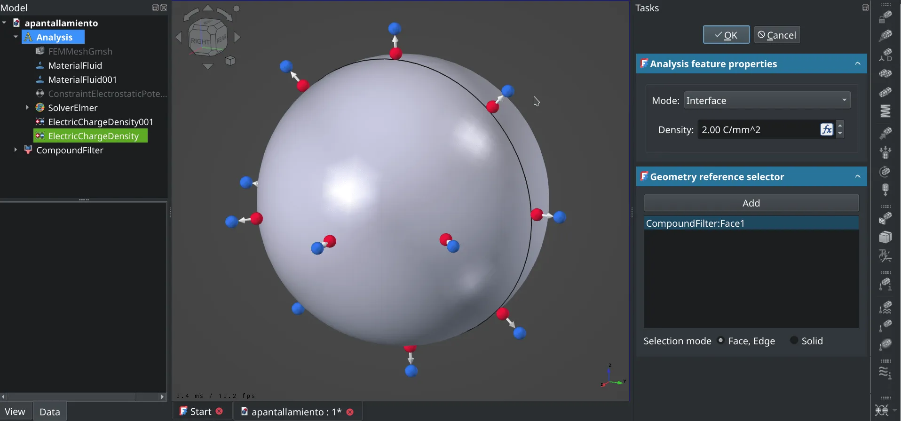

This week in FreeCAD development:

**Draft**: paullee0 and Roy_043 fixed several issues. Additionally, Roy_043 added a font name dropdown list to Preferences.

**Sketcher**: rpronto fixed an issue that occured when renaming a constraint, and ashimabu fixed a bug where sketch color would still appear as constrained after deleting the constraint.

**FEM**: marioalexis84 contributed several minor improvements and two new features: a calculator filter and an object to define electric charge densities. He also improved the handling of electrical quantities for the standard units system.

**CAM**: phaseloop increase speed by about 30-50% when generating V-carve paths on complex faces, and LarryWoestman fixed a bug in the refactored_grbl postprocessor.

Among other changes:

- pieterhijma started contributing patches as part of his grant work on developers documentation.
- davesrocketshop made the support for external material libraries an optional build feature.

Additional fixes were contributed by mosfet80, chennes, semhustej, benj5378, hyarion, tringenbach, luzpaz, kpemartin, Tiago-Almeida007, jonzirk76, alfrix, kadet1090, and ljo.

**PR stats**: since the previous report, 49 pull requests have been merged, and 44 new pull requests have been opened.

**Issue stats**: overall, there are 2755 open issues in the tracker, up by 20 from last week.

We have switched to Qt6 for weekly builds. However, the builds for Windows are still behind our Linux and macOS builds for technical reasons. We are working on resolving the issue.