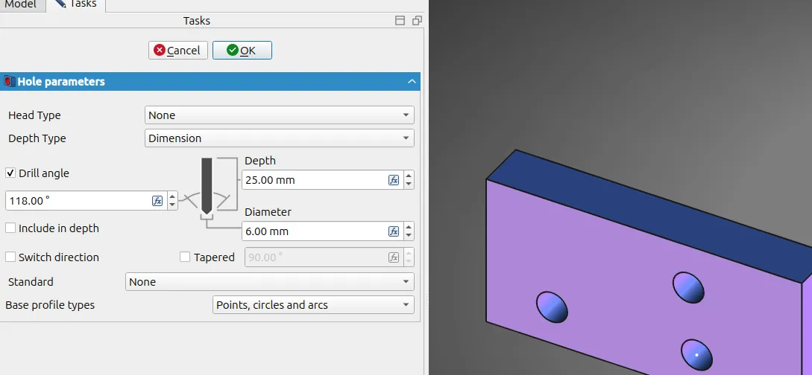
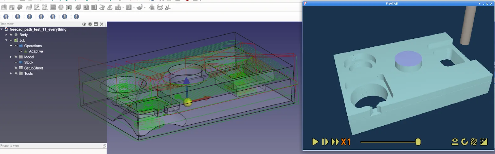

This week in FreeCAD development:

**Draft**:

- Roy_043 added some initial code to track documents so that the task panel could be closed when a document is closed. Expect further work to get this to work in BIM as well.
- tetektoza renamed the Continue mode to Chained, but retained the original mode for the Dimension command.

**Sketcher**:

- AjinkyaDahale fixed more trimming issues.
- tetektoza added the auto-scrolling of geometry elements when a user selects a geometry element in the sketch.
- leuriato added a check for constraint names to ensure that they can be referenced in expressions.

**PartDesign**: theo-vt updated the Hole tool to center holes on sketch points as well as circles and arcs.

**FEM**: marioalexis82 refactored the SolverCalculiX object. User-visible changes are:

- The task panel of the new solver object now behaves like the task panel for meshers.
- Two properties have been added to solver objects: a temporary `WorkingDirectory` to track the working directory used by solvers to write models, and `Results` to reference the pipelines (and other objects) generated from the simulation.
- The `VectorMode` view property has been renamed to `Component`, and it is now possible to load symmetrical six-component tensors as a single field, not just scalars and vectors.

**TechDraw**: furgo16 fixed the issues where BIM views were added with too big a scale of 1.

**GUI**:

- semhustej patched the width of the BIM Setup dialog so that it always shows all UI elements.
- xtemp09 fixed the left side of the macro panel (icons) being too small.

**CAM**:

- tarman3 patched the new simulator so that it could zoom out more to show the entire larger object. He also added a combined Dressup menu to the workbench's toolbar.
- dbtayl added adaptive roughing/overhang detection and one-click "adaptive roughing" of the entire model.

Additional improvements and fixes were contributed by kadet1090, FlachyJoe, alfrix, oursland, 3x380V, luzpaz, tetektoza, hyarion, pieterhijma, captain0xff, maxwxyz, bofdahof, step-security-bot, dependabot, chennes, Syres916, mnesarco, and Abdelhadi-Wael.

**PR stats**: since the previous report, 50 pull requests have been merged, and 30 new pull requests have been opened.

**Issue stats**: overall, there are 2823 open issues in the tracker, up by 22 from last week.