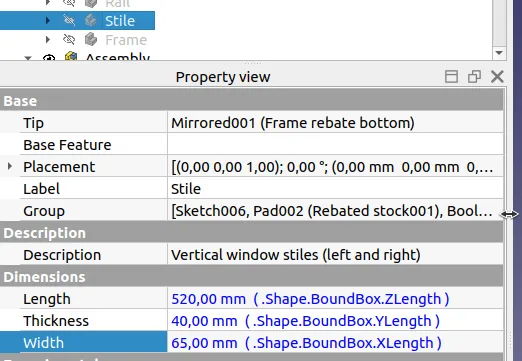
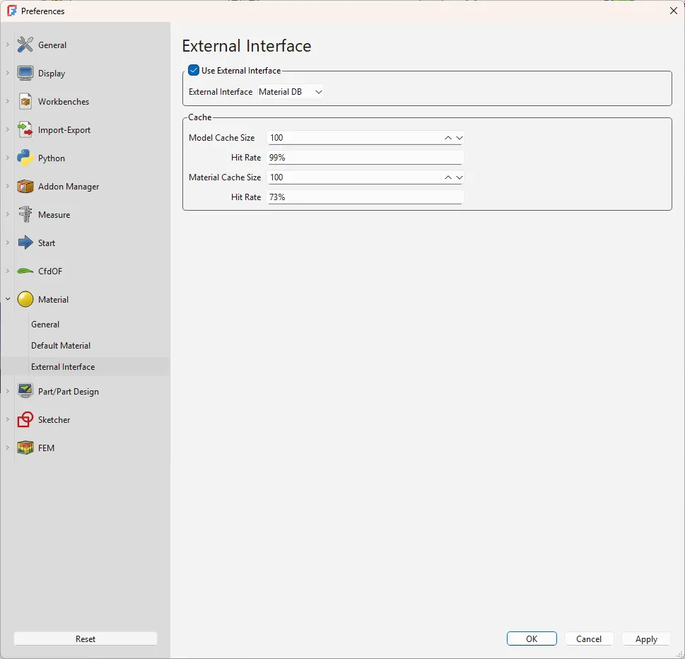

This week in FreeCAD development:

**Draft**: Roy_043 added a global mode to the ShapeString task panel so that coordinates could be relative to the global coordinate system.

**Sketcher**: AjinkyaDahale pushed another fix for the Trim tool, this time-to avoid an unnecessary geometry update when trimming.

**Assembly**: furgo16 patched the BOM tool to support autopopulating columns with given dynamic properties like these:

**BIM**:

- tetektoza contributed a patch that makes it possible to insert a Window to a Curtain Wall.
- paullee0 patched the BIM Window Interactive Tool so that with the SketchArch-addon, the required SketchArch parametric placement information of an Arch Object (Window currently) is automatically completed now. He also contributed more code to support the ArchSketch addon in the BIM workbench.

**FEM**: ickby fixed several bugs, and muezabdalla improved the UI of the temperature constrain expandable.

**TechDraw/Core**: tetektoza introduced a new option to select a preferred PDF version (in Preferences) for importing and exporting PDF files. You can choose between PDF 1.4, 1.6, X-4, and A-1b. Before that, FreeCAD was hardcoded to use PDF/A-1b.

**GUI**:

- Graicc added a classic trackball orbit style for navigation (see [this forum thread](https://forum.freecad.org/viewtopic.php?t=91769)), and Rexbas fixed an issue in the MayaGesture style.
- alexneufeld contributed an improvement that improves the default random colors for assembly objects by using the perceptually uniform [CET-R1](https://colorcet.com/gallery.html#rainbow) color map.

**Materials**: davesrocketshop finished adding support for external materials databases. The last patch adds a Preferences page where you can tweak cache settings or disable the feature entirely.

Among other changes:

- aprospero did a major overhaul of how FreeCAD imports paths from SVG files.
- pieterhijma improved the App::PropertyContainer documentation as part of his grant work.

Additional improvements and fixes were contributed by J-Dunn, rhabacker, furgo16, Roy-043, tarman, captain0xff, vletii, Syres916, chennes, FlachyJoe, sliptonic, kadet1090, 3x380V, Joao-A-Neves, oursland, and mosfet80.

**PR stats**: since the previous report, 50 pull requests have been merged, and 32 new pull requests have been opened.

**Issue stats**: overall, there are 2814 open issues in the tracker, down by 9 from last week.